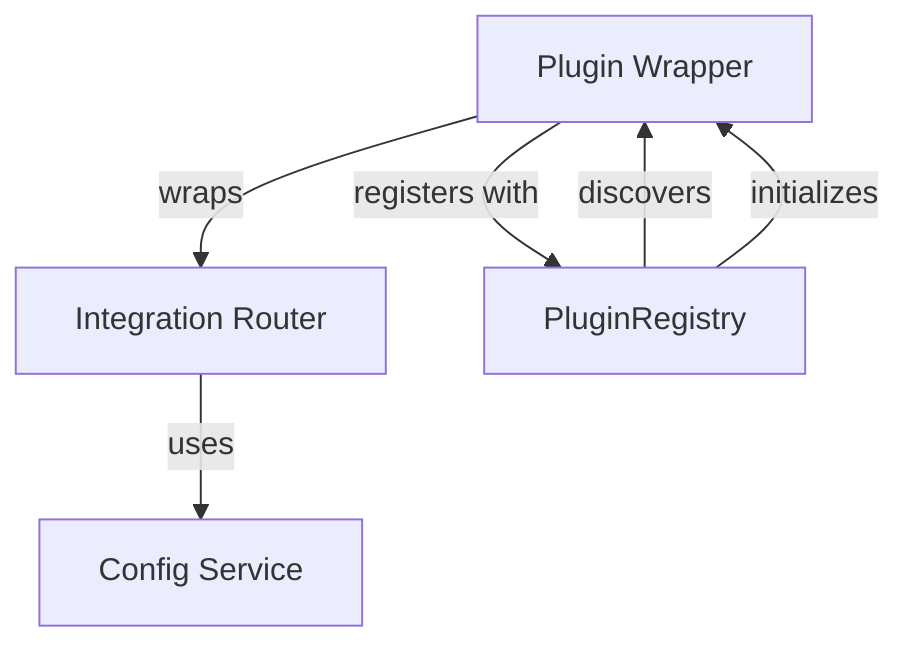
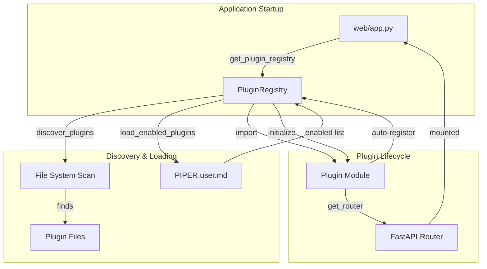
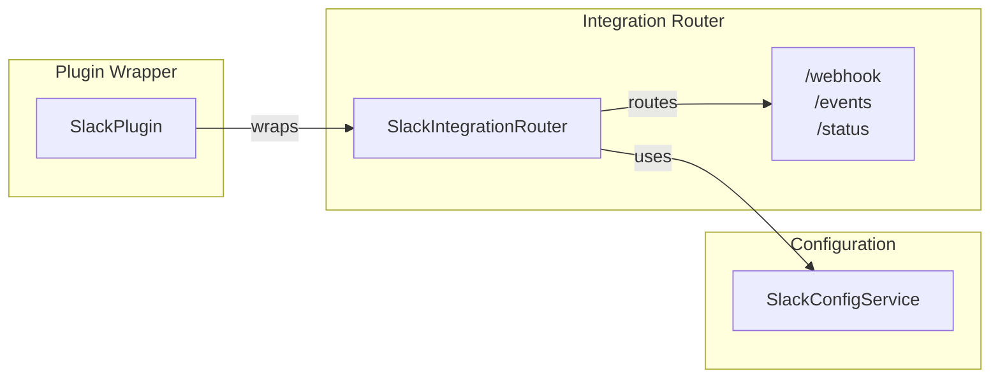
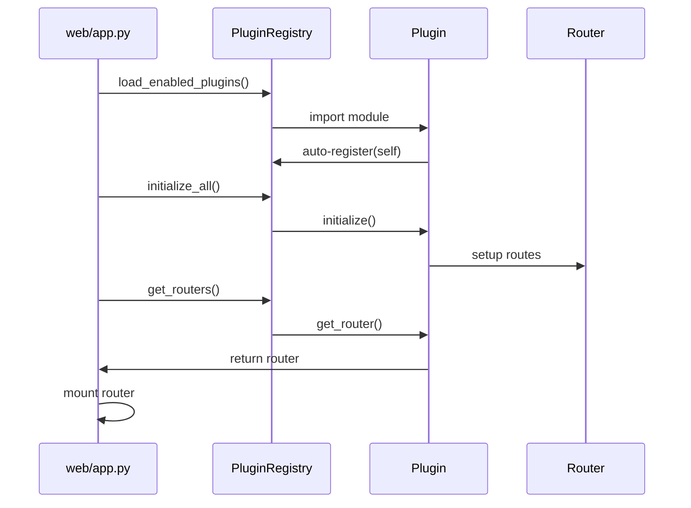

# Cursor Agent Prompt: GREAT-3C Phase 1 - Pattern Documentation

## Session Log Management
Continue session log: `dev/2025/10/04/2025-10-04-[timestamp]-cursor-log.md`

Update with timestamped entries for Phase 1 work.

## Mission
**Create Pattern Documentation**: Document the plugin wrapper/adapter pattern as intentional architecture with Mermaid diagrams, and enhance existing README with architectural context.

## Context

**Phase 0 Complete**: Investigation found
- Wrapper pattern is architecturally sound (~111 lines per plugin)
- Current README is good (329 lines) but lacks architectural diagrams
- Need pattern doc in `docs/architecture/`
- Mermaid diagrams recommended for maintainability

**Phase 1 Goal**: Create comprehensive pattern documentation with visual diagrams.

## Your Tasks

### Task 1: Create docs/architecture/patterns/ Directory

```bash
mkdir -p docs/architecture/patterns
```

### Task 2: Create Plugin Wrapper Pattern Document

**File**: `docs/architecture/patterns/plugin-wrapper-pattern.md`

**Structure**:

```markdown
# Plugin Wrapper Pattern

**Status**: Active
**Last Updated**: October 4, 2025
**Author**: Piper Morgan Team

## Overview

Piper Morgan's plugin system uses the Adapter/Wrapper pattern where plugins are thin wrappers (~100 lines) around integration routers that contain business logic.

## Pattern Description

### Three-Layer Architecture



**Layers**:
1. **Plugin Wrapper** - Implements PiperPlugin interface, handles lifecycle
2. **Integration Router** - Contains business logic, FastAPI routes
3. **Config Service** - Manages integration-specific configuration

### File Structure

Each integration follows this pattern:

```
services/integrations/[name]/
├── __init__.py
├── [name]_integration_router.py  # Business logic (~300-500 lines)
├── [name]_plugin.py               # Thin wrapper (~100 lines)
├── config_service.py              # Config management (~150 lines)
└── tests/
```

## Why This Pattern?

### Separation of Concerns
- **Plugin Layer**: Protocol compliance, lifecycle management
- **Router Layer**: Business logic, API routes
- **Config Layer**: Configuration, validation

### Benefits

1. **Clear Boundaries**: Interface between plugin system and business logic
2. **Gradual Migration**: Business logic can move to plugins later if needed
3. **Testing Simplicity**: Test routers and plugins independently
4. **Maintenance**: Changes to plugin protocol don't affect business logic
5. **Flexibility**: Routers can exist without plugins during development

### Trade-offs

**Advantages**:
- Clean separation of concerns
- Easy to understand and maintain
- Supports incremental adoption
- Minimal coupling

**Disadvantages**:
- Two-file structure per integration (slight overhead)
- Additional abstraction layer
- Router+Plugin coupling (though loose)

## Pattern Examples

### Example: Slack Plugin Structure

**Router** (`slack_integration_router.py`):
```python
class SlackIntegrationRouter:
    """Business logic for Slack integration"""

    def __init__(self, config_service: SlackConfigService):
        self.config = config_service
        self.router = APIRouter(prefix="/api/integrations/slack")
        self._setup_routes()

    def _setup_routes(self):
        @self.router.post("/webhook")
        async def handle_webhook(request: Request):
            # Business logic here
            pass
```

**Plugin** (`slack_plugin.py`):
```python
class SlackPlugin(PiperPlugin):
    """Thin wrapper implementing PiperPlugin interface"""

    def __init__(self):
        self.config_service = SlackConfigService()
        self.router_instance = SlackIntegrationRouter(self.config_service)

    def get_router(self) -> APIRouter:
        return self.router_instance.router

    # Other PiperPlugin interface methods...
```

## Implementation Guidelines

### Creating a New Integration

1. **Start with Router**: Implement business logic first
2. **Add Config Service**: Following standard pattern
3. **Wrap with Plugin**: Implement PiperPlugin interface
4. **Register**: Auto-registration via module import
5. **Configure**: Add to PIPER.user.md

### When to Use This Pattern

**Use this pattern when**:
- Adding new external integrations
- Need lifecycle management
- Want discovery and config control
- Integration has routes/webhooks

**Don't use this pattern for**:
- Internal utilities (use services/ directly)
- One-off scripts
- Core system components

## Migration Path

If future needs require moving business logic into plugins:

1. **Phase 1**: Move router methods into plugin class
2. **Phase 2**: Update tests to use plugin directly
3. **Phase 3**: Remove router file, update imports
4. **Phase 4**: Update documentation

This migration is intentionally easy - the wrapper pattern supports it naturally.

## Related Patterns

- **Adapter Pattern**: Wrapper adapts router to plugin interface
- **Facade Pattern**: Plugin presents simple interface to complex router
- **Proxy Pattern**: Plugin controls access to router

## References

- [Plugin Interface Definition](../../services/plugins/plugin_interface.py)
- [Plugin Registry](../../services/plugins/plugin_registry.py)
- [Plugin Development Guide](../../guides/plugin-development-guide.md)

---

*This pattern was established in GREAT-3A (October 2025) and documented in GREAT-3C.*
```

### Task 3: Add Architectural Diagrams to README

**File**: `services/plugins/README.md`

**Add after the overview section**:

```markdown
## Architecture

### Plugin System Overview



### Wrapper Pattern



### Data Flow



## Why the Wrapper Pattern?

Piper Morgan uses a **two-file structure** for integrations:

1. **Router File**: Contains business logic (300-500 lines)
2. **Plugin File**: Thin wrapper implementing interface (100 lines)

**Benefits**:
- Clear separation between business logic and plugin protocol
- Easy to test independently
- Supports gradual migration if needed
- Minimal coupling between layers

See [Plugin Wrapper Pattern](../../docs/architecture/patterns/plugin-wrapper-pattern.md) for detailed explanation.
```

### Task 4: Verify Mermaid Diagrams Render

**Test locally if possible**:
```bash
# Check if GitHub will render these
# Mermaid is supported in GitHub markdown
# Verify syntax is correct
```

**Validation checklist**:
- [ ] All diagram syntax valid
- [ ] Node labels clear and readable
- [ ] Arrows show correct flow
- [ ] Subgraphs organized logically
- [ ] Colors/styling minimal (for maintainability)

### Task 5: Add Cross-References

Update these files with links to new pattern doc:

**In `services/plugins/README.md`**:
Add to top:
```markdown
For architectural details, see [Plugin Wrapper Pattern](../../docs/architecture/patterns/plugin-wrapper-pattern.md).
```

**In new pattern doc**:
Link to README:
```markdown
For usage instructions, see [Plugin System README](../../../services/plugins/README.md).
```

### Task 6: Update docs/NAVIGATION.md

**Add entry**:
```markdown
## Architecture Patterns

- [Plugin Wrapper Pattern](architecture/patterns/plugin-wrapper-pattern.md) - How plugins wrap integration routers
```

## Deliverable

Create: `dev/2025/10/04/phase-1-cursor-pattern-docs.md`

Include:
1. **Files Created**:
   - docs/architecture/patterns/plugin-wrapper-pattern.md (complete content)
2. **Files Modified**:
   - services/plugins/README.md (diagrams added)
   - docs/NAVIGATION.md (entry added)
3. **Diagrams Created**: 3 Mermaid diagrams
4. **Cross-References**: Links added between docs
5. **Validation**: Diagram syntax verified

## Success Criteria
- [ ] Pattern document created with comprehensive explanation
- [ ] 3 Mermaid diagrams added to README
- [ ] Pattern doc explains "why" not just "how"
- [ ] Examples show actual code structure
- [ ] Migration path documented
- [ ] Cross-references in place
- [ ] All markdown syntax valid

---

**Deploy at 12:40 PM**
**Foundation for Phase 2 developer guide**
