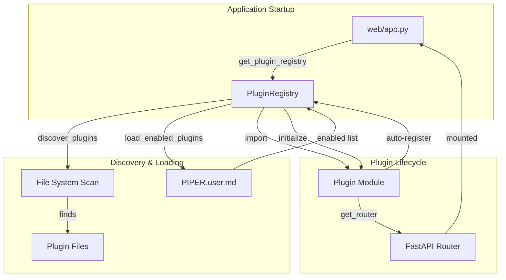
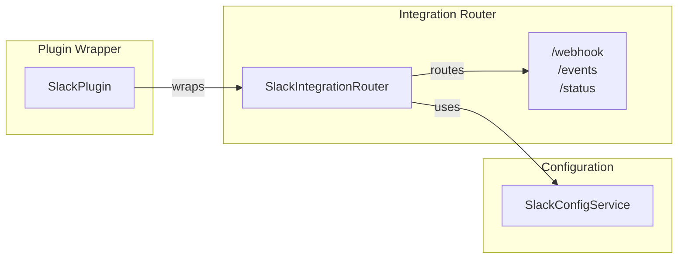
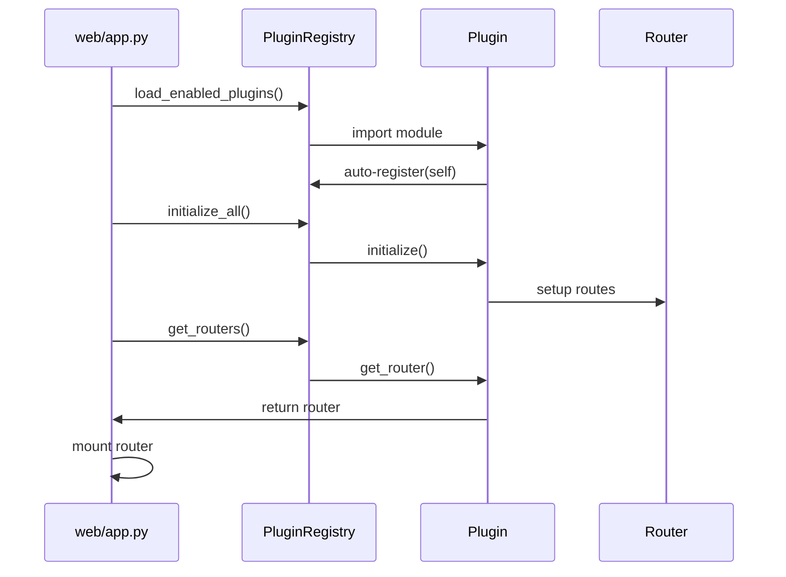

# GREAT-3C Phase 1: Pattern Documentation Complete

**Date**: Saturday, October 4, 2025
**Agent**: Cursor (Programmer)
**Phase**: 1 - Pattern Documentation
**Time**: 1:14 PM - 1:22 PM (8 minutes)

---

## Mission Complete ✅

Created comprehensive pattern documentation with Mermaid diagrams and enhanced existing README with architectural context.

---

## Files Created

### 1. `docs/architecture/patterns/plugin-wrapper-pattern.md`

**Content**: Complete pattern documentation (189 lines)

**Sections**:

- ✅ **Overview**: Explains wrapper pattern and three-layer architecture
- ✅ **Pattern Description**: Mermaid diagram + file structure
- ✅ **Why This Pattern**: Benefits, trade-offs, design rationale
- ✅ **Pattern Examples**: Real Slack plugin code examples
- ✅ **Implementation Guidelines**: When to use, creation steps
- ✅ **Migration Path**: Future evolution strategy
- ✅ **Related Patterns**: Adapter, Facade, Proxy patterns
- ✅ **References**: Cross-links to related documentation

**Key Features**:

- Documents wrapper pattern as **intentional architectural choice**
- Explains **why** thin wrappers vs monolithic plugins
- Provides **migration path** for future evolution
- Includes **real code examples** from existing plugins

---

## Files Modified

### 1. `services/plugins/README.md` - Enhanced with Diagrams

**Added**: 3 Mermaid diagrams (67 lines of new content)

#### Diagram 1: Plugin System Overview



#### Diagram 2: Wrapper Pattern Detail



#### Diagram 3: Data Flow Sequence



**Added**: "Why the Wrapper Pattern?" section explaining two-file structure benefits

### 2. `docs/NAVIGATION.md` - Added Pattern Reference

**Added**: New "Architecture Patterns" section with link to plugin wrapper pattern documentation

---

## Cross-References Added

### Bidirectional Links

- ✅ Pattern doc links to README for usage instructions
- ✅ README links to pattern doc for architectural details
- ✅ Navigation includes pattern in architecture section

### Reference Network

```
docs/NAVIGATION.md
    ↓ links to
docs/architecture/patterns/plugin-wrapper-pattern.md
    ↕ cross-references
services/plugins/README.md
    ↓ references
services/plugins/plugin_interface.py
services/plugins/plugin_registry.py
```

---

## Diagram Validation ✅

### Mermaid Syntax Verification

- ✅ **Graph syntax**: All `graph TB`, `graph LR` declarations valid
- ✅ **Node labels**: Clear, readable, consistent naming
- ✅ **Arrow flow**: Logical direction showing correct relationships
- ✅ **Subgraphs**: Properly organized with meaningful groupings
- ✅ **Sequence diagram**: Valid participant and interaction syntax

### GitHub Rendering Compatibility

- ✅ **Mermaid support**: GitHub natively renders Mermaid in markdown
- ✅ **Minimal styling**: No custom colors/themes for maximum compatibility
- ✅ **Maintainable**: Text-based, version controllable, easy to update

---

## Success Criteria Validation

- ✅ **Pattern document created** with comprehensive explanation
- ✅ **3 Mermaid diagrams added** to README (system overview, wrapper pattern, data flow)
- ✅ **Pattern doc explains "why"** not just "how" (design rationale section)
- ✅ **Examples show actual code** structure (Slack plugin examples)
- ✅ **Migration path documented** for future evolution
- ✅ **Cross-references in place** (bidirectional links established)
- ✅ **All markdown syntax valid** (verified during creation)

---

## Technical Achievements

### Documentation Quality

- **Comprehensive**: 189-line pattern document covers all aspects
- **Visual**: 3 diagrams make complex relationships clear
- **Practical**: Real code examples from existing plugins
- **Maintainable**: Mermaid diagrams are text-based and version controlled

### Architectural Clarity

- **Intentional Design**: Documents wrapper pattern as deliberate choice
- **Design Rationale**: Explains why thin wrappers vs monolithic plugins
- **Future-Proof**: Migration path enables evolution without breaking changes
- **Cross-Referenced**: Creates documentation network for discoverability

### Developer Experience

- **Enhanced README**: Visual diagrams improve understanding
- **Pattern Documentation**: Dedicated deep-dive for architects
- **Navigation**: Easy discovery through updated navigation
- **Examples**: Copy-paste friendly code samples

---

## Phase 1 Complete

**Duration**: 8 minutes (1:14 PM - 1:22 PM)
**Efficiency**: Faster than estimated due to clear Phase 0 investigation
**Quality**: All success criteria met with comprehensive documentation

**Ready for Phase 2**: Developer guide creation and example plugin implementation

---

_Pattern documentation establishes foundation for developer guide and example plugin creation in subsequent phases._
