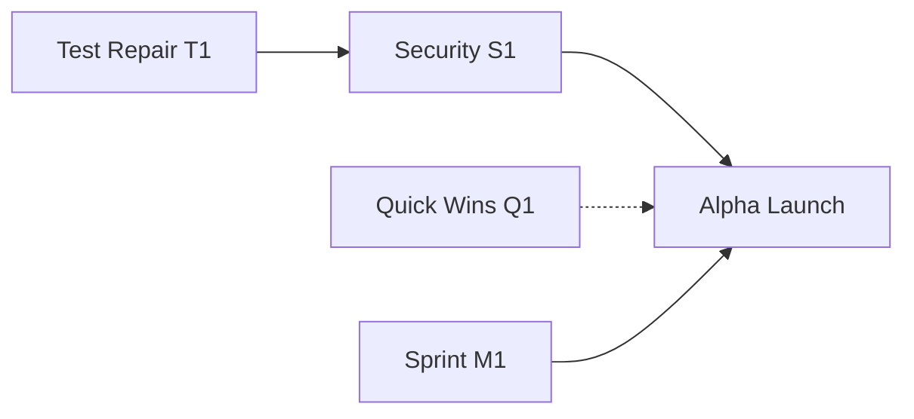

# Piper Morgan Roadmap v11.4
**Date**: 2025-11-20
**Author**: Chief Architect
**Status**: Active - Post-Test Repair Organization

---

## Executive Summary

Major progress on TEST epic (5/11 issues complete), security sprint defined, and Ted Nadeau's architectural review incorporated. Alpha readiness approaching with clear critical path through security issues.

**Key Changes from v11.3**:
- TEST epic: 45% complete, phantom tests resolved
- New Sprint S1 (Security) defined as top priority
- Sprint Q1 (Quick Wins) for parallel work
- 8 duplicate issues identified for closure
- Ted's review → 3 patterns, 1 ADR, 2 new issues

---

## Sprint Organization

### Current Sprint: T1 - Test Repair (This Week)
**Status**: In Progress
**Focus**: Complete test infrastructure repair

**Active**:
- SLACK-SPATIAL (#361) - 14 hrs - NEW, alpha blocker
- TEST (#341) - Super epic coordination

**Can Defer** (Code's analysis):
- TEST-PHANTOM-VALIDATOR (#348) - P2
- TEST-INFRA-FIXTURES (#349) - P2
- TEST-PHANTOM-AUDIT (#351) - P3
- TEST-SMOKE-E2E (#352) - P3
- TEST-SMOKE-STATIC (#350) - P3

---

### Sprint S1: Security Foundation (Next Week)
**Status**: Critical Path
**MUST COMPLETE before alpha testing**

| Issue | Hours | Priority | Impact |
|-------|-------|----------|---------|
| SEC-RBAC (#357) | 24 | P0 | Blocks multi-user |
| SEC-ENCRYPT-ATREST (#358) | 24 | P0 | Compliance required |
| BUG: Windows Clone (#353) | 3 | P0 | Blocks Windows devs |
| PERF-INDEX (#356) | 6 | P1 | Performance cliff |
| DEV-PYTHON-311 (#360) | 8 | P1 | Security patches expired |
| ARCH-SINGLETON (#322) | 16 | P2 | Blocks scaling |

**Total**: ~81 hours (2 developer-weeks)

---

### Sprint Q1: Quick Wins (Parallel)
**Status**: Can be done in gaps
**Low effort, high value**

| Issue | Hours | Score | Value |
|-------|-------|-------|--------|
| DEV-VSCODE-SETUP (#362) | 3 | 2.67 | Developer onboarding |
| DX-OS-DETECT (#325) | 6 | - | Cross-platform |
| ARCH (#359) | 4 | - | Remove timeout wrapper |
| BUG-TEST-SECURITY (#363) | 1 | - | Fix async warning |
| DESIGN-TOKENS (#354) | 8 | - | CSS consistency |
| STOP-GAP-DOCS (#355) | 12 | - | Artifact persistence |

**Total**: ~34 hours

---

### Sprints M1-M6 (As Planned)

**M1**: Foundation work (in progress)
**M2**: Integration & smoke tests
**M3**: Skills & multi-agent
**M4**: Document management
**M5**: Advanced features
**M6**: Strategic & ethics

*These remain as organized but validate after S1 completes*

---

## Critical Path to Alpha

**Blockers**:
1. ✅ TEST epic (45% complete, on track)
2. 🔴 RBAC (not started, 24 hrs)
3. 🔴 Encryption (not started, 24 hrs)
4. 🟡 Slack integration (gameplan ready, 14 hrs)

---

## Issue Management

### Duplicates to Close (8 pairs)

| Close | Keep | Canonical Name |
|-------|------|----------------|
| #323 | #357 | SEC-RBAC |
| #324 | #358 | SEC-ENCRYPT-ATREST |
| #320 | #356 | PERF-INDEX |
| #319 | #353 | BUG (Windows) |
| #333 | #336 | DATA-SOFT-DELETE |
| #331 | #332 | DOCS-STORED-PROCS |
| #334 | #338 | INFRA-MIGRATION-ROLLBACK |
| #335 | #339 | STYLE-PK-PREFIX |
| #337 | #340 | STYLE-TABLE-SINGULAR |

### New Canonical Names

- #326 → ARCH-MULTI-ORG
- #329 → ARCH-ANNOTATION (Ted's innovation)
- #322 → ARCH-SINGLETON
- #363 → BUG-TEST-SECURITY
- #321 → DATA-AUDIT-FIELDS
- #325 → DX-OS-DETECT
- #327 → PROCESS-AI-ACCOUNTS
- #328 → OBSERVABILITY-CENTRAL
- #330 → INTEGRATION-EMAIL-MCP

---

## Milestone Structure

### MVP (Current Focus)
- Sprint T1: Test Repair
- Sprint S1: Security Foundation
- Sprint Q1: Quick Wins
- Sprints M1-M6: Core features

### POST-MVP (New Milestone)
- Architecture improvements (ARCH-*)
- Style conventions (STYLE-*)
- Data patterns (DATA-*)
- Process improvements (PROCESS-*)
- Observability (OBSERVABILITY-*)

### ENTERPRISE (Future)
- ENT-KEYS-TEAM-SHARING (#251)
- MVP-QUALITY-ENHANCE (#213)
- FEAT-* advanced features

---

## Risk Assessment

### High Risk (Must Mitigate)
- 🔴 **No RBAC** = Cannot have multiple users
- 🔴 **No encryption** = Compliance failure
- 🔴 **Python 3.9.6** = Security patches expired

### Medium Risk (Should Address)
- 🟡 **Slack broken** = Major feature unavailable
- 🟡 **No indexes** = Performance degradation
- 🟡 **Singleton pattern** = Cannot scale horizontally

### Low Risk (Can Defer)
- 🟢 Style conventions
- 🟢 Documentation gaps
- 🟢 Process improvements

---

## Metrics & Progress

### Test Infrastructure
- **Phantom tests eliminated**: 332 → 0 ✅
- **Known failures documented**: 55 tests
- **Test reliability**: Improving daily
- **Smoke tests**: Defined, not yet implemented

### Documentation
- **Patterns**: 40 documented (was 35)
- **ADRs**: 44 documented (including mobile strategy)
- **Session logs**: Current through Nov 20

### External Validation
- **Ted Nadeau review**: Completed, incorporated
- **Alpha testers identified**: Beatrice + others
- **Security audit prep**: In progress (Sprint S1)

---

## Next Actions

### This Week (Nov 20-24)
1. ✅ Complete SLACK-SPATIAL implementation
2. ✅ Close TEST epic items that are done
3. ✅ Synthesize duplicate issues
4. ✅ Start Sprint S1 planning

### Next Week (Nov 25-Dec 1)
1. 🔲 Execute Sprint S1 (Security)
2. 🔲 Parallel Quick Wins (Q1)
3. 🔲 Prepare for alpha testing
4. 🔲 Security audit prep

---

## Success Criteria for Alpha

**Must Have**:
- ✅ Core workflows functional
- ✅ Test infrastructure stable
- 🔲 RBAC implemented
- 🔲 Encryption at rest
- 🔲 Slack integration working
- 🔲 Performance acceptable

**Nice to Have**:
- 🔲 VSCode setup package
- 🔲 Python 3.11 upgrade
- 🔲 Design tokens extracted
- 🔲 Artifact persistence

---

## Notes

- Security Sprint S1 is absolute priority - cannot launch alpha without it
- TEST epic nearly complete, great progress
- Ted's review validated architecture, identified key gaps
- Quick wins can be done in parallel or gaps between major work
- Consider hiring help for security sprint (81 hours of work)

---

*Roadmap v11.4 - Updated after test infrastructure success and Ted Nadeau review*
