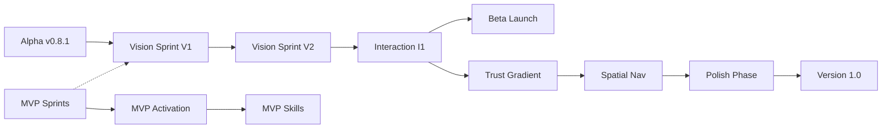

# Piper Morgan Roadmap v12.1
**Date**: 2025-11-29
**Author**: Chief Architect
**Status**: Active - Learning System UX Integrated

---

## Executive Summary

Minor update from v12.0: Integrates comprehensive Learning System UX design from CXO work. "Filing dreams" metaphor unifies background processing. Two-layer journal architecture (Session vs Insight) clarified. Trust gradient consistently applied to all autonomous behaviors.

**Key Changes from v12.0**:
- VISION-JOURNAL-LAYERS replaced by comprehensive MUX-VISION-LEARNING-UX
- Learning System elevated from peripheral to foundational
- Composting → Learning pipeline now has complete UX specification

**Continuing from v12.0**:
- UX 2.0 super-epic track with three layers (Vision, Interaction, Implementation)
- Morning Standup as consciousness template
- "Entities experience Moments in Places" core grammar
- Alpha testing active with Michelle

---

## Sprint Organization

### COMPLETED Sprints

#### Sprint S1: Security Foundation ✅
**Status**: COMPLETE (Nov 22-23)
**Achievement**: SEC-RBAC implemented with lightweight JSONB approach

- ✅ SEC-RBAC (#357) - 13 hrs actual vs 24 est - COMPLETE
- ✅ PERF-INDEX (#356) - COMPLETE
- ✅ DEV-PYTHON-311 (#360) - COMPLETE
- ✅ BUG: Windows Clone (#353) - COMPLETE
- ⏸️ SEC-ENCRYPT-ATREST (#358) - Deferred (not alpha blocking)
- ⏸️ ARCH-SINGLETON (#322) - Deferred (not alpha blocking)

#### Sprint A9: Final Alpha Prep ✅
**Status**: COMPLETE (Nov 23)
**Achievement**: System production-ready, Michelle onboarded

- ✅ FRONTEND-RBAC-AWARENESS (#376) - 82 min vs 6-7 hr estimate!
- ✅ ALPHA-DOCS-UPDATE (#377) - All 4 docs updated
- ✅ UI Quick Fixes (#379) - 14 navigation issues resolved
- ✅ PROD-DEPLOY-ALPHA (#378) - v0.8.1 deployed

---

## UX 2.0 Super-Epic Track

### Foundation: The Consciousness Model Recovery
**Discovery**: Original embodied AI consciousness vision got flattened in implementation. Morning Standup is the ONLY surviving example of the intended experience.

**Core Grammar**: "Entities experience Moments in Places"
- Entities: Actors with identity and agency
- Moments: Bounded significant occurrences (theatrical unities)
- Places: Contexts where action happens
- Situations: Container holding sequences of Moments

### UX-VISION: Conceptual Architecture Layer
**Purpose**: Formalize the discovered object model and consciousness patterns
**Duration**: 2 weeks (Sprints V1-V2)

#### Sprint V1: Formalization (Week of Dec 2)
- `VISION-OBJECT-MODEL` (8h): ADR documenting object model decisions from CXO work
- `VISION-GRAMMAR-CORE` (12h): Implement "Entities experience Moments in Places" as base pattern
- `VISION-CONSCIOUSNESS` (8h): Extract & document embodied AI patterns from Morning Standup
- `VISION-METAPHORS` (4h): Formalize Native(Mind)/Federated(Senses)/Synthetic(Understanding)

**Sprint Total**: 32 hours

#### Sprint V2: Integration Mapping (Week of Dec 9)
- `VISION-FEATURE-MAP` (12h): Map all existing features to object model
- `VISION-STANDUP-EXTRACT` (16h): Systematically extract consciousness patterns for generalization
- `VISION-LIFECYCLE-SPEC` (8h): Implement 8-stage lifecycle with composting
- `MUX-VISION-LEARNING-UX` (16h): Complete learning system experience design **[UPDATED]**
  - Incorporates two-layer journal architecture (Session vs Insight)
  - "Filing dreams" metaphor for composting
  - Trust gradient for background processing
  - Control mechanisms (correct/delete/inspect/reset)

**Sprint Total**: 52 hours

### UX-INTERACT: Interaction Design Layer
**Purpose**: Design how users interact with the consciousness model
**Duration**: 4 weeks (Sprints I1-I3)

#### Sprint I1: Recognition Patterns (Weeks of Dec 16 & 23)
- `INTERACT-CANONICAL-ENHANCE` (16h): Evolve 25 canonical queries to true orientation system
- `INTERACT-RECOGNITION` (24h): Design "did you mean..." patterns (recognition over articulation)
- `INTERACT-INTENT-BRIDGE` (8h): Connect current intent classification to recognition interface

**Sprint Total**: 48 hours

#### Sprint I2: Trust Gradient (Week of Dec 30)
- `INTERACT-TRUST-LEVELS` (12h): Define trust gradient mechanics and progression
- `INTERACT-DELEGATION` (12h): System-initiated vs user-initiated patterns (avoid "self-threat")
- `INTERACT-PREMONITION` (8h): When/how Piper surfaces insights from Insight Journal

**Sprint Total**: 32 hours

#### Sprint I3: Spatial Navigation (Week of Jan 6)
- `INTERACT-WORKSPACE` (12h): How Piper navigates between contexts/channels/projects
- `INTERACT-ATTENTION` (16h): Attention algorithms based on spatial metaphors (from SLACK-SPATIAL)
- `INTERACT-MOMENT-UI` (12h): How Moments appear and are manipulated in interface

**Sprint Total**: 40 hours

### UX-IMPLEMENT: UI Polish Layer
**Purpose**: Systematic closure of 68 identified UX gaps
**Duration**: 5 weeks (Sprints P1-P4)

#### Sprint P1: Navigation Crisis (Week of Jan 13)
- Address top 10 of 68 gaps (Score 700 - navigation is #1 issue)
- Global nav implementation
- Feature discovery improvements

#### Sprint P2: Document Management (Week of Jan 20)
- Document retrieval UI (major blind spot identified)
- Object lifecycle visualization
- Composting interface design (connects to MUX-VISION-LEARNING-UX)

#### Sprint P3: Cross-Channel Unity (Weeks of Jan 27 & Feb 3)
- Memory sync between touchpoints (web/CLI/Slack)
- Consistent personality across channels
- Unified conversation model implementation

#### Sprint P4: Accessibility & Polish (Week of Feb 10)
- ARIA labels throughout
- Contrast testing and fixes
- Theme consistency resolution

---

## Integration Strategy

### How UX 2.0 Guides Current Work

| Current Track | UX 2.0 Guidance | Implementation |
|---------------|-----------------|----------------|
| RBAC Phase 2 | Objects have Native/Federated/Synthetic ownership | Align permission model |
| SLACK-SPATIAL | Already aligned! Spatial metaphors validated | Extract patterns for system-wide use |
| Learning System | Composting lifecycle feeds learning | Implement per MUX-VISION-LEARNING-UX spec |
| Multi-Agent Coord | Agents as Entities experiencing Moments | Reframe coordination as Situation management |
| Notion Integration | Perfect example of Federated objects | Use as reference implementation |

### The "75% Pattern" Solution
**Problem**: Features work but feel incomplete
**Root Cause**: Missing conceptual layer
**Solution**: UX 2.0 provides completion guidance without refactoring

---

## Critical Path Updates

---

## Sprint Sequencing

### December 2024
- Week 1: Vision Sprint V1 (Formalization)
- Week 2: Vision Sprint V2 (Integration + Learning UX)
- Week 3-4: Interaction Sprint I1 begins (Recognition)

### January 2025
- Week 1: Complete I1 (Recognition)
- Week 2: Sprint I2 (Trust Gradient)
- Week 3: Sprint I3 (Spatial Navigation)
- Week 4: Sprint P1 begins (Navigation Crisis)

### February 2025
- Week 1: Sprint P2 (Document Management)
- Week 2-3: Sprint P3 (Cross-Channel Unity)
- Week 4: Sprint P4 (Accessibility)
- **Target: v1.0 Launch**

---

## Success Metrics

### Vision Success
- [ ] Morning Standup patterns extracted and documented
- [ ] Object model ADR approved and published
- [ ] Learning system UX creates transparent, trustworthy experience
- [ ] 3+ features reimplemented with Moments paradigm

### Interaction Success
- [ ] Recognition interfaces reduce articulation barrier by 50%
- [ ] Trust gradient implemented with 3+ levels
- [ ] Spatial navigation patterns consistent across channels

### Implementation Success
- [ ] 68 UX gaps reduced to <10
- [ ] Navigation crisis resolved (Score 700 → <100)
- [ ] Cross-channel consistency achieved

### Overall Success
- [ ] Alpha users report "feels coherent" improvement
- [ ] 75% features reach 100% conceptual completion
- [ ] Embodied consciousness visible beyond Morning Standup
- [ ] Learning system builds trust rather than creepiness

---

## Risk Assessment

### Mitigated Risks (from v12.0)
- ✅ **RBAC implemented** - Multi-user enabled
- ✅ **Alpha launched** - Michelle testing successfully
- ✅ **Tests passing** - 1154 tests, infrastructure stable
- ✅ **Learning UX defined** - No longer opaque or creepy

### Active Risks
- 🟡 **Conceptual drift** - Must preserve discovered insights
- 🟡 **Implementation flattening** - Risk of losing consciousness model again
- 🟡 **Scope creep** - UX vision could expand indefinitely

### Mitigation Strategies
1. **Document NOW** - Capture all CXO discoveries in ADRs immediately
2. **Morning Standup as North Star** - Always return to this working example
3. **Bounded sprints** - Fixed timeboxes prevent scope creep
4. **"Filing dreams" metaphor** - Unifies all background processing

---

## Model Allocation Strategy

### Orchestration Layer
- **Chief Architect**: Opus 4.5 (strategic decisions, pattern recognition)
- **Lead Developer**: Sonnet 4.5 (coordination, validation)
- **Chief of Staff**: Opus 4.5 (synthesis, communication)
- **CXO**: Opus 4.5 (nuanced UX vision work)

### Execution Layer
- **Claude Code**: Sonnet 4.5 (complex implementation)
- **Cursor Agent**: Sonnet 4.5 (validation, testing)
- **Sub-agents**: Haiku 4.5 (straightforward tasks, documentation)

### Documentation Layer
- **Communications**: Sonnet 4.5 (blog posts, narratives)
- **Issue Writers**: Haiku 4.5 (can work from templates)

---

## Next Actions

### This Week (Nov 29 - Dec 1)
1. ✅ Document UX discoveries in ADRs
2. ✅ Create MUX-VISION-LEARNING-UX issue specification
3. ⏱️ Brief Chief of Staff on roadmap v12.1
4. ⏱️ Extract Morning Standup patterns
5. 🔲 Set up coordination queue system

### Next Week (Dec 2-8)
1. 🔲 Execute Vision Sprint V1
2. 🔲 Continue alpha testing with Michelle
3. 🔲 Begin Vision-Feature mapping
4. 🔲 Prepare recognition pattern designs

---

## Change Log

### v12.1 (Nov 29, 2025)
- Replaced VISION-JOURNAL-LAYERS with comprehensive MUX-VISION-LEARNING-UX
- Added "Filing dreams" metaphor documentation
- Elevated Learning System to foundational status
- Added two-layer journal architecture specification

### v12.0 (Nov 28, 2025)
- Initial UX 2.0 super-epic integration
- Discovered "Entities experience Moments in Places" grammar
- Identified Morning Standup as consciousness template

---

## Notes

**Critical Insight**: The Morning Standup being the ONLY place where embodied consciousness survives isn't a bug - it's our North Star. It shows what Piper could be everywhere.

**Strategic Principle**: This isn't refactoring - it's completion guidance. The UX work shows HOW to finish what's partially built.

**Model Wisdom**: "Entities experience Moments in Places" discovered through hand sketching, not AI tools. Human discovery remains essential.

**Language Matters**: "Having had some time to reflect..." not "while you were away" - subtle differences shape trust.

---

*Roadmap v12.1 - Learning System elevated to foundational architecture*
