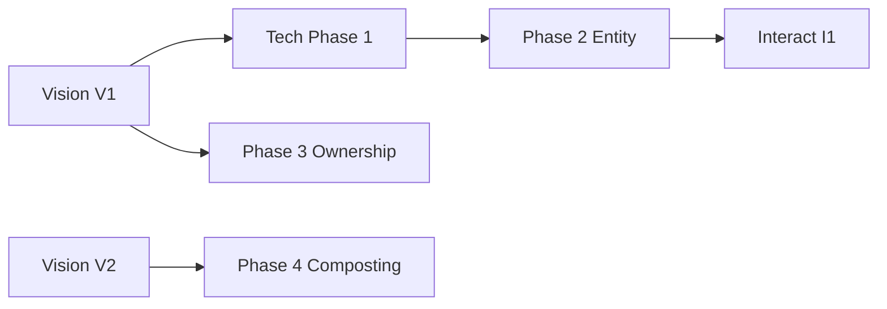

# Piper Morgan Roadmap v12.2
**Date**: 2025-11-29
**Author**: Chief Architect
**Status**: Active - Dual Track Implementation

---

## Executive Summary

Major update from v12.1: Establishes dual-track implementation with MUX-VISION (conceptual) and MUX-TECH (technical) running in parallel with defined convergence points. First pilot of coordination queue successful. GitHub issues #432-436 created for technical implementation.

**Key Changes from v12.1**:
- Added MUX-TECH epic with 4 implementation phases (60 hours total)
- Established convergence points between vision and technical tracks
- Coordination queue operational with successful pilot
- GitHub-coordination pool alignment documented

---

## Dual Track Visualization

```
Week 1 (Dec 2-6)          Week 2 (Dec 9-13)         Week 3 (Dec 16-20)
┌──────────────────┐      ┌──────────────────┐      ┌──────────────────┐
│   MUX-VISION V1  │      │   MUX-VISION V2  │      │  MUX-INTERACT I1 │
│   (32 hours)     │      │   (52 hours)     │      │   (48 hours)     │
├──────────────────┤      ├──────────────────┤      ├──────────────────┤
│ • OBJECT-MODEL   │──────>• FEATURE-MAP    │      │ • CANONICAL      │
│ • GRAMMAR-CORE   │      │ • STANDUP-EXTRACT│      │ • RECOGNITION    │
│ • CONSCIOUSNESS  │──┐   │ • LIFECYCLE-SPEC │──┐   │ • INTENT-BRIDGE  │
│ • METAPHORS      │  │   │ • LEARNING-UX    │  │   │                  │
└──────────────────┘  │   └──────────────────┘  │   └──────────────────┘
                      │                          │
                      ▼                          ▼
              ┌──────────────────┐      ┌──────────────────┐
              │   MUX-TECH X1    │      │   MUX-TECH X2    │
              │   (24 hours)     │      │   (36 hours)     │
              ├──────────────────┤      ├──────────────────┤
              │ • PHASE1-GRAMMAR │──────>• PHASE2-ENTITY   │
              │   (#433, 16h)    │      │   (#434, 24h)    │
              │ • PHASE3-OWNERSHIP│      │ • PHASE4-COMPOST │
              │   (#435, 8h)     │      │   (#436, 12h)    │
              └──────────────────┘      └──────────────────┘

CONVERGENCE POINTS: V1→X1, V2→X2, LEARNING-UX→PHASE4
```

---

## Sprint Organization

### COMPLETED Sprints ✅
- Sprint S1: Security Foundation (Nov 22-23)
- Sprint A9: Final Alpha Prep (Nov 23)
- Alpha v0.8.1 deployed, Michelle testing

### ACTIVE Work (Nov 29)
- ✅ Coordination queue established
- ✅ First pilot successful (audit completed)
- ✅ MUX-TECH issues created (#432-436)
- ✅ Roadmap v12.2 created

---

## MUX Super-Epic Structure

### MUX-VISION: Conceptual Architecture
**Purpose**: Define consciousness model and patterns
**Status**: Ready to begin Dec 2

#### Sprint V1: Formalization (Dec 2-6)
- VISION-OBJECT-MODEL (8h) - ADR-045 formalization
- VISION-GRAMMAR-CORE (12h) - "Entities experience Moments in Places"
- VISION-CONSCIOUSNESS (8h) - Extract from Morning Standup
- VISION-METAPHORS (4h) - Native/Federated/Synthetic

#### Sprint V2: Integration (Dec 9-13)
- VISION-FEATURE-MAP (12h) - Map features to model
- VISION-STANDUP-EXTRACT (16h) - Pattern extraction
- VISION-LIFECYCLE-SPEC (8h) - 8-stage with composting
- MUX-VISION-LEARNING-UX (16h) - Complete learning system

### MUX-TECH: Technical Implementation
**Purpose**: Implement consciousness-aware models
**Status**: Begins after V1 completes
**GitHub Issues**: #433-436

#### Sprint X1: Core Models (Dec 9-13)
**Dependencies**: V1 must complete first
- MUX-TECH-PHASE1-GRAMMAR (#433, 16h)
  - Moment, Situation models
  - 8-stage LifecycleStage enum
  - Links to VISION-OBJECT-MODEL
- MUX-TECH-PHASE3-OWNERSHIP (#435, 8h)
  - Native/Federated/Synthetic types
  - Can start after VISION-METAPHORS
  - Independent of PHASE1

#### Sprint X2: Entity & Learning (Dec 16-20)
**Dependencies**: PHASE1 complete, V2 complete
- MUX-TECH-PHASE2-ENTITY (#434, 24h)
  - PiperEntity model
  - Consciousness attributes
  - Requires PHASE1 models
- MUX-TECH-PHASE4-COMPOSTING (#436, 12h)
  - Learning pipeline
  - Connects to MUX-VISION-LEARNING-UX
  - Needs PHASE1 lifecycle

### MUX-INTERACT: Interaction Design
**Starts**: Dec 16 (overlaps with X2)
- Recognition patterns, trust gradient, spatial navigation

### MUX-IMPLEMENT: UI Polish
**Starts**: Jan 13
- Navigation crisis, document management, cross-channel unity

---

## Coordination Mechanisms

### GitHub ↔ Coordination Pool Alignment

**Pattern for Breaking Down Large Issues**:
```yaml
GitHub Issue: #433 (MUX-TECH-PHASE1-GRAMMAR)
Coordination Prompts:
  - 001-implement-moment-model.md (4h)
  - 002-implement-situation-model.md (4h)
  - 003-implement-lifecycle-enum.md (4h)
  - 004-integrate-with-existing.md (4h)
```

**Documentation Requirements per Issue**:
- Update domain-models.md with changes
- Update architecture.md if structure changes
- Update dependency diagrams if needed
- Update ADRs for decision evolution

### Convergence Points

1. **V1 → X1**: Vision defines, Tech implements
2. **V2 → X2**: Integration patterns inform entity work
3. **LEARNING-UX → PHASE4**: UX design guides pipeline
4. **X1 + X2 → I1**: Models enable interaction patterns

---

## Critical Path & Dependencies



**Must Complete in Order**:
1. VISION-OBJECT-MODEL → PHASE1-GRAMMAR
2. PHASE1-GRAMMAR → PHASE2-ENTITY
3. VISION-LEARNING-UX → PHASE4-COMPOSTING

**Can Parallelize**:
- PHASE3-OWNERSHIP (after VISION-METAPHORS)
- MUX-INTERACT (after core models exist)

---

## Resource Allocation

### Model Strategy (Updated)
- **Vision Work**: Opus 4.5 (conceptual depth)
- **Technical Implementation**: Sonnet 4.5 via coordination queue
- **Simple Tasks**: Haiku 4.5 sub-agents
- **Validation**: Cursor Agent with Sonnet 4.5

### Coordination Queue Usage
- Large issues broken into 2-8 hour prompts
- Agents claim work autonomously
- PM reviews completed work async
- Documentation updates with code

---

## Success Metrics

### December 2025
- [ ] V1 Vision sprint complete (32h)
- [ ] X1 Core models implemented (24h)
- [ ] Morning Standup uses new models
- [ ] Coordination queue processing 5+ prompts/week

### January 2026
- [ ] Entity consciousness visible in code
- [ ] Learning pipeline operational
- [ ] Recognition patterns designed
- [ ] Trust gradient implemented

### February 2026
- [ ] 75% features use consciousness models
- [ ] Navigation crisis resolved
- [ ] v1.0 launch ready

---

## Risk Mitigation

### Technical Risks
- **Model complexity**: Start with Moment, validate, then expand
- **Breaking changes**: Feature flags for new models
- **Performance**: Profile consciousness overhead

### Process Risks
- **Coordination overhead**: Queue reduces sync needs
- **Documentation drift**: Updates required per issue
- **Vision-tech mismatch**: Convergence checkpoints

---

## Next Actions

### This Week (Nov 29-Dec 1)
- ✅ Set up coordination queue
- ✅ Create MUX-TECH issues
- ✅ Update roadmap to v12.2
- ⏱️ Complete second pilot test
- ⏱️ Brief team on dual-track approach

### Next Week (Dec 2-8)
- 🔲 Execute Vision Sprint V1
- 🔲 Prepare Tech Sprint X1 prompts
- 🔲 Continue alpha testing
- 🔲 First convergence checkpoint

---

## Change Log

### v12.2 (Nov 29, 2025, 4:45 PM)
- Added MUX-TECH epic with 4 phases
- Established dual-track visualization
- Documented convergence points
- Added GitHub-coordination alignment
- Successful first pilot noted

### v12.1 (Nov 29, 2025, 11:40 AM)
- Integrated MUX-VISION-LEARNING-UX
- Added "Filing dreams" metaphor
- Two-layer journal architecture

### v12.0 (Nov 28, 2025)
- Initial UX 2.0 integration
- Discovered core grammar

---

## Notes

**Inchworm Principle**: Each phase completes 100% before next begins. Convergence points allow validation without blocking parallel work.

**Morning Standup**: Remains our North Star example of consciousness working despite model limitations.

**Coordination Queue**: Enables async work distribution, reducing real-time coordination needs.

---

*Roadmap v12.2 - Dual tracks converging toward consciousness*
