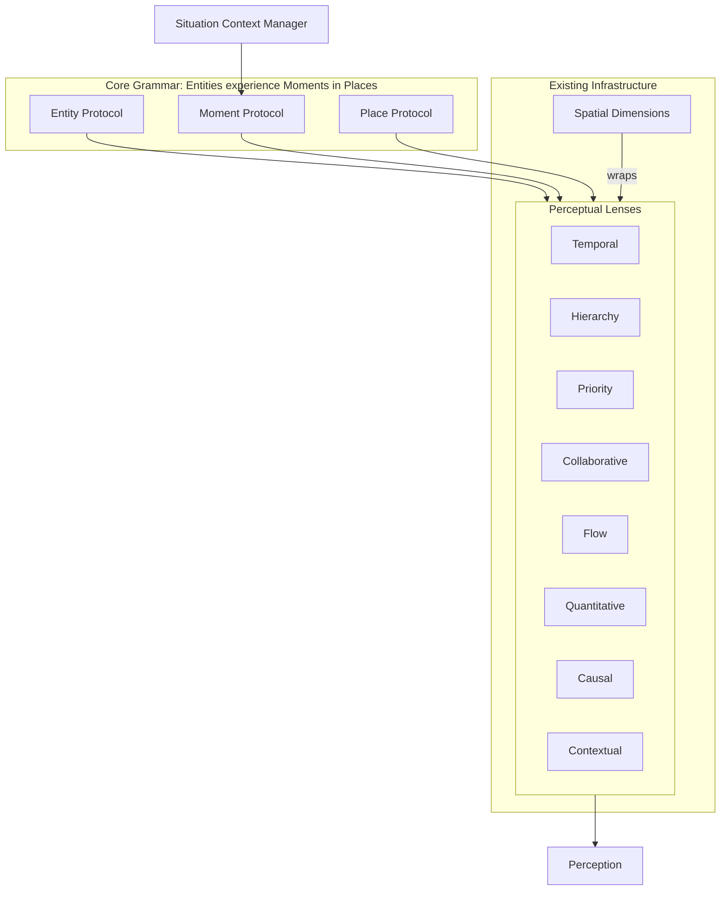

# Gameplan: MUX-399-P1 Core Grammar & Lens Infrastructure

**GitHub Issue**: #613
**Parent Epic**: #399 MUX-VISION-OBJECT-MODEL
**Type**: Implementation
**Estimated Effort**: Large (10-12 hours)
**Created**: 2026-01-19
**Depends On**: #612 (P0 Investigation) - COMPLETE

---

## Phase -1: Infrastructure Verification Checkpoint

### Part A: Lead Developer's Current Understanding

**Infrastructure Status** (verified in P0):
- [x] Spatial infrastructure: Methods in `self.dimensions` dict, NOT separate classes
- [x] Notion pattern: `services/intelligence/spatial/notion_spatial.py`
- [x] GitHub pattern: `services/integrations/spatial/github_spatial.py`
- [x] Slack pattern: Granular `spatial_*.py` types
- [x] Morning Standup: Reference implementation at `services/features/morning_standup.py`
- [x] ADR-045: ACCEPTED (Nov 28, 2025)
- [x] ADR-055: Next available number for implementation spec

**Key P0 Findings Informing This Work**:
1. Lenses must be CREATED, not wrapped (no dimension classes exist)
2. Use Option B (Direct Integration) - Lenses call `integration.dimensions["TEMPORAL"](target)`
3. Morning Standup shows 6 consciousness patterns to preserve
4. B1 FTUX specs already use implicit grammar - make it explicit

**My understanding of the task**:
- Create foundational grammar abstractions (Protocols, Situation, Lenses)
- Build infrastructure that future MUX phases depend on
- TDD approach - tests first
- "Experience framing" not just data transformation

### Part A.2: Work Characteristics Assessment

**Worktree Candidate?**

Worktrees ADD value when:
- [x] Task duration >30 minutes (main branch may advance) ← YES, ~10 hours
- [x] Exploratory/risky changes where easy rollback is valuable ← YES, new module
- [ ] Multiple agents will work in parallel on different files/features

Worktrees ADD overhead when:
- [ ] Single agent, sequential work
- [ ] Small fixes (<15 min)
- [ ] Tightly coupled files requiring atomic commits
- [ ] Time-critical work

**Assessment:**
- [x] **USE WORKTREE** - Long implementation, benefits from isolation

### Part B: PM Verification Required

**PM, please confirm**:

1. **Location for new code**: `services/mux/` (new module)
   - Alternative: `services/domain/mux/` or `services/intelligence/mux/`

2. **Testing approach**: TDD with pytest
   - Tests in `tests/unit/services/mux/`

3. **Worktree**: Should I create a worktree for P1?

### Part C: Proceed/Revise Decision

- [ ] **PROCEED** - Understanding is correct
- [ ] **REVISE** - Need different approach
- [ ] **CLARIFY** - Need more context

---

## Phase 0: GitHub Orientation & Setup

### Required Actions

1. **Verify GitHub issue exists**
   ```bash
   gh issue view 613
   ```

2. **Create worktree** (if approved)
   ```bash
   git worktree add ../piper-mux-p1 -b mux/p1-core-grammar
   cd ../piper-mux-p1
   ```

3. **Create module structure**
   ```bash
   mkdir -p services/mux/lenses
   touch services/mux/__init__.py
   touch services/mux/protocols.py
   touch services/mux/situation.py
   touch services/mux/perception.py
   touch services/mux/lenses/__init__.py

   mkdir -p tests/unit/services/mux/lenses
   touch tests/unit/services/mux/__init__.py
   touch tests/unit/services/mux/conftest.py
   ```

4. **Create session log**
   ```bash
   # File: dev/2026/01/19/2026-01-19-HHMM-p1-code-log.md
   ```

---

## Phase 0.5-0.8: NOT APPLICABLE

These phases (Frontend-Backend Contract, Data Flow, Conversation Design, Post-Completion) are for UI/integration work. P1 is pure backend infrastructure.

---

## Phase 1: Protocol Definitions (2 hours)

### Objective
Define the three substrate Protocols with `@runtime_checkable` for role fluidity.

### TDD Sequence

**Step 1.1: Write Protocol tests first**
```python
# tests/unit/services/mux/test_protocols.py
from typing import runtime_checkable

def test_entity_protocol_checkable():
    """EntityProtocol can be used with isinstance()"""

def test_moment_protocol_checkable():
    """MomentProtocol can be used with isinstance()"""

def test_place_protocol_checkable():
    """PlaceProtocol can be used with isinstance()"""

def test_role_fluidity():
    """Same object can satisfy Entity and Place protocols"""

def test_experiences_method():
    """EntityProtocol requires experiences() method"""

def test_captures_method():
    """MomentProtocol requires captures() method"""

def test_contains_method():
    """PlaceProtocol requires contains() method"""
```

**Step 1.2: Implement Protocols**
```python
# services/mux/protocols.py
from typing import Protocol, runtime_checkable, Any, List
from datetime import datetime

@runtime_checkable
class EntityProtocol(Protocol):
    """Any actor with identity and agency."""
    id: str

    def experiences(self, moment: 'MomentProtocol') -> 'Perception':
        """Entity experiences a Moment, returning a Perception."""
        ...

@runtime_checkable
class MomentProtocol(Protocol):
    """Bounded significant occurrence with theatrical unities."""
    id: str
    timestamp: datetime

    def captures(self) -> dict:
        """Return what this Moment captures (policy, process, people, outcomes)."""
        ...

@runtime_checkable
class PlaceProtocol(Protocol):
    """Context where action happens."""
    id: str
    atmosphere: str  # warm, formal, urgent, etc.

    def contains(self) -> List[Any]:
        """Return entities/moments contained in this Place."""
        ...
```

**Step 1.3: Run tests, verify passing**

### Deliverables
- `services/mux/protocols.py`
- `tests/unit/services/mux/test_protocols.py`

### Evidence Required
- Test output showing all protocol tests passing
- Example of role fluidity working

---

## Phase 2: Situation Context Manager (2 hours)

### Objective
Implement Situation as async context manager (frame, not substrate).

### TDD Sequence

**Step 2.1: Write Situation tests first**
```python
# tests/unit/services/mux/test_situation.py
import pytest

@pytest.mark.asyncio
async def test_situation_is_async_context_manager():
    """Situation can be used with async with"""

@pytest.mark.asyncio
async def test_situation_captures_moments():
    """Moments added during situation are captured"""

@pytest.mark.asyncio
async def test_situation_has_dramatic_tension():
    """Situation carries tension description"""

@pytest.mark.asyncio
async def test_situation_extracts_learning_on_exit():
    """Exiting situation produces learning (goals vs outcomes)"""
```

**Step 2.2: Implement Situation**
```python
# services/mux/situation.py
from dataclasses import dataclass, field
from typing import List, Optional
from datetime import datetime

@dataclass
class SituationLearning:
    """What was learned when situation closed."""
    goals: List[str]
    outcomes: List[str]
    delta: str  # The gap/learning

@dataclass
class Situation:
    """
    Frame holding sequences of Moments (not a substrate).
    Use as async context manager.
    """
    description: str
    dramatic_tension: str
    goals: List[str] = field(default_factory=list)
    moments: List['MomentProtocol'] = field(default_factory=list)
    outcomes: List[str] = field(default_factory=list)
    started_at: Optional[datetime] = None
    ended_at: Optional[datetime] = None

    async def __aenter__(self) -> 'Situation':
        self.started_at = datetime.now()
        return self

    async def __aexit__(self, exc_type, exc_val, exc_tb) -> None:
        self.ended_at = datetime.now()
        # Learning extraction happens here

    def add_moment(self, moment: 'MomentProtocol') -> None:
        self.moments.append(moment)

    def extract_learning(self) -> SituationLearning:
        """Extract learning from goals vs outcomes delta."""
        ...
```

**Step 2.3: Run tests, verify passing**

### Deliverables
- `services/mux/situation.py`
- `tests/unit/services/mux/test_situation.py`

### Evidence Required
- Test output showing context manager works
- Example of learning extraction

---

## Phase 3: Lens Infrastructure (5-6 hours)

### Objective
Create lens abstraction layer that calls existing spatial dimension methods.

### Sub-Phase 3.1: Perception and PerceptionMode (30 min)

**Tests first:**
```python
# tests/unit/services/mux/test_perception.py
def test_perception_mode_enum():
    """PerceptionMode has NOTICING, REMEMBERING, ANTICIPATING"""

def test_perception_has_experience_framing():
    """Perception.observation is experience language, not raw data"""

def test_perception_has_confidence():
    """Perception carries confidence level"""
```

**Implementation:**
```python
# services/mux/perception.py
from enum import Enum
from dataclasses import dataclass
from typing import Any, Dict

class PerceptionMode(Enum):
    NOTICING = "noticing"      # Current state
    REMEMBERING = "remembering" # Historical
    ANTICIPATING = "anticipating" # Future

@dataclass
class Perception:
    """Result of perceiving through a lens."""
    lens_name: str
    mode: PerceptionMode
    raw_data: Dict[str, Any]
    observation: str  # Experience-framed (e.g., "I notice three meetings today")
    confidence: float = 1.0
```

### Sub-Phase 3.2: Lens Base Class (30 min)

**Tests first:**
```python
# tests/unit/services/mux/lenses/test_lens_base.py
def test_lens_is_abstract():
    """Lens cannot be instantiated directly"""

def test_lens_requires_perceive_method():
    """Subclasses must implement perceive()"""

def test_lens_has_frame_as_experience():
    """Lens provides _frame_as_experience() helper"""
```

**Implementation:**
```python
# services/mux/lenses/base.py
from abc import ABC, abstractmethod
from typing import Union
from ..protocols import EntityProtocol, MomentProtocol, PlaceProtocol
from ..perception import Perception, PerceptionMode

Target = Union[EntityProtocol, MomentProtocol, PlaceProtocol]

class Lens(ABC):
    """Base class for perceptual lenses."""
    name: str

    @abstractmethod
    async def perceive(
        self,
        target: Target,
        mode: PerceptionMode = PerceptionMode.NOTICING
    ) -> Perception:
        """Apply this lens to perceive a target."""
        ...

    def _frame_as_experience(self, raw_data: dict, mode: PerceptionMode) -> str:
        """Transform raw data into experience language."""
        # Subclasses can override for custom framing
        ...
```

### Sub-Phase 3.3: Individual Lens Implementations (4-5 hours)

For each lens (8 total), follow TDD:

1. **TemporalLens** - When did/will this happen?
2. **HierarchyLens** - What contains/is contained by this?
3. **PriorityLens** - How important/urgent is this?
4. **CollaborativeLens** - Who is involved?
5. **FlowLens** - What state is this in?
6. **QuantitativeLens** - How much/many?
7. **CausalLens** - What caused/will result from this?
8. **ContextualLens** - What surrounds this?

**Example: TemporalLens**

```python
# tests/unit/services/mux/lenses/test_temporal.py
@pytest.mark.asyncio
async def test_temporal_lens_noticing():
    """Temporal lens perceives current temporal context"""

@pytest.mark.asyncio
async def test_temporal_lens_remembering():
    """Temporal lens can recall past temporal context"""

@pytest.mark.asyncio
async def test_temporal_lens_experience_framing():
    """Temporal observations are experience-framed"""
    # "You have 3 meetings today" not "meetings: [...]"
```

```python
# services/mux/lenses/temporal.py
class TemporalLens(Lens):
    """Perceives when things happen, sequences, deadlines."""
    name = "temporal"

    async def perceive(
        self,
        target: Target,
        mode: PerceptionMode = PerceptionMode.NOTICING
    ) -> Perception:
        # Get raw temporal data from appropriate integration
        raw_data = await self._get_temporal_data(target)

        # Frame as experience
        observation = self._frame_as_experience(raw_data, mode)

        return Perception(
            lens_name=self.name,
            mode=mode,
            raw_data=raw_data,
            observation=observation
        )

    def _frame_as_experience(self, raw_data: dict, mode: PerceptionMode) -> str:
        if mode == PerceptionMode.NOTICING:
            # "I notice you have 3 meetings today"
            ...
        elif mode == PerceptionMode.REMEMBERING:
            # "Yesterday had fewer meetings"
            ...
        elif mode == PerceptionMode.ANTICIPATING:
            # "Tomorrow looks busier"
            ...
```

### Sub-Phase 3.4: LensSet for Compound Perception (30 min)

```python
# services/mux/lenses/lens_set.py
class LensSet:
    """Apply multiple lenses for compound perception."""

    def __init__(self, lenses: List[Lens]):
        self.lenses = {lens.name: lens for lens in lenses}

    async def perceive_through(
        self,
        lens_names: List[str],
        target: Target,
        mode: PerceptionMode = PerceptionMode.NOTICING
    ) -> List[Perception]:
        """Apply multiple lenses to build compound perception."""
        perceptions = []
        for name in lens_names:
            if name in self.lenses:
                perception = await self.lenses[name].perceive(target, mode)
                perceptions.append(perception)
        return perceptions

    def synthesize(self, perceptions: List[Perception]) -> str:
        """Combine multiple perceptions into coherent observation."""
        ...
```

### Deliverables
- `services/mux/perception.py`
- `services/mux/lenses/base.py`
- `services/mux/lenses/temporal.py`
- `services/mux/lenses/hierarchy.py`
- `services/mux/lenses/priority.py`
- `services/mux/lenses/collaborative.py`
- `services/mux/lenses/flow.py`
- `services/mux/lenses/quantitative.py`
- `services/mux/lenses/causal.py`
- `services/mux/lenses/contextual.py`
- `services/mux/lenses/lens_set.py`
- `services/mux/lenses/__init__.py`
- Corresponding test files

### Evidence Required
- All 8 lens tests passing
- LensSet compound perception test passing
- Example perception with experience framing

---

## Phase 4: Visual Diagram (30 min)

### Objective
Create mermaid diagram showing the model.



### Deliverables
- Diagram in ADR-055 or `dev/active/mux-grammar-diagram.md`

---

## Phase 5: ADR-055 Draft (1 hour)

### Objective
Document implementation specification building on ADR-045.

### Content
1. Decision: Implementation approach for object model
2. Context: P0 findings, existing infrastructure
3. Protocol definitions
4. Lens architecture
5. Diagram
6. References to ADR-038, ADR-045

### Deliverables
- `docs/internal/architecture/current/adrs/adr-055-object-model-implementation.md` (draft)

---

## Phase Z: Completion & Handoff

### Required Actions

1. **Run full test suite**
   ```bash
   python -m pytest tests/unit/services/mux/ -v
   ```

2. **Verify no regressions**
   ```bash
   python -m pytest tests/ -m smoke
   ```

3. **Update completion matrix in issue #613**

4. **Write experience checkpoint**

5. **Update session log**

### Success Criteria
- [ ] 3 Protocols defined and testable with isinstance()
- [ ] Situation context manager works with async with
- [ ] All 8 lenses implemented with NOTICING mode
- [ ] LensSet compound perception working
- [ ] >50 tests passing
- [ ] 0 regressions
- [ ] ADR-055 draft complete
- [ ] Experience checkpoint written

---

## STOP Conditions

**STOP immediately and escalate if**:
- Protocol pattern doesn't support role fluidity
- Existing spatial infrastructure can't be cleanly called from lenses
- Performance concerns with runtime_checkable (measure first)
- "Flattening" detected (code feels like database schema, not grammar)
- Architectural conflict with existing patterns

**When stopped**: Document the issue, provide options, wait for PM decision.

---

## Multi-Agent Deployment

### Recommendation: Single Agent with TDD

**Rationale**:
- Sequential TDD (test → implement → verify) is inherently single-threaded
- Protocols must exist before Lenses can use them
- Understanding builds progressively

### Optional Parallelization
After Phase 2, could split:
- Agent A: Lenses 1-4 (Temporal, Hierarchy, Priority, Collaborative)
- Agent B: Lenses 5-8 (Flow, Quantitative, Causal, Contextual)

But coordination overhead may not be worth it for 4-5 hours of lens work.

---

## Related Documentation

- Issue spec: `dev/2026/01/19/mux-399-p1-compliant.md`
- P0 findings: `dev/2026/01/19/p0-*.md` (4 documents)
- Parent epic: #399
- Depends on: #612 (P0) - COMPLETE

---

*Gameplan created: 2026-01-19*
*Template version: v9.3*
