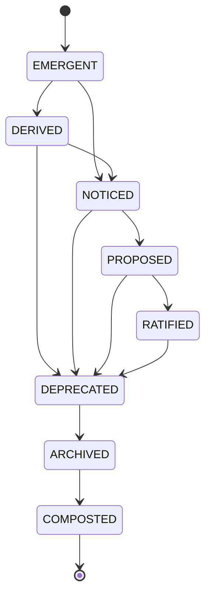

# MUX-399-P3 - Lifecycle State Machine with Composting

**Priority**: P1
**Labels**: `MUX`, `architecture`, `DDD`, `state-machine`
**Milestone**: MUX-V1
**Epic**: #399 MUX-VISION-OBJECT-MODEL
**Related**: ADR-045, ADR-055

---

## Problem Statement

### Current State
Objects in the system have implicit lifecycles but no formal state machine:
- Things are "active" or "deleted" with nothing in between
- No concept of deprecation, archiving, or composting
- Deletion destroys without extracting value
- No lifecycle history tracking

### Impact
- **Blocks**: Proper handling of object retirement with learning extraction
- **User Impact**: Lost institutional knowledge when things are deleted
- **Technical Debt**: Ad-hoc status fields across models with inconsistent semantics

### Strategic Context
"Nothing disappears, it transforms." The shadow side of PM work is ending things - but ending should feed new beginnings. Composting closes the loop: archived knowledge becomes fertilizer for future decisions.

---

## Goal

**Primary Objective**: Implement the 8-stage lifecycle state machine with composting feedback to the learning system.

**Example User Experience**:
```
Before: Task deleted → gone forever
After: Task composted → "What did we learn from this task?" extracted and fed to learning system
```

**Not In Scope** (explicitly):
- ❌ Migrating all existing models to lifecycle (future work)
- ❌ Automatic lifecycle transitions based on rules
- ❌ UI for lifecycle state management
- ❌ Lifecycle-based permissions

---

## What Already Exists

### Infrastructure ✅
- ADR-045: Object Model with lifecycle concepts
- P1 Protocol definitions providing foundation
- Existing learning service for composting integration
- Some models have `status` fields (ad-hoc, inconsistent)

### What's Missing ❌
- `LifecycleState` enum with 8 stages
- `LifecycleManager` with transition rules
- `HasLifecycle` protocol
- Composting integration with learning system
- Transition history tracking

---

## Requirements

### Phase 1: Lifecycle State Definitions
**Objective**: Define the 8-stage lifecycle

**Tasks**:
- [ ] Create `services/mux/lifecycle.py` (or appropriate location)
- [ ] Define `LifecycleState` enum with 8 states:
  ```
  EMERGENT    → Just appearing, not yet fully formed
  DERIVED     → Computed/inferred from other objects
  NOTICED     → Brought to attention, acknowledged
  PROPOSED    → Suggested for action/decision
  RATIFIED    → Accepted, committed, active
  DEPRECATED  → Still valid but being phased out
  ARCHIVED    → Preserved but inactive
  COMPOSTED   → Transformed into learning/knowledge
  ```
- [ ] Document each state with meaning and typical objects
- [ ] Write tests for enum behavior

**Deliverables**:
- `LifecycleState` enum with rich docstrings
- Unit tests for state definitions

### Phase 2: Transition Rules
**Objective**: Define valid state transitions

**Tasks**:
- [ ] Create transition map (which states can follow which)
- [ ] Define `LifecycleTransition` type with:
  - `from_state`
  - `to_state`
  - `timestamp`
  - `reason` (why transition happened)
  - `actor` (who/what triggered it)
- [ ] Implement transition validation
- [ ] Write tests for valid and invalid transitions

**Valid Transitions**:
```
EMERGENT → DERIVED, NOTICED
DERIVED → NOTICED, DEPRECATED
NOTICED → PROPOSED, DEPRECATED
PROPOSED → RATIFIED, DEPRECATED
RATIFIED → DEPRECATED
DEPRECATED → ARCHIVED
ARCHIVED → COMPOSTED
```

**Deliverables**:
- Transition map definition
- `LifecycleTransition` type
- Validation logic with tests

### Phase 3: HasLifecycle Protocol
**Objective**: Create protocol for objects with lifecycle awareness

**Tasks**:
- [ ] Define `HasLifecycle` protocol with:
  - `lifecycle_state` property
  - `lifecycle_history` property (list of transitions)
  - `transition_to(state, reason)` method
- [ ] Make protocol `@runtime_checkable`
- [ ] Write compliance tests

**Deliverables**:
- `HasLifecycle` protocol definition
- Protocol compliance tests

### Phase 4: Lifecycle Manager
**Objective**: Implement central lifecycle management

**Tasks**:
- [ ] Create `LifecycleManager` class
- [ ] Implement `transition(obj, to_state, reason)` method
- [ ] Add validation of transition rules
- [ ] Emit events on transition (for observers)
- [ ] Track history on the object
- [ ] Write comprehensive tests

**Deliverables**:
- `LifecycleManager` implementation
- Event emission for transitions
- Unit tests for all paths

### Phase 5: Composting Integration
**Objective**: Extract learning when objects reach COMPOSTED state

**Tasks**:
- [ ] Define `CompostingExtractor` interface
- [ ] Implement default extractor that:
  - Captures object's key attributes
  - Captures lifecycle history (its journey)
  - Extracts "lessons" (what happened, what was learned)
- [ ] Integrate with existing learning service
- [ ] Write tests for composting extraction

**Deliverables**:
- `CompostingExtractor` interface and default implementation
- Learning service integration
- Composting tests

### Phase Z: Completion & Handoff
- [ ] All acceptance criteria met (checked below)
- [ ] Evidence provided for each criterion
- [ ] All tests passing
- [ ] Documentation updated
- [ ] GitHub issue fully updated
- [ ] Session log completed
- [ ] **Experience Checkpoint**: One paragraph on how lifecycle honors the grammar

---

## Acceptance Criteria

### Functionality
- [ ] `LifecycleState` enum defined with 8 states
- [ ] Each state has meaningful docstring explaining its purpose
- [ ] Valid transition map enforced
- [ ] `HasLifecycle` protocol defined and `@runtime_checkable`
- [ ] `LifecycleManager` validates transitions
- [ ] Transition history tracked on objects
- [ ] COMPOSTED transition extracts learning to learning service
- [ ] Events emitted on transitions

### Testing
- [ ] Unit tests for `LifecycleState` enum
- [ ] Unit tests for transition validation (valid and invalid)
- [ ] Unit tests for `HasLifecycle` protocol compliance
- [ ] Unit tests for `LifecycleManager` operations
- [ ] Unit tests for composting extraction
- [ ] Integration test: Full lifecycle journey from EMERGENT to COMPOSTED

### Quality
- [ ] No regressions in existing functionality
- [ ] Type hints throughout
- [ ] Docstrings with examples and journey metaphors
- [ ] Follows existing code patterns in services/

### Documentation
- [ ] Lifecycle diagram in ADR-055
- [ ] Code documentation complete
- [ ] Experience checkpoint written
- [ ] Session log completed

---

## Completion Matrix

| Component | Status | Evidence Link |
|-----------|--------|---------------|
| LifecycleState enum | ❌ | |
| Transition rules | ❌ | |
| HasLifecycle protocol | ❌ | |
| LifecycleManager | ❌ | |
| Composting integration | ❌ | |
| Experience checkpoint | ❌ | |

---

## Testing Strategy

### Unit Tests
```python
# Enum tests
def test_lifecycle_state_values():
    """Test that all 8 states exist"""

def test_lifecycle_state_ordering():
    """Test that states have expected progression"""

# Transition tests
def test_valid_emergent_transitions():
    """Test EMERGENT can go to DERIVED or NOTICED"""

def test_invalid_emergent_to_composted():
    """Test that EMERGENT cannot skip to COMPOSTED"""

def test_all_paths_to_composted():
    """Test that every state can eventually reach COMPOSTED"""

# Protocol tests
def test_has_lifecycle_protocol_compliance():
    """Test that a class can satisfy HasLifecycle"""

# Manager tests
def test_lifecycle_manager_validates_transition():
    """Test that invalid transitions are rejected"""

def test_lifecycle_manager_tracks_history():
    """Test that transition history is recorded"""

# Composting tests
def test_composting_extracts_learning():
    """Test that COMPOSTED transition extracts knowledge"""

def test_composting_preserves_journey():
    """Test that lifecycle history is captured in composting"""
```

### Integration Tests
```python
async def test_full_lifecycle_journey():
    """
    Verify complete lifecycle from emergence to composting:
    1. Object emerges (EMERGENT)
    2. Gets noticed (NOTICED)
    3. Gets proposed (PROPOSED)
    4. Gets ratified (RATIFIED)
    5. Gets deprecated (DEPRECATED)
    6. Gets archived (ARCHIVED)
    7. Gets composted (COMPOSTED)
    8. Verify learning extracted
    """

async def test_composting_feeds_learning_service():
    """
    Verify that composted objects contribute to learning system
    """
```

### Manual Testing Checklist
**Scenario 1**: Basic Lifecycle
1. [ ] Create object in EMERGENT state
2. [ ] Transition to NOTICED → verify history updated
3. [ ] Attempt invalid transition (NOTICED → COMPOSTED) → verify rejection

**Scenario 2**: Composting
1. [ ] Take object through full lifecycle to COMPOSTED
2. [ ] Verify learning service received extracted knowledge
3. [ ] Verify lifecycle history captured

---

## Success Metrics

### Quantitative
- 8 lifecycle states defined
- Valid transition map with validation
- 1 protocol definition
- 1 manager implementation
- Composting integration working
- >30 tests passing
- 0 regressions

### Qualitative
- States feel like meaningful phases, not arbitrary buckets
- Composting metaphor resonates (death feeds life)
- Transition history tells a story

---

## STOP Conditions

**STOP immediately and escalate if**:
- 8-state model doesn't fit real object lifecycles
- Composting creates data integrity issues
- Learning service integration is blocked
- Transition rules too rigid or too permissive
- Performance concerns with history tracking

**When stopped**: Document the issue, provide options, wait for PM decision.

---

## Effort Estimate

**Overall Size**: Medium

**Breakdown by Phase**:
- Phase 1 (State Definitions): 0.5 hours
- Phase 2 (Transition Rules): 1 hour
- Phase 3 (Protocol): 0.5 hours
- Phase 4 (Manager): 1 hour
- Phase 5 (Composting): 1 hour
- Testing: Included in each phase

**Total**: 4 hours

**Complexity Notes**:
- Composting integration depends on learning service API
- May need to define minimal learning extraction for MVP

---

## Dependencies

### Required (Must be complete first)
- [ ] #[P1-issue-number] - Core Grammar & Lens Infrastructure (Protocols defined)

### Optional (Nice to have)
- Learning service documentation/interface
- P2 Ownership Model (to understand what can have lifecycle)

---

## Related Documentation

- **Architecture**: ADR-045 (lifecycle concepts), ADR-055 (implementation)
- **Methodology**: TDD, DDD
- **Strategic**: PPM memo ("The shadow side of PM work is ending things")
- **Philosophy**: "Nothing disappears, it transforms"

---

## Evidence Section

[To be filled during implementation]

### Implementation Evidence
```bash
[Test output showing all tests passing]
[Commit hashes]
```

### Cross-Validation (if applicable)
**Verified By**: [TBD - separate verification agent]
**Date**:
**Report**:

---

## Completion Checklist

Before requesting PM review:
- [ ] All acceptance criteria met ✅
- [ ] Completion matrix 100% ✅
- [ ] Evidence provided for each criterion ✅
- [ ] Tests passing with output ✅
- [ ] Documentation updated ✅
- [ ] No regressions confirmed ✅
- [ ] STOP conditions all clear ✅
- [ ] Session log complete ✅
- [ ] Cross-validation complete (if multi-agent) ✅

**Status**: Not Started

---

## Notes for Implementation

**From PPM Memo**:
- "The shadow side of PM work is ending things" - honor this
- Composting should feel like respectful closure, not deletion

**From Chief Architect Memo**:
- Lifecycle should compose with Protocols
- Consider event-driven architecture for transition notifications
- Composting loop to learning is architectural requirement

**State Metaphors**:
- EMERGENT: "This is just appearing..."
- DERIVED: "This follows from..."
- NOTICED: "I see this now..."
- PROPOSED: "I suggest we..."
- RATIFIED: "We've committed to..."
- DEPRECATED: "We're moving away from..."
- ARCHIVED: "This is preserved but inactive..."
- COMPOSTED: "This has become learning..."

**Mermaid Diagram for ADR-055**:


---

_Issue created: 2026-01-19_
_Last updated: 2026-01-19_
