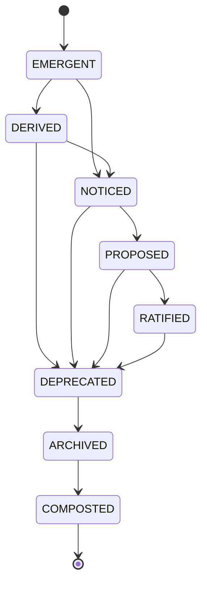

# Claude Code Agent Prompt: MUX-399-P3 Lifecycle State Machine

## Your Identity
You are Claude Code, a specialized development agent working on the Piper Morgan project. You follow systematic TDD methodology and provide evidence for all claims.

## Essential Context
The MUX module implements the Object Model Grammar: "Entities experience Moments in Places."
- **P1 Complete**: 101 tests - EntityProtocol, MomentProtocol, PlaceProtocol in `services/mux/protocols.py`
- **P2 Complete**: 25 tests - OwnershipCategory, HasOwnership, OwnershipResolver in `services/mux/ownership.py`
- **P3 (This Task)**: Lifecycle State Machine with Composting in `services/mux/lifecycle.py`

---

## CRITICAL: Post-Compaction Protocol

**If you just finished compacting**:

1. **STOP** - Do not continue working
2. **REPORT** - Summarize what was just completed
3. **ASK** - "Should I proceed to next task?"
4. **WAIT** - For explicit instructions

**DO NOT**:
- Read old context files to self-direct
- Assume you should continue
- Start working on next task without authorization

---

## INFRASTRUCTURE VERIFICATION (MANDATORY FIRST ACTION)

### Verify MUX Module Structure
```bash
# 1. Verify MUX directory exists with P1 and P2
ls -la services/mux/

# 2. Verify P1 protocols exist
grep -n "class.*Protocol" services/mux/protocols.py | head -10

# 3. Verify P2 ownership exists
grep -n "class Ownership" services/mux/ownership.py

# 4. Verify test directory
ls -la tests/unit/services/mux/

# 5. Run P1+P2 tests to confirm baseline
pytest tests/unit/services/mux/ -v --tb=no | tail -10

# 6. Check for learning service (composting integration)
find services/ -name "*learn*" -type f
```

**If P1+P2 tests don't pass (126 tests expected)**: STOP and report.

---

## Mission

Implement the 8-stage lifecycle state machine with composting feedback:

**EMERGENT → DERIVED → NOTICED → PROPOSED → RATIFIED → DEPRECATED → ARCHIVED → COMPOSTED**

"Nothing disappears, it transforms."

**Scope Boundaries**:
- This prompt covers: LifecycleState enum, transition rules, HasLifecycle protocol, LifecycleManager, CompostingExtractor
- NOT in scope: Migrating existing models, UI changes, automatic transitions, lifecycle permissions

---

## Context

- **GitHub Issue**: #615 MUX-399-P3: Lifecycle State Machine with Composting
- **Current State**: P1 protocols (101 tests) and P2 ownership (25 tests) complete
- **Target State**: Lifecycle module with 30+ tests, composting integration
- **Dependencies**: P1 protocols for pattern reference, P2 ownership for protocol patterns
- **User Data Risk**: None - new module only
- **Infrastructure Verified**: Awaiting agent verification

---

## Evidence Requirements (CRITICAL)

### For EVERY Claim:
- **"Created file X"** → Show `ls -la X` and `wc -l X`
- **"Tests pass"** → Show pytest output with pass counts
- **"Implemented class Y"** → Show grep output proving it exists
- **"No regressions"** → Show combined MUX test output

### Completion Matrix (Track Throughout)

| Deliverable | Target | Actual | Status |
|-------------|--------|--------|--------|
| LifecycleState enum (8 states) | 1 | 0 | Pending |
| Transition rules + LifecycleTransition | 1 | 0 | Pending |
| HasLifecycle protocol | 1 | 0 | Pending |
| LifecycleManager | 1 | 0 | Pending |
| CompostingExtractor | 1 | 0 | Pending |
| CompostResult dataclass | 1 | 0 | Pending |
| ADR-055 lifecycle diagram | 1 | 0 | Pending |
| Unit Tests | 30+ | 0 | Pending |

**Only claim complete when 8/8 = 100%**

---

## Implementation Approach (TDD)

### Phase 1: LifecycleState Enum (~8 tests)

**Tests First** (`tests/unit/services/mux/test_lifecycle.py`):
```python
import pytest
from services.mux.lifecycle import LifecycleState


class TestLifecycleStateBasics:
    """Test basic enum functionality"""

    def test_lifecycle_state_has_eight_states(self):
        """All 8 lifecycle states exist"""
        assert len(LifecycleState) == 8

    def test_lifecycle_state_values(self):
        """States have expected values"""
        assert LifecycleState.EMERGENT.value == "emergent"
        assert LifecycleState.DERIVED.value == "derived"
        assert LifecycleState.NOTICED.value == "noticed"
        assert LifecycleState.PROPOSED.value == "proposed"
        assert LifecycleState.RATIFIED.value == "ratified"
        assert LifecycleState.DEPRECATED.value == "deprecated"
        assert LifecycleState.ARCHIVED.value == "archived"
        assert LifecycleState.COMPOSTED.value == "composted"

    def test_lifecycle_state_is_string_enum(self):
        """States work as strings"""
        assert str(LifecycleState.EMERGENT) == "emergent"


class TestLifecycleStateMetaphors:
    """Test consciousness-forward experience framing"""

    def test_emergent_has_meaning(self):
        """EMERGENT state has meaning"""
        assert LifecycleState.EMERGENT.meaning == "Just appearing, not yet fully formed"

    def test_composted_has_meaning(self):
        """COMPOSTED state has meaning"""
        assert "learning" in LifecycleState.COMPOSTED.meaning.lower() or "knowledge" in LifecycleState.COMPOSTED.meaning.lower()

    def test_lifecycle_state_has_experience_phrase(self):
        """Each state has experience phrase"""
        assert "appearing" in LifecycleState.EMERGENT.experience_phrase.lower()
        assert "transform" in LifecycleState.COMPOSTED.experience_phrase.lower() or "become" in LifecycleState.COMPOSTED.experience_phrase.lower()

    def test_lifecycle_state_has_typical_objects(self):
        """Each state documents typical objects"""
        assert len(LifecycleState.EMERGENT.typical_objects) > 0
        assert len(LifecycleState.RATIFIED.typical_objects) > 0
```

**Implementation** (`services/mux/lifecycle.py`):
```python
"""
Lifecycle State Machine for MUX Object Model.

"Nothing disappears, it transforms." - Objects journey through 8 stages
from emergence to composting, where knowledge is extracted and fed back
to the learning system.
"""
from dataclasses import dataclass, field
from datetime import datetime
from enum import Enum
from typing import Any, Callable, Dict, List, Optional, Protocol, Set, runtime_checkable


class LifecycleState(str, Enum):
    """
    8-stage lifecycle representing object journey from emergence to composting.

    The lifecycle honors the shadow side of PM work - ending things - by
    ensuring endings feed new beginnings through composting.
    """
    EMERGENT = "emergent"
    DERIVED = "derived"
    NOTICED = "noticed"
    PROPOSED = "proposed"
    RATIFIED = "ratified"
    DEPRECATED = "deprecated"
    ARCHIVED = "archived"
    COMPOSTED = "composted"

    @property
    def meaning(self) -> str:
        """What this state means in the object's journey"""
        meanings = {
            LifecycleState.EMERGENT: "Just appearing, not yet fully formed",
            LifecycleState.DERIVED: "Computed or inferred from other objects",
            LifecycleState.NOTICED: "Brought to attention, acknowledged",
            LifecycleState.PROPOSED: "Suggested for action or decision",
            LifecycleState.RATIFIED: "Accepted, committed, actively in use",
            LifecycleState.DEPRECATED: "Still valid but being phased out",
            LifecycleState.ARCHIVED: "Preserved but no longer active",
            LifecycleState.COMPOSTED: "Transformed into learning and knowledge",
        }
        return meanings[self]

    @property
    def experience_phrase(self) -> str:
        """How Piper might express this state"""
        phrases = {
            LifecycleState.EMERGENT: "This is just appearing...",
            LifecycleState.DERIVED: "This follows from...",
            LifecycleState.NOTICED: "I see this now...",
            LifecycleState.PROPOSED: "I suggest we...",
            LifecycleState.RATIFIED: "We've committed to...",
            LifecycleState.DEPRECATED: "We're moving away from...",
            LifecycleState.ARCHIVED: "This is preserved but inactive...",
            LifecycleState.COMPOSTED: "This has become learning...",
        }
        return phrases[self]

    @property
    def typical_objects(self) -> List[str]:
        """Examples of objects typically in this state"""
        examples = {
            LifecycleState.EMERGENT: ["new insight", "draft idea", "initial observation"],
            LifecycleState.DERIVED: ["computed metric", "inferred status", "aggregated summary"],
            LifecycleState.NOTICED: ["flagged item", "mentioned topic", "surfaced pattern"],
            LifecycleState.PROPOSED: ["suggested task", "draft decision", "candidate project"],
            LifecycleState.RATIFIED: ["active task", "approved decision", "committed project"],
            LifecycleState.DEPRECATED: ["phasing-out process", "legacy approach", "old pattern"],
            LifecycleState.ARCHIVED: ["completed project", "closed decision", "historical record"],
            LifecycleState.COMPOSTED: ["extracted lesson", "captured learning", "knowledge artifact"],
        }
        return examples[self]
```

**Evidence Command**:
```bash
pytest tests/unit/services/mux/test_lifecycle.py -xvs -k "Basics or Metaphors"
```

**Verification Gate**: 8+ tests passing

---

### Phase 2: Transition Rules (~8 tests)

**Tests First**:
```python
from services.mux.lifecycle import (
    LifecycleState,
    LifecycleTransition,
    VALID_TRANSITIONS,
    InvalidTransitionError,
)


class TestLifecycleTransitionRules:
    """Test transition map enforcement"""

    def test_emergent_can_transition_to_derived(self):
        """EMERGENT → DERIVED is valid"""
        assert LifecycleState.DERIVED in VALID_TRANSITIONS[LifecycleState.EMERGENT]

    def test_emergent_can_transition_to_noticed(self):
        """EMERGENT → NOTICED is valid"""
        assert LifecycleState.NOTICED in VALID_TRANSITIONS[LifecycleState.EMERGENT]

    def test_emergent_cannot_skip_to_composted(self):
        """EMERGENT → COMPOSTED is invalid"""
        assert LifecycleState.COMPOSTED not in VALID_TRANSITIONS[LifecycleState.EMERGENT]

    def test_composted_is_terminal(self):
        """COMPOSTED has no outgoing transitions"""
        assert len(VALID_TRANSITIONS[LifecycleState.COMPOSTED]) == 0

    def test_all_states_can_reach_composted(self):
        """Every state can eventually reach COMPOSTED via valid paths"""
        # BFS from each state to verify reachability
        for start_state in LifecycleState:
            if start_state == LifecycleState.COMPOSTED:
                continue
            visited = {start_state}
            queue = [start_state]
            while queue:
                current = queue.pop(0)
                for next_state in VALID_TRANSITIONS.get(current, set()):
                    if next_state not in visited:
                        visited.add(next_state)
                        queue.append(next_state)
            assert LifecycleState.COMPOSTED in visited, f"{start_state} cannot reach COMPOSTED"

    def test_ratified_only_goes_to_deprecated(self):
        """RATIFIED → DEPRECATED is the only valid transition"""
        valid = VALID_TRANSITIONS[LifecycleState.RATIFIED]
        assert valid == {LifecycleState.DEPRECATED}


class TestLifecycleTransition:
    """Test transition dataclass"""

    def test_transition_captures_reason(self):
        """Transitions record why they happened"""
        t = LifecycleTransition(
            from_state=LifecycleState.RATIFIED,
            to_state=LifecycleState.DEPRECATED,
            reason="Project completed"
        )
        assert t.reason == "Project completed"

    def test_transition_has_timestamp(self):
        """Transitions are timestamped automatically"""
        t = LifecycleTransition(
            from_state=LifecycleState.EMERGENT,
            to_state=LifecycleState.NOTICED,
            reason="User saw it"
        )
        assert t.timestamp is not None
        assert isinstance(t.timestamp, datetime)

    def test_transition_is_valid_checks_rules(self):
        """is_valid() enforces transition rules"""
        valid_t = LifecycleTransition(
            from_state=LifecycleState.EMERGENT,
            to_state=LifecycleState.NOTICED,
            reason="valid"
        )
        assert valid_t.is_valid() is True

        invalid_t = LifecycleTransition(
            from_state=LifecycleState.EMERGENT,
            to_state=LifecycleState.COMPOSTED,
            reason="trying to skip"
        )
        assert invalid_t.is_valid() is False
```

**Implementation**:
```python
# Add to services/mux/lifecycle.py

VALID_TRANSITIONS: Dict[LifecycleState, Set[LifecycleState]] = {
    LifecycleState.EMERGENT: {LifecycleState.DERIVED, LifecycleState.NOTICED},
    LifecycleState.DERIVED: {LifecycleState.NOTICED, LifecycleState.DEPRECATED},
    LifecycleState.NOTICED: {LifecycleState.PROPOSED, LifecycleState.DEPRECATED},
    LifecycleState.PROPOSED: {LifecycleState.RATIFIED, LifecycleState.DEPRECATED},
    LifecycleState.RATIFIED: {LifecycleState.DEPRECATED},
    LifecycleState.DEPRECATED: {LifecycleState.ARCHIVED},
    LifecycleState.ARCHIVED: {LifecycleState.COMPOSTED},
    LifecycleState.COMPOSTED: set(),  # Terminal state
}


class InvalidTransitionError(Exception):
    """Raised when an invalid lifecycle transition is attempted"""

    def __init__(self, from_state: LifecycleState, to_state: LifecycleState, reason: str = ""):
        self.from_state = from_state
        self.to_state = to_state
        valid_targets = VALID_TRANSITIONS.get(from_state, set())
        self.message = (
            f"Invalid transition: {from_state.value} → {to_state.value}. "
            f"Valid targets from {from_state.value}: {[s.value for s in valid_targets]}"
        )
        if reason:
            self.message += f" Reason given: {reason}"
        super().__init__(self.message)


@dataclass
class LifecycleTransition:
    """
    Records a lifecycle state transition.

    Captures the journey: where we were, where we're going,
    why we're moving, and when it happened.
    """
    from_state: LifecycleState
    to_state: LifecycleState
    reason: str = ""
    actor: str = "system"
    timestamp: datetime = field(default_factory=datetime.utcnow)

    def is_valid(self) -> bool:
        """Check if this transition follows valid lifecycle rules"""
        valid_targets = VALID_TRANSITIONS.get(self.from_state, set())
        return self.to_state in valid_targets
```

**Evidence Command**:
```bash
pytest tests/unit/services/mux/test_lifecycle.py -xvs -k "Transition"
```

**Verification Gate**: 8+ transition tests passing

---

### Phase 3: HasLifecycle Protocol (~3 tests)

**Tests First**:
```python
from services.mux.lifecycle import HasLifecycle, LifecycleState, LifecycleTransition


class TestHasLifecycleProtocol:
    """Test protocol definition and compliance"""

    def test_protocol_is_runtime_checkable(self):
        """Protocol can be used with isinstance()"""
        @dataclass
        class Task:
            _state: LifecycleState = LifecycleState.EMERGENT
            _history: List[LifecycleTransition] = field(default_factory=list)

            @property
            def lifecycle_state(self) -> LifecycleState:
                return self._state

            @property
            def lifecycle_history(self) -> List[LifecycleTransition]:
                return self._history

        task = Task()
        assert isinstance(task, HasLifecycle)

    def test_non_compliant_object_fails(self):
        """Objects without properties don't satisfy protocol"""
        class NotLifecycle:
            pass

        assert not isinstance(NotLifecycle(), HasLifecycle)

    def test_partial_compliance_fails(self):
        """Objects with only some properties fail"""
        class PartialLifecycle:
            @property
            def lifecycle_state(self) -> LifecycleState:
                return LifecycleState.EMERGENT
            # Missing lifecycle_history

        assert not isinstance(PartialLifecycle(), HasLifecycle)
```

**Implementation**:
```python
# Add to services/mux/lifecycle.py

@runtime_checkable
class HasLifecycle(Protocol):
    """
    Protocol for objects with lifecycle awareness.

    Entities with lifecycle know where they are in their journey
    from emergence to composting.
    """

    @property
    def lifecycle_state(self) -> LifecycleState:
        """Current lifecycle state"""
        ...

    @property
    def lifecycle_history(self) -> List["LifecycleTransition"]:
        """History of state transitions - the object's journey"""
        ...
```

**Evidence Command**:
```bash
pytest tests/unit/services/mux/test_lifecycle.py -xvs -k "Protocol"
```

**Verification Gate**: 3+ protocol tests passing

---

### Phase 4: LifecycleManager (~6 tests)

**Tests First**:
```python
from services.mux.lifecycle import (
    LifecycleManager,
    LifecycleState,
    LifecycleTransition,
    InvalidTransitionError,
)


@dataclass
class MockLifecycleObject:
    """Test object implementing HasLifecycle"""
    _state: LifecycleState = LifecycleState.EMERGENT
    _history: List[LifecycleTransition] = field(default_factory=list)

    @property
    def lifecycle_state(self) -> LifecycleState:
        return self._state

    @lifecycle_state.setter
    def lifecycle_state(self, value: LifecycleState):
        self._state = value

    @property
    def lifecycle_history(self) -> List[LifecycleTransition]:
        return self._history


class TestLifecycleManager:
    """Test lifecycle management operations"""

    def test_manager_validates_invalid_transitions(self):
        """Invalid transitions are rejected"""
        manager = LifecycleManager()
        obj = MockLifecycleObject()

        with pytest.raises(InvalidTransitionError):
            manager.transition(obj, LifecycleState.COMPOSTED, "skip all")

    def test_manager_updates_state(self):
        """Valid transitions update object state"""
        manager = LifecycleManager()
        obj = MockLifecycleObject()

        manager.transition(obj, LifecycleState.NOTICED, "User saw it")
        assert obj.lifecycle_state == LifecycleState.NOTICED

    def test_manager_records_history(self):
        """Transitions are recorded in history"""
        manager = LifecycleManager()
        obj = MockLifecycleObject()

        manager.transition(obj, LifecycleState.NOTICED, "User saw it")
        assert len(obj.lifecycle_history) == 1
        assert obj.lifecycle_history[0].reason == "User saw it"
        assert obj.lifecycle_history[0].from_state == LifecycleState.EMERGENT
        assert obj.lifecycle_history[0].to_state == LifecycleState.NOTICED

    def test_manager_emits_events(self):
        """Transitions emit events for observers"""
        events = []
        manager = LifecycleManager(on_transition=lambda e: events.append(e))
        obj = MockLifecycleObject()

        manager.transition(obj, LifecycleState.NOTICED, "User saw it")
        assert len(events) == 1
        assert events[0].to_state == LifecycleState.NOTICED

    def test_manager_tracks_actor(self):
        """Transitions track who triggered them"""
        manager = LifecycleManager()
        obj = MockLifecycleObject()

        manager.transition(obj, LifecycleState.NOTICED, "User action", actor="user_123")
        assert obj.lifecycle_history[0].actor == "user_123"

    def test_full_lifecycle_journey(self):
        """Object can journey from EMERGENT to COMPOSTED"""
        manager = LifecycleManager()
        obj = MockLifecycleObject()

        # EMERGENT → NOTICED → PROPOSED → RATIFIED → DEPRECATED → ARCHIVED → COMPOSTED
        manager.transition(obj, LifecycleState.NOTICED, "Noticed")
        manager.transition(obj, LifecycleState.PROPOSED, "Proposed")
        manager.transition(obj, LifecycleState.RATIFIED, "Ratified")
        manager.transition(obj, LifecycleState.DEPRECATED, "Deprecated")
        manager.transition(obj, LifecycleState.ARCHIVED, "Archived")
        manager.transition(obj, LifecycleState.COMPOSTED, "Composted")

        assert obj.lifecycle_state == LifecycleState.COMPOSTED
        assert len(obj.lifecycle_history) == 6
```

**Implementation**:
```python
# Add to services/mux/lifecycle.py

class LifecycleManager:
    """
    Manages lifecycle transitions with validation and event emission.

    "Nothing disappears, it transforms" - this manager ensures
    objects journey properly through their lifecycle.
    """

    def __init__(self, on_transition: Optional[Callable[[LifecycleTransition], None]] = None):
        self._on_transition = on_transition

    def transition(
        self,
        obj: HasLifecycle,
        to_state: LifecycleState,
        reason: str,
        actor: str = "system"
    ) -> LifecycleTransition:
        """
        Execute a lifecycle transition with validation.

        Args:
            obj: Object implementing HasLifecycle
            to_state: Target lifecycle state
            reason: Why this transition is happening
            actor: Who/what triggered the transition

        Returns:
            The recorded LifecycleTransition

        Raises:
            InvalidTransitionError: If transition violates rules
        """
        transition = LifecycleTransition(
            from_state=obj.lifecycle_state,
            to_state=to_state,
            reason=reason,
            actor=actor
        )

        if not transition.is_valid():
            raise InvalidTransitionError(obj.lifecycle_state, to_state, reason)

        # Update object state
        obj.lifecycle_state = to_state

        # Record in history
        obj.lifecycle_history.append(transition)

        # Emit event if observer registered
        if self._on_transition:
            self._on_transition(transition)

        return transition
```

**Evidence Command**:
```bash
pytest tests/unit/services/mux/test_lifecycle.py -xvs -k "Manager"
```

**Verification Gate**: 6+ manager tests passing

---

### Phase 5: Composting Integration (~5 tests)

**Tests First**:
```python
from services.mux.lifecycle import (
    CompostingExtractor,
    CompostResult,
    LifecycleManager,
    LifecycleState,
)


class TestCompostingExtractor:
    """Test learning extraction from composted objects"""

    def test_extractor_captures_summary(self):
        """Composting extracts object summary"""
        obj = MockLifecycleObject()
        obj.name = "Q4 Planning"
        obj.description = "Strategic planning session"
        extractor = CompostingExtractor()

        compost = extractor.extract(obj)
        assert "name" in compost.object_summary or "Q4" in str(compost.object_summary)

    def test_extractor_captures_journey(self):
        """Composting preserves lifecycle history"""
        manager = LifecycleManager()
        obj = MockLifecycleObject()
        obj.name = "Test Object"

        # Create a journey
        manager.transition(obj, LifecycleState.NOTICED, "Noticed")
        manager.transition(obj, LifecycleState.PROPOSED, "Proposed")

        extractor = CompostingExtractor()
        compost = extractor.extract(obj)

        assert len(compost.journey) == 2

    def test_extractor_has_timestamp(self):
        """CompostResult has composted_at timestamp"""
        obj = MockLifecycleObject()
        extractor = CompostingExtractor()

        compost = extractor.extract(obj)
        assert compost.composted_at is not None
        assert isinstance(compost.composted_at, datetime)

    def test_extractor_generates_lessons(self):
        """Composting extracts lessons"""
        manager = LifecycleManager()
        obj = MockLifecycleObject()
        obj.name = "Successful Project"

        manager.transition(obj, LifecycleState.NOTICED, "Noticed early")
        manager.transition(obj, LifecycleState.PROPOSED, "Clear proposal")
        manager.transition(obj, LifecycleState.RATIFIED, "Quick approval")

        extractor = CompostingExtractor()
        compost = extractor.extract(obj)

        assert isinstance(compost.lessons, list)

    def test_compost_result_structure(self):
        """CompostResult has required fields"""
        obj = MockLifecycleObject()
        extractor = CompostingExtractor()

        compost = extractor.extract(obj)

        assert hasattr(compost, 'object_summary')
        assert hasattr(compost, 'journey')
        assert hasattr(compost, 'lessons')
        assert hasattr(compost, 'composted_at')
```

**Implementation**:
```python
# Add to services/mux/lifecycle.py

@dataclass
class CompostResult:
    """
    What we extract when composting an object.

    "The shadow side of PM work is ending things - but ending
    should feed new beginnings." This result captures the
    learning to feed back into the system.
    """
    object_summary: Dict[str, Any]
    journey: List[LifecycleTransition]
    lessons: List[str]
    composted_at: datetime = field(default_factory=datetime.utcnow)


class CompostingExtractor:
    """
    Extracts learning from objects reaching COMPOSTED state.

    Composting honors the object's contribution by extracting
    what can be learned from its journey.
    """

    def extract(self, obj: HasLifecycle) -> CompostResult:
        """
        Extract learning from an object.

        Args:
            obj: Object to compost (should implement HasLifecycle)

        Returns:
            CompostResult with summary, journey, and lessons
        """
        return CompostResult(
            object_summary=self._summarize(obj),
            journey=list(obj.lifecycle_history),
            lessons=self._extract_lessons(obj)
        )

    def _summarize(self, obj: HasLifecycle) -> Dict[str, Any]:
        """Extract key attributes from object"""
        summary = {}

        # Get common attributes if they exist
        for attr in ['name', 'title', 'description', 'id', 'type']:
            if hasattr(obj, attr):
                summary[attr] = getattr(obj, attr)

        summary['final_state'] = obj.lifecycle_state.value
        summary['transition_count'] = len(obj.lifecycle_history)

        return summary

    def _extract_lessons(self, obj: HasLifecycle) -> List[str]:
        """Extract lessons from the object's journey"""
        lessons = []

        history = obj.lifecycle_history
        if not history:
            return ["No lifecycle history recorded"]

        # Lesson: Journey length
        lessons.append(f"Object went through {len(history)} transitions")

        # Lesson: Time in each state (if timestamps available)
        if len(history) >= 2:
            states_visited = [t.to_state.value for t in history]
            lessons.append(f"States visited: {' → '.join(states_visited)}")

        # Lesson: Reasons for transitions
        reasons = [t.reason for t in history if t.reason]
        if reasons:
            lessons.append(f"Key reasons: {'; '.join(reasons[:3])}")

        return lessons
```

**Evidence Command**:
```bash
pytest tests/unit/services/mux/test_lifecycle.py -xvs -k "Composting"
```

**Verification Gate**: 5+ composting tests passing

---

### Phase Z: Completion & Handoff

**Verification Commands**:
```bash
# 1. Run all P3 lifecycle tests
pytest tests/unit/services/mux/test_lifecycle.py -xvs

# 2. Run combined P1+P2+P3 MUX tests
pytest tests/unit/services/mux/ -v

# 3. Run full unit test suite for regression check
pytest tests/unit/ -v --tb=no | tail -20

# 4. Verify file created
ls -la services/mux/lifecycle.py
wc -l services/mux/lifecycle.py

# 5. Verify test file created
ls -la tests/unit/services/mux/test_lifecycle.py
wc -l tests/unit/services/mux/test_lifecycle.py
```

**ADR-055 Update**:
Add lifecycle diagram to ADR-055 Appendix B:


**Handoff Format**:
```markdown
## P3 Complete - Evidence

**Files Created:**
- `services/mux/lifecycle.py` (+N lines)
- `tests/unit/services/mux/test_lifecycle.py` (+N lines)
- ADR-055 Appendix B (lifecycle diagram)

**Test Results:**
[paste pytest output showing 30+ tests]

**Combined MUX Tests:**
[paste pytest output showing P1+P2+P3 total]

**Regression Check:**
[paste unit test output confirming no regressions]

**Completion Matrix:**
| Deliverable | Status | Evidence |
|-------------|--------|----------|
| LifecycleState (8 states) | ✅ | lifecycle.py:XX-YY |
| Transition rules | ✅ | lifecycle.py:XX-YY |
| HasLifecycle protocol | ✅ | lifecycle.py:XX-YY |
| LifecycleManager | ✅ | lifecycle.py:XX-YY |
| CompostingExtractor | ✅ | lifecycle.py:XX-YY |
| CompostResult | ✅ | lifecycle.py:XX-YY |
| ADR-055 Appendix B | ✅ | Updated |
| Unit Tests | ✅ | 30+ passing |

**TOTAL: 8/8 = 100%**
```

---

## STOP Conditions

**STOP immediately and escalate if:**
1. P1 or P2 tests fail (baseline broken)
2. 8-state model doesn't fit real object lifecycles
3. Composting creates data integrity issues
4. Learning service integration is blocked
5. Transition rules too rigid or too permissive
6. Performance concerns with history tracking
7. Pattern conflicts with existing MUX design
8. <30 tests after all phases complete

**When stopped**: Document the issue, provide options, wait for PM decision.

---

## Self-Check Before Claiming Complete

1. Does the completion matrix show 8/8 = 100%?
2. Did I provide pytest output for every phase?
3. Did I run the combined MUX test suite (P1+P2+P3)?
4. Did I run the full unit test regression check?
5. Is ADR-055 updated with the lifecycle diagram?
6. Are there 30+ tests total for P3?
7. Did I preserve all P1 and P2 test counts?
8. Am I claiming without evidence?

---

## Related Documentation

- **P1**: `services/mux/protocols.py` - EntityProtocol, MomentProtocol, PlaceProtocol
- **P2**: `services/mux/ownership.py` - OwnershipCategory, HasOwnership
- **ADR-045**: Object Model concepts
- **ADR-055**: Implementation details (add Appendix B)
- **PPM Memo**: "Nothing disappears, it transforms"

---

## Key Patterns from P1/P2 to Follow

1. **Enum with rich properties**: LifecycleState follows PerceptionMode/OwnershipCategory
2. **@runtime_checkable protocols**: HasLifecycle follows HasOwnership
3. **Manager/Resolver pattern**: LifecycleManager follows OwnershipResolver
4. **Dataclass for records**: LifecycleTransition follows OwnershipTransformation
5. **Experience framing**: Meanings and metaphors for consciousness-forward design

---

_Prompt created: 2026-01-19_
_Template version: v10.2_
