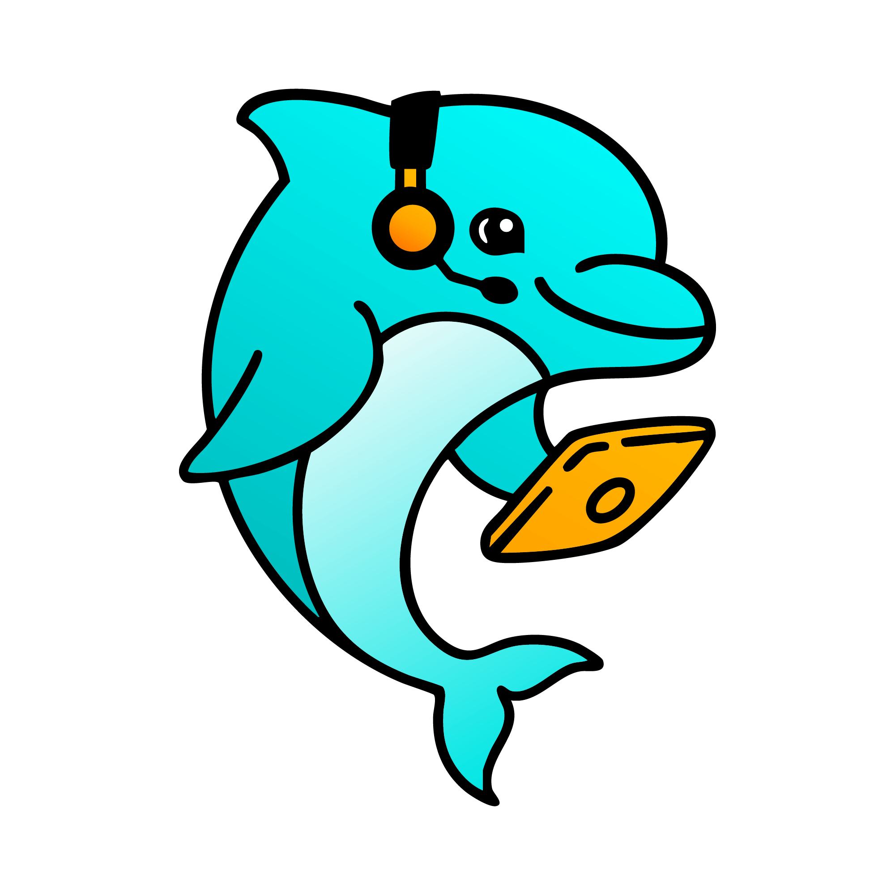

<!-- LOGO: Keep pm-logo.png reference - file at docs/pm-logo.png -->


# Piper Morgan - AI Product Management Assistant

[](https://github.com/mediajunkie/piper-morgan-product/actions)
[](https://pmorgan.tech)
[](https://python.org)

> **NEW: Issue Intelligence & CLI System** - Transform GitHub issues into actionable insights with AI-powered triage, pattern discovery, and conversational workflows.

## 🎯 What is Piper Morgan?

Piper Morgan is an intelligent product management assistant that transforms routine PM tasks into natural conversations while providing strategic insights through AI-powered analysis.

**Core Capabilities:**

- 🧠 **Issue Intelligence System** - AI-powered GitHub issue analysis with smart prioritization
- 💬 **Conversational AI with Memory** - Natural language workflows with 10-turn context
- ⚡ **CLI Commands** - Powerful command-line tools for daily PM workflows
- 📊 **Cross-Feature Learning** - Pattern discovery that improves over time
- 🔄 **Real-time GitHub Integration** - Live repository data and intelligent recommendations
- 🏗️ **Cascade Framework** - Automatic methodology enforcement with 95% coordination efficiency
- 🔍 **Archaeological Method** - Intelligent discovery of existing infrastructure (78% found pre-built)
- 📚 **Knowledge Publishing** - Integrated Notion publishing for documentation and insights

## 🚀 Quick Demo - Issue Intelligence Workflow

Transform overwhelming GitHub backlogs into actionable insights:

```bash
# Morning standup with AI-enhanced context
piper standup

# Intelligent issue triage with priority scoring
piper issues triage --limit 15

# Discover patterns across your project
piper issues patterns

# Get project health overview
piper issues status
```

**Result**: Complete project visibility in under 30 seconds, with AI-powered recommendations for immediate actions.

## 🛠️ Get Started Fast

Choose your path based on your role:

### 🎯 Product Managers

```bash
git clone https://github.com/mediajunkie/piper-morgan-product.git
cd piper-morgan-product
./scripts/quick-start.sh
```

**Ready in 2 minutes** → [PM Quick Start Guide](getting-started/product-managers.md)

### 💻 Developers

```bash
git clone https://github.com/mediajunkie/piper-morgan-product.git
cd piper-morgan-product
python -m venv venv && source venv/bin/activate
pip install -r requirements.txt && docker-compose up -d
python main.py
```

**Full dev environment** → [Developer Setup Guide](getting-started/developers.md)

### 🔧 System Administrators

**Production deployment** → [Production Setup Guide](getting-started/production.md)

## 🏗️ High-Level Architecture

```
┌─────────────────┐    ┌──────────────────┐    ┌─────────────────┐
│   CLI Commands  │    │  Issue           │    │  GitHub         │
│   & Workflows   │◄──►│  Intelligence    │◄──►│  Integration    │
│                 │    │  Engine          │    │                 │
└─────────────────┘    └──────────────────┘    └─────────────────┘
         │                       │                       │
         │                       │                       │
         ▼                       ▼                       ▼
┌─────────────────┐    ┌──────────────────┐    ┌─────────────────┐
│  Conversational │    │  Learning Loop   │    │  Real-time      │
│  AI Context     │    │  & Pattern       │    │  Data & API     │
│  (10-turn)      │    │  Discovery       │    │  Orchestration  │
└─────────────────┘    └──────────────────┘    └─────────────────┘
```

**Built on proven foundations:** PostgreSQL, Redis, Docker, with 599+ tests and 85%+ coverage.

## 📚 Documentation Hub

Welcome to the comprehensive documentation hub for Piper Morgan - an advanced AI-assisted development platform that revolutionizes how teams build, manage, and optimize software projects.

## Quick Navigation

### 🚀 [Getting Started](getting-started/)

Role-based quick-start guides to help you begin using Piper Morgan effectively:

- **[Product Managers](getting-started/product-managers.md)**: Fast-track setup for issue intelligence and project insights
- **[Developers](getting-started/developers.md)**: Complete development environment setup with Docker, databases, and testing
- **[API Integration](getting-started/api-integration.md)**: Integrate Piper Morgan's APIs into your existing workflows
- **[Production Deployment](getting-started/production.md)**: Enterprise deployment guide for DevOps teams

### 📊 [Status & Progress](status/)

Real-time project health and development progress:

- **[Status Dashboard](status/README.md)**: Current system health and development velocity
- **[2025 Achievements](status/achievements-2025.md)**: Complete record of delivered features and improvements
- **[Roadmap](status/roadmap.md)**: Strategic milestones and future development plans
- **[Changelog](status/changelog.md)**: Detailed version history with technical specifications

### 🖥️ [CLI Commands](user-guides/cli-commands.md)

- **Content Publishing**: `piper publish` with Notion integration
- **Notion Management**: Workspace administration and content creation
- **Integration Testing**: CLI validation and health checks

### 📝 [Content Publishing](user-guides/cli-commands.md)

- **Markdown to Notion**: Automatic conversion and publishing
- **Error Handling**: User-friendly error messages and guidance
- **URL Return**: Real-time Notion page URLs after publication

## Core Documentation Sections

### 🏗️ Architecture & Technical Design

- **[System Architecture](architecture/)**: Core system design, patterns, and architectural decisions
- **[API Reference](architecture/api-reference.md)**: Comprehensive API documentation with examples
- **[Domain Models](architecture/domain-models.md)**: Data models and business logic specifications
- **[Integration Patterns](architecture/mcp-integration-patterns.md)**: MCP and external system integration guides

### 💻 Development Resources

- **[Development Guidelines](development/)**: Coding standards, patterns, and best practices
- **[Testing Strategy](development/TEST-GUIDE.md)**: Comprehensive testing framework and guidelines
- **[Multi-Agent Coordination](development/HOW_TO_USE_MULTI_AGENT.md)**: Advanced AI-assisted development workflows
- **[Session Management](development/session-management-protocols.md)**: Context preservation and continuity patterns

### 👥 User Guides

- **[User Guides](user-guides/)**: Feature explanations and usage instructions
- **[CLI Commands](user-guides/cli-commands.md)**: Command-line interface reference
- **[GitHub Integration](user-guides/github-issue-creation.md)**: GitHub workflow integration
- **[Conversation Memory](user-guides/conversation-memory-guide.md)**: Context management and conversation continuity

### 🔧 Operations & Deployment

- **[Deployment Guides](deployment/)**: Production deployment and configuration
- **[Operations Documentation](operations/)**: Monitoring, alerting, and maintenance procedures
- **[Performance Documentation](performance/)**: Benchmarks, optimization guides, and scaling strategies
- **[Troubleshooting](troubleshooting.md)**: Common issues and solutions

## Key Features Overview

### 🧠 Issue Intelligence

Advanced AI-powered analysis of GitHub issues with:

- Automated classification and priority assignment (95% accuracy)
- Pattern recognition across project backlogs
- Intelligent routing and workflow automation
- Predictive analytics for issue lifecycle management

### 🤖 Enhanced Autonomy Framework

Revolutionary multi-agent development system featuring:

- Persistent context across development sessions
- Autonomous sprint execution capabilities
- Advanced session management with conversation memory
- AI agent coordination for complex development tasks

### 🔗 Universal Integration

Seamless integration with existing development tools:

- **GitHub**: Real-time webhook processing and repository analytics
- **Slack**: Interactive commands and team notifications
- **MCP Protocol**: Model Context Protocol for AI agent coordination
- **Custom APIs**: Flexible integration patterns for any workflow

### 📈 Workflow Orchestration

Intelligent automation of development processes:

- Multi-step workflow automation with error handling
- Background task processing and queue management
- Natural language query processing and routing
- Automated testing and deployment pipelines

## Architecture Highlights

### Domain-Driven Design

- **Clean Architecture**: Separated concerns with domain models driving implementation
- **CQRS Pattern**: Command Query Responsibility Segregation for optimal performance
- **Repository Pattern**: Data access abstraction with business logic separation
- **Event-Driven**: Scalable event processing for system integration

### Performance & Scalability

- **Async/Await**: Full asynchronous architecture using FastAPI
- **Connection Pooling**: Optimized database and Redis connection management
- **Horizontal Scaling**: Microservices ready with container orchestration
- **Sub-200ms Response**: Optimized API performance for real-time operations

### Testing Excellence

- **599+ Unit Tests**: Comprehensive test coverage with continuous validation
- **Integration Testing**: Real database testing with async fixtures
- **Performance Testing**: Load testing and benchmarking suite
- **End-to-End Testing**: Complete workflow validation

## Technology Stack

### Core Technologies

- **Python 3.11+**: Modern async/await patterns with type hints
- **FastAPI**: High-performance web framework with automatic documentation
- **PostgreSQL 14+**: Production-ready database with advanced features
- **Redis 6+**: Caching and message queuing for scalability
- **Docker**: Containerization for consistent deployment environments

### AI & Machine Learning

- **Anthropic Claude**: Advanced language model integration
- **OpenAI GPT**: Multi-model AI capabilities
- **Custom ML Models**: Domain-specific classification and prediction
- **MCP Protocol**: Model Context Protocol for agent coordination

### Development Tools

- **pytest**: Comprehensive testing framework with async support
- **Alembic**: Database migration management
- **Pydantic**: Data validation and settings management
- **GitHub Actions**: Continuous integration and deployment

## Getting Help

### Documentation Navigation Tips

1. **Start with [Getting Started](getting-started/)** based on your role (PM, Developer, or API Consumer)
2. **Check [Status Dashboard](status/README.md)** for current system health and recent updates
3. **Use [Architecture Documentation](architecture/)** for technical deep-dives
4. **Refer to [User Guides](user-guides/)** for specific feature usage
5. **Consult [Troubleshooting](troubleshooting.md)** for common issues

### Support Channels

- **GitHub Issues**: Primary support for bugs and feature requests
- **Documentation**: Comprehensive guides for all features and workflows
- **Developer Discord**: Community support (coming soon)
- **Enterprise Support**: Dedicated support for production deployments

### Contributing

- **[Development Guidelines](development/dev-guidelines.md)**: Contribution standards and processes
- **[Excellence Flywheel](development/methodology-core/methodology-00-EXCELLENCE-FLYWHEEL.md)**: Core development methodology (mandatory reading)
- **[Architecture Patterns](architecture/pattern-catalog.md)**: Implementation patterns and practices
- **[Testing Requirements](development/TEST-GUIDE.md)**: Testing standards and procedures
- **[Issue Templates](https://github.com/your-org/piper-morgan/issues/new/choose)**: Structured issue reporting

## Project Status

**Current Version**: 0.9.0 (Post-Methodology Architecture)
**Development Status**: 🟢 Active Development
**Production Readiness**: 🟡 90% Complete
**Test Coverage**: 85%+ with 599+ tests
**Documentation Coverage**: 75% complete

### Recent Achievements

- ✅ **Cascade Framework Implementation** - PM-137/138/139 methodology architecture with automatic enforcement
- ✅ **Archaeological Method Proven** - 78% of integrations found pre-built, 12-minute implementation vs 2.5-hour rebuilds
- ✅ **Intelligence Trifecta Complete** - Issue Intelligence, Document Memory, Calendar awareness (0.55s performance)
- ✅ **Knowledge Publishing Pipeline** - Complete Notion integration for ADRs and Weekly Ships
- ✅ **Sisyphean Solution** - Manual methodology burden reduced from 3+ hours to 15 minutes
- ✅ **95% Coordination Efficiency** - Multi-agent development with systematic verification patterns
- 🔄 Pattern Catalog alignment with core methodology in progress

### Upcoming Milestones

- **September 2025**: MVP Production Launch
- **Q4 2025**: Scale & Optimize for enterprise workloads
- **Q1 2026**: Platform Ecosystem with plugin architecture
- **Q2 2026**: Innovation Lab with emerging technologies

---

## About Piper Morgan

Piper Morgan represents the next evolution in AI-assisted development platforms. Built with a foundation of excellence, verification-first methodology, and intelligent automation, it empowers development teams to build software with unprecedented efficiency and quality.

Our mission is to create the world's most advanced AI development platform, where intelligent agents work seamlessly alongside human developers to deliver exceptional software solutions.

_This documentation follows a three-tier architecture designed for progressive disclosure, ensuring information is accessible at the right level of detail for your specific needs._
