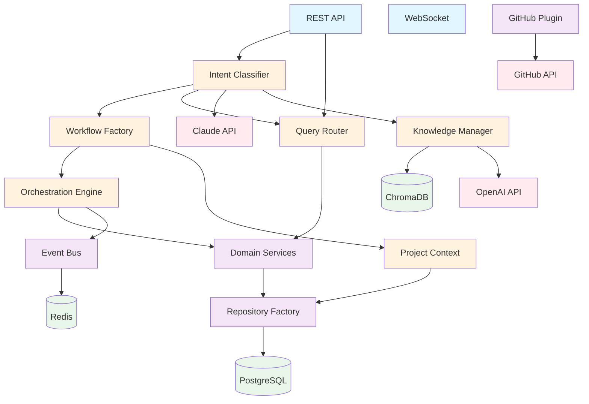

# Piper Morgan 1.0 - Dependency and Layer Diagrams

## Overview

This document provides visual representations of Piper Morgan's architecture through various diagrams showing layers, dependencies, data flow, and component interactions. These diagrams serve as reference materials for understanding system structure and enforcing architectural boundaries.

## 1. High-Level Layer Architecture

```
┌─────────────────────────────────────────────────────────────────────────┐
│                          PRESENTATION LAYER                             │
│  ┌─────────────┐  ┌──────────────┐  ┌─────────────┐  ┌──────────────┐ │
│  │  Web Chat   │  │   REST API   │  │  WebSocket  │  │ Admin Panel  │ │
│  │   (Future)  │  │  (FastAPI)   │  │   (Events)  │  │  (Future)    │ │
│  └─────────────┘  └──────────────┘  └─────────────┘  └──────────────┘ │
└─────────────────────────────────────────────────────────────────────────┘
                                    ▼
┌─────────────────────────────────────────────────────────────────────────┐
│                         APPLICATION LAYER                               │
│  ┌─────────────┐  ┌──────────────┐  ┌─────────────┐  ┌──────────────┐ │
│  │   Intent    │  │   Workflow   │  │    Query    │  │   Learning   │ │
│  │ Classifier  │  │   Factory    │  │   Router    │  │   Engine     │ │
│  └─────────────┘  └──────────────┘  └─────────────┘  └──────────────┘ │
│                                                                         │
│  ┌─────────────┐  ┌──────────────┐  ┌─────────────┐  ┌──────────────┐ │
│  │Orchestration│  │   Project    │  │  Knowledge  │  │   Response   │ │
│  │   Engine    │  │   Context    │  │   Manager   │  │  Generator   │ │
│  └─────────────┘  └──────────────┘  └─────────────┘  └──────────────┘ │
└─────────────────────────────────────────────────────────────────────────┘
                                    ▼
┌─────────────────────────────────────────────────────────────────────────┐
│                           SERVICE LAYER                                 │
│  ┌─────────────┐  ┌──────────────┐  ┌─────────────┐  ┌──────────────┐ │
│  │   Domain    │  │  Repository  │  │ Integration │  │    Event     │ │
│  │  Services   │  │   Factory    │  │  Plugins    │  │     Bus      │ │
│  └─────────────┘  └──────────────┘  └─────────────┘  └──────────────┘ │
│                                                                         │
│  ┌─────────────────────────────────────────────────────────────────┐   │
│  │                    Plugin Implementations                        │   │
│  │  ┌─────────┐  ┌─────────┐  ┌─────────┐  ┌─────────┐           │   │
│  │  │ GitHub  │  │  Slack  │  │  Jira   │  │Analytics│           │   │
│  │  │ Plugin  │  │ Plugin  │  │ Plugin  │  │ Plugin  │           │   │
│  │  └─────────┘  └─────────┘  └─────────┘  └─────────┘           │   │
│  └─────────────────────────────────────────────────────────────────┘   │
└─────────────────────────────────────────────────────────────────────────┘
                                    ▼
┌─────────────────────────────────────────────────────────────────────────┐
│                            DATA LAYER                                   │
│  ┌─────────────┐  ┌──────────────┐  ┌─────────────┐  ┌──────────────┐ │
│  │ PostgreSQL  │  │   ChromaDB   │  │    Redis    │  │ File System  │ │
│  │  (Domain)   │  │  (Vectors)   │  │  (Events)   │  │  (Documents) │ │
│  └─────────────┘  └──────────────┘  └─────────────┘  └──────────────┘ │
└─────────────────────────────────────────────────────────────────────────┘
                                    ▼
┌─────────────────────────────────────────────────────────────────────────┐
│                         EXTERNAL SERVICES                               │
│  ┌─────────────┐  ┌──────────────┐  ┌─────────────┐  ┌──────────────┐ │
│  │ Claude API  │  │  OpenAI API  │  │ GitHub API  │  │  Temporal    │ │
│  └─────────────┘  └──────────────┘  └─────────────┘  └──────────────┘ │
└─────────────────────────────────────────────────────────────────────────┘

Legend:
─── Layer Boundary (strict)
▼   Dependency Direction (one-way)
```

## 2. Component Dependency Graph



## 3. Data Flow Diagrams

### 3.1 Command Flow (Workflow Execution)

```
User Request
     │
     ▼
┌─────────────┐
│  REST API   │
└─────────────┘
     │
     ▼
┌─────────────┐     ┌─────────────┐
│   Intent    │────▶│  Knowledge  │
│ Classifier  │     │    Base     │
└─────────────┘     └─────────────┘
     │
     ▼
┌─────────────┐     ┌─────────────┐
│  Workflow   │────▶│   Project   │
│  Factory    │     │   Context   │
└─────────────┘     └─────────────┘
     │
     ▼
┌─────────────┐
│Orchestration│
│   Engine    │
└─────────────┘
     │
     ├──────────────┬──────────────┬──────────────┐
     ▼              ▼              ▼              ▼
┌─────────┐    ┌─────────┐    ┌─────────┐    ┌─────────┐
│  Task 1 │    │  Task 2 │    │  Task 3 │    │  Event  │
│(Analyze)│    │(Extract)│    │(Create) │    │   Bus   │
└─────────┘    └─────────┘    └─────────┘    └─────────┘
     │              │              │              │
     ▼              ▼              ▼              ▼
┌─────────┐    ┌─────────┐    ┌─────────┐    ┌─────────┐
│   LLM   │    │   LLM   │    │ GitHub  │    │  Redis  │
│  (Claude)│    │  (Claude)│    │   API   │    │  Queue  │
└─────────┘    └─────────┘    └─────────┘    └─────────┘
```

### 3.2 Query Flow (Direct Data Access)

```
User Query
     │
     ▼
┌─────────────┐
│  REST API   │
└─────────────┘
     │
     ▼
┌─────────────┐
│   Intent    │
│ Classifier  │
└─────────────┘
     │
     ▼
┌─────────────┐
│    Query    │
│   Router    │
└─────────────┘
     │
     ▼
┌─────────────┐
│   Query     │
│  Service    │
└─────────────┘
     │
     ▼
┌─────────────┐
│ Repository  │
└─────────────┘
     │
     ▼
┌─────────────┐
│ PostgreSQL  │
└─────────────┘
     │
     ▼
Query Result
```

## 4. Module Dependency Tree

```
services/
├── api/                          [Depends on: all application services]
│   ├── routes/
│   │   ├── intent.py            [→ intent_service, orchestration, queries]
│   │   ├── projects.py          [→ queries.project_service]
│   │   └── workflows.py         [→ orchestration.engine]
│   └── middleware.py            [→ api.errors]
│
├── domain/                       [No dependencies - pure domain logic]
│   └── models.py                [Standalone domain entities]
│
├── intent_service/              [Depends on: llm, knowledge]
│   ├── classifier.py            [→ llm.client, knowledge.search]
│   └── prompts.py               [→ shared_types]
│
├── orchestration/               [Depends on: domain, repositories]
│   ├── engine.py                [→ workflows, repositories, event_bus]
│   ├── workflow_factory.py      [→ workflows/*, project_context]
│   └── workflows/               [→ integrations, llm]
│       ├── github_workflow.py   [→ integrations.github]
│       └── query_workflow.py    [→ queries.*]
│
├── queries/                     [Depends on: repositories]
│   ├── query_router.py          [→ project_queries, *_queries]
│   └── project_queries.py       [→ repositories.project]
│
├── project_context/             [Depends on: repositories, llm]
│   └── project_context.py       [→ repositories.project, llm.client]
│
├── knowledge/                   [Depends on: external services]
│   ├── knowledge_base.py        [→ chromadb, openai]
│   └── document_processor.py    [→ file parsers]
│
├── repositories/                [Depends on: database]
│   ├── base.py                  [→ sqlalchemy]
│   ├── project.py               [→ base, domain.models]
│   └── factory.py               [→ all repositories]
│
├── integrations/                [Depends on: external APIs]
│   ├── github/
│   │   ├── client.py            [→ github API]
│   │   └── plugin.py            [→ client, domain.models]
│   └── plugin_base.py           [Abstract interface]
│
├── database/                    [Depends on: sqlalchemy]
│   ├── models.py                [→ shared_types]
│   └── session.py               [→ sqlalchemy.async]
│
├── events/                      [Depends on: redis]
│   └── event_bus.py             [→ redis, asyncio]
│
└── llm/                         [Depends on: external LLM APIs]
    ├── client.py                [→ anthropic, openai]
    └── adapters.py              [→ client]

shared_types.py                  [No dependencies - shared enums]
```

## 5. Service Interaction Patterns

### 5.1 Synchronous Dependencies

```
┌─────────────────┐
│ Intent Service  │
└────────┬────────┘
         │ calls
         ▼
┌─────────────────┐
│ Knowledge Base  │
└────────┬────────┘
         │ searches
         ▼
┌─────────────────┐
│    ChromaDB     │
└─────────────────┘
```

### 5.2 Asynchronous Event Flow

```
┌─────────────────┐
│   Workflow      │
└────────┬────────┘
         │ publishes
         ▼
┌─────────────────┐     ┌─────────────────┐     ┌─────────────────┐
│   Event Bus     │────▶│ Learning Engine │     │ Analytics Engine│
└────────┬────────┘     └─────────────────┘     └─────────────────┘
         │ stores                subscribers process events
         ▼
┌─────────────────┐
│     Redis       │
└─────────────────┘
```

## 6. Deployment Architecture

```
┌─────────────────────────────────────────────────────────┐
│                   Docker Network                        │
│                                                         │
│  ┌─────────────┐  ┌─────────────┐  ┌─────────────┐   │
│  │   Traefik   │  │   FastAPI   │  │   Temporal  │   │
│  │   (Proxy)   │──│    (App)    │  │  (Workflow) │   │
│  │    :80      │  │   :8001     │  │   :7233     │   │
│  └─────────────┘  └─────────────┘  └─────────────┘   │
│         │                │                │            │
│         └────────────────┼────────────────┘            │
│                          │                             │
│  ┌─────────────┐  ┌─────────────┐  ┌─────────────┐   │
│  │ PostgreSQL  │  │  ChromaDB   │  │    Redis    │   │
│  │   :5432     │  │   :8000     │  │   :6379     │   │
│  └─────────────┘  └─────────────┘  └─────────────┘   │
│                                                         │
└─────────────────────────────────────────────────────────┘
                            │
                            ▼
                    External Services
         ┌──────────┬──────────┬──────────┐
         │ Claude   │ OpenAI   │ GitHub   │
         │  API     │  API     │  API     │
         └──────────┴──────────┴──────────┘
```

## 7. Import Dependency Rules

### Allowed Dependencies

```python
# ✅ ALLOWED: Lower layers importing from higher layers
from shared_types import WorkflowType  # Shared types anywhere
from services.domain.models import Project  # Domain models in services
from services.repositories.base import BaseRepository  # Base classes

# ✅ ALLOWED: Same layer dependencies (with care)
from services.orchestration.tasks import Task  # Within orchestration
```

### Forbidden Dependencies

```python
# ❌ FORBIDDEN: Higher layers importing from lower
from services.database.models import ProjectDB  # DB models in domain
from services.repositories.project import ProjectRepository  # Repo in domain
from services.api.routes import intent_router  # API in services

# ❌ FORBIDDEN: Cross-cutting concerns
from services.orchestration.engine import engine  # Singleton imports
from services.intent_service.classifier import classifier  # Service instances
```

## 8. Circular Dependency Prevention

### Problem Pattern
```
A → B → C → A  (Circular)
```

### Solution: Dependency Inversion
```
A → Interface ← B
       ↑
       C
```

### Example Implementation
```python
# interfaces.py
class WorkflowExecutor(Protocol):
    async def execute(self, workflow_id: str) -> WorkflowResult: ...

# orchestration/engine.py
class OrchestrationEngine(WorkflowExecutor):
    # Implements interface

# services that need orchestration
def __init__(self, executor: WorkflowExecutor):
    self.executor = executor  # Depends on interface, not implementation
```

## 9. Testing Dependencies

```
┌─────────────────────────────────────────────────────┐
│                   Test Fixtures                     │
│  ┌────────────┐  ┌────────────┐  ┌────────────┐   │
│  │   Mocks    │  │  Builders  │  │  Fixtures  │   │
│  └────────────┘  └────────────┘  └────────────┘   │
└─────────────────────────────────────────────────────┘
                         │
                         ▼
┌─────────────────────────────────────────────────────┐
│                  Test Categories                    │
│  ┌────────────┐  ┌────────────┐  ┌────────────┐   │
│  │   Unit     │  │Integration │  │    E2E     │   │
│  │  (Mocked)  │  │ (Test DB)  │  │   (Live)   │   │
│  └────────────┘  └────────────┘  └────────────┘   │
└─────────────────────────────────────────────────────┘
```

## 10. Monitoring and Observability

```
Application Metrics
       │
       ▼
┌─────────────┐     ┌─────────────┐     ┌─────────────┐
│ Prometheus  │────▶│   Grafana   │     │  Alerts     │
└─────────────┘     └─────────────┘     └─────────────┘
       ▲                                         │
       │                                         ▼
┌─────────────┐     ┌─────────────┐     ┌─────────────┐
│   FastAPI   │     │   Logging   │────▶│    Slack    │
│  Metrics    │     │   (JSON)    │     │   Channel   │
└─────────────┘     └─────────────┘     └─────────────┘
```

## Summary

These diagrams illustrate:

1. **Strict layer boundaries** - Dependencies flow downward only
2. **Plugin architecture** - External integrations isolated
3. **CQRS pattern** - Separate query and command flows
4. **Event-driven communication** - Loose coupling between services
5. **Clear module organization** - Predictable file structure
6. **Deployment isolation** - Services communicate through defined interfaces

Key architectural principles:
- Domain models have no external dependencies
- Repositories return domain models, not database models
- Services orchestrate but don't contain business logic
- External integrations are plugins, not core
- Shared types enable communication without coupling

Regular review of these diagrams helps maintain architectural integrity and prevent violation of design principles.
---
*Last Updated: June 21, 2025*

## Revision Log
- **June 21, 2025**: Added systematic documentation dating and revision tracking
