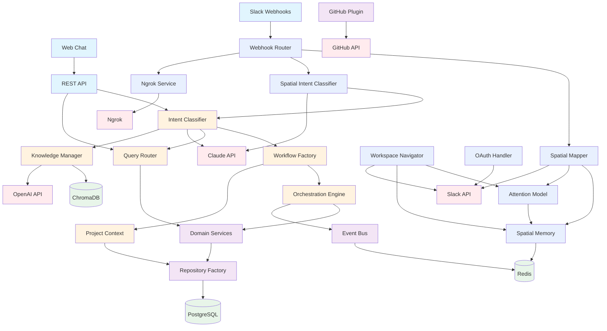
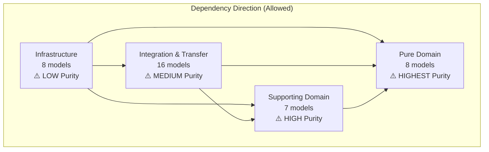
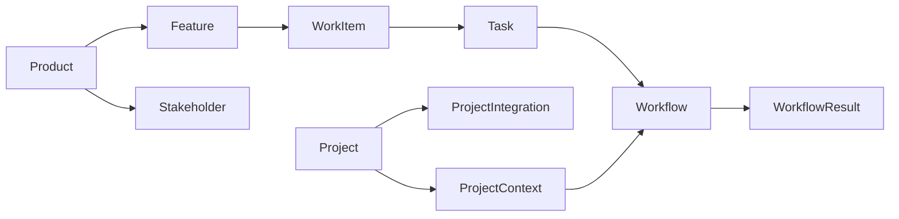
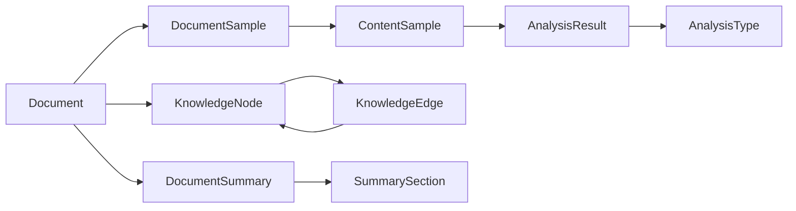
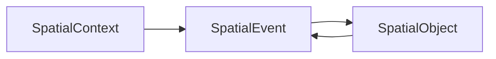
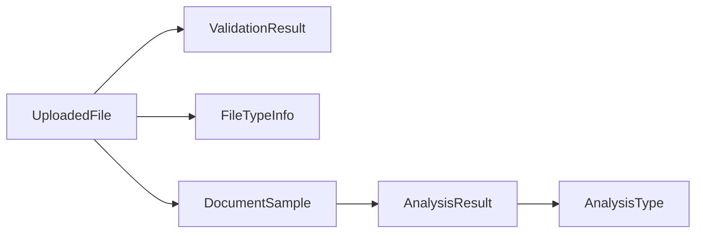

# Piper Morgan 1.0 - Dependency and Layer Diagrams

## Overview

This document provides visual representations of Piper Morgan's architecture through various diagrams showing layers, dependencies, data flow, and component interactions. These diagrams serve as reference materials for understanding system structure and enforcing architectural boundaries.

## 🚨 Quick Reference for Coding Agents

### Critical Dependency Rules
```python
# ✅ ALLOWED: Lower purity → Higher purity
Infrastructure → Integration → Supporting → Pure Domain

# ❌ FORBIDDEN: Higher purity → Lower purity
Pure Domain ↛ Supporting ↛ Integration ↛ Infrastructure

# ✅ SAFE IMPORTS
from services.domain.models import Product, Feature  # Always safe
from services.shared_types import WorkflowType       # Always safe

# ❌ DANGEROUS IMPORTS
from services.repositories import ProductRepository  # In domain models
from services.database.models import ProductDB      # In domain models
```

### Model Layer Quick Lookup
| Layer | Models | Purity Level | Can Import From |
|-------|--------|--------------|-----------------|
| Pure Domain | 8 | ⚠️ HIGHEST | shared_types only |
| Supporting Domain | 7 | ⚠️ HIGH | Pure Domain + shared_types |
| Integration & Transfer | 16 | ⚠️ MEDIUM | Supporting + Pure + shared_types |
| Infrastructure | 8 | ⚠️ LOW | All layers |

**For Detailed Model Documentation**: See [Models Architecture Hub](models-architecture.md)

## 1. High-Level Layer Architecture

```
┌─────────────────────────────────────────────────────────────────────────┐
│                          PRESENTATION LAYER                             │
│  ┌─────────────┐  ┌──────────────┐  ┌─────────────┐  ┌──────────────┐ │
│  │  Web Chat   │  │   REST API   │  │Slack Spatial│  │ Admin Panel  │ │
│  │ (Complete)  │  │  (FastAPI)   │  │  Webhooks   │  │  (Future)    │ │
│  └─────────────┘  └──────────────┘  └─────────────┘  └──────────────┘ │
└─────────────────────────────────────────────────────────────────────────┘
                                    ▼
┌─────────────────────────────────────────────────────────────────────────┐
│                         APPLICATION LAYER                               │
│  ┌─────────────┐  ┌──────────────┐  ┌─────────────┐  ┌──────────────┐ │
│  │   Intent    │  │   Workflow   │  │    Query    │  │   Learning   │ │
│  │ Classifier  │  │   Factory    │  │   Router    │  │   Engine     │ │
│  └─────────────┘  └──────────────┘  └─────────────┘  └──────────────┘ │
│                                                                         │
│  ┌─────────────┐  ┌──────────────┐  ┌─────────────┐  ┌──────────────┐ │
│  │Orchestration│  │   Project    │  │  Knowledge  │  │   Response   │ │
│  │   Engine    │  │   Context    │  │   Manager   │  │  Generator   │ │
│  └─────────────┘  └──────────────┘  └─────────────┘  └──────────────┘ │
└─────────────────────────────────────────────────────────────────────────┘
                                    ▼
┌─────────────────────────────────────────────────────────────────────────┐
│                           SERVICE LAYER                                 │
│  ┌─────────────┐  ┌──────────────┐  ┌─────────────┐  ┌──────────────┐ │
│  │   Domain    │  │  Repository  │  │ Integration │  │    Event     │ │
│  │  Services   │  │   Factory    │  │  Plugins    │  │     Bus      │ │
│  └─────────────┘  └──────────────┘  └─────────────┘  └──────────────┘ │
│                                                                         │
│  ┌─────────────────────────────────────────────────────────────────┐   │
│  │                    Plugin Implementations                        │   │
│  │  ┌─────────┐  ┌─────────────────────────────────┐  ┌─────────┐   │   │
│  │  │ GitHub  │  │     Slack Spatial Intelligence   │  │  Jira   │   │   │
│  │  │ Plugin  │  │  ┌─────────┐ ┌──────────────┐  │  │ Plugin  │   │   │
│  │  └─────────┘  │  │Spatial  │ │  Attention   │  │  └─────────┘   │   │
│  │              │  │Mapper   │ │    Model     │  │               │   │
│  │              │  └─────────┘ └──────────────┘  │               │   │
│  │              │  ┌─────────┐ ┌──────────────┐  │               │   │
│  │              │  │Workspace│ │    Spatial   │  │               │   │
│  │              │  │Navigator│ │    Memory    │  │               │   │
│  │              │  └─────────┘ └──────────────┘  │               │   │
│  │              └─────────────────────────────────┘               │   │
│  └─────────────────────────────────────────────────────────────────┘   │
└─────────────────────────────────────────────────────────────────────────┘
                                    ▼
┌─────────────────────────────────────────────────────────────────────────┐
│                            DATA LAYER                                   │
│  ┌─────────────┐  ┌──────────────┐  ┌─────────────┐  ┌──────────────┐ │
│  │ PostgreSQL  │  │   ChromaDB   │  │    Redis    │  │ File System  │ │
│  │  (Domain)   │  │  (Vectors)   │  │  (Events)   │  │  (Documents) │ │
│  └─────────────┘  └──────────────┘  └─────────────┘  └──────────────┘ │
└─────────────────────────────────────────────────────────────────────────┘
                                    ▼
┌─────────────────────────────────────────────────────────────────────────┐
│                         EXTERNAL SERVICES                               │
│  ┌─────────────┐  ┌──────────────┐  ┌─────────────┐  ┌──────────────┐ │
│  │ Claude API  │  │  OpenAI API  │  │ GitHub API  │  │  Slack API   │ │
│  └─────────────┘  └──────────────┘  └─────────────┘  └──────────────┘ │
│                                                                         │
│  ┌─────────────┐  ┌──────────────┐                                     │
│  │  Temporal   │  │    Ngrok     │                                     │
│  │ (Workflow)  │  │ (Dev Tunnel) │                                     │
│  └─────────────┘  └──────────────┘                                     │
└─────────────────────────────────────────────────────────────────────────┘

Legend:
─── Layer Boundary (strict)
▼   Dependency Direction (one-way)
```

## 2. Component Dependency Graph



## 3. Data Flow Diagrams

### 3.1 Command Flow (Workflow Execution)

```
User Request
     │
     ▼
┌─────────────┐
│  REST API   │
└─────────────┘
     │
     ▼
┌─────────────┐     ┌─────────────┐
│   Intent    │────▶│  Knowledge  │
│ Classifier  │     │    Base     │
└─────────────┘     └─────────────┘
     │
     ▼
┌─────────────┐     ┌─────────────┐
│  Workflow   │────▶│   Project   │
│  Factory    │     │   Context   │
└─────────────┘     └─────────────┘
     │
     ▼
┌─────────────┐
│Orchestration│
│   Engine    │
└─────────────┘
     │
     ├──────────────┬──────────────┬──────────────┐
     ▼              ▼              ▼              ▼
┌─────────┐    ┌─────────┐    ┌─────────┐    ┌─────────┐
│  Task 1 │    │  Task 2 │    │  Task 3 │    │  Event  │
│(Analyze)│    │(Extract)│    │(Create) │    │   Bus   │
└─────────┘    └─────────┘    └─────────┘    └─────────┘
     │              │              │              │
     ▼              ▼              ▼              ▼
┌─────────┐    ┌─────────┐    ┌─────────┐    ┌─────────┐
│   LLM   │    │   LLM   │    │ GitHub  │    │  Redis  │
│  (Claude)│    │  (Claude)│    │   API   │    │  Queue  │
└─────────┘    └─────────┘    └─────────┘    └─────────┘
```

### 3.2 Query Flow (Direct Data Access)

```
User Query
     │
     ▼
┌─────────────┐
│  REST API   │
└─────────────┘
     │
     ▼
┌─────────────┐
│   Intent    │
│ Classifier  │
└─────────────┘
     │
     ▼
┌─────────────┐
│    Query    │
│   Router    │
└─────────────┘
     │
     ▼
┌─────────────┐
│   Query     │
│  Service    │
└─────────────┘
     │
     ▼
┌─────────────┐
│ Repository  │
└─────────────┘
     │
     ▼
┌─────────────┐
│ PostgreSQL  │
└─────────────┘
     │
     ▼
Query Result
```

### 3.3 Slack Spatial Intelligence Flow

```
Slack Event
     │
     ▼
┌─────────────┐
│   Slack     │
│  Webhook    │
└─────────────┘
     │
     ▼
┌─────────────┐
│  Webhook    │
│   Router    │
└─────────────┘
     │
     ▼
┌─────────────┐
│   Spatial   │
│   Mapper    │
└─────────────┘
     │
     ├──────────────┬──────────────┬──────────────┐
     ▼              ▼              ▼              ▼
┌─────────┐    ┌─────────┐    ┌─────────┐    ┌─────────┐
│Spatial  │    │Attention│    │Workspace│    │ Spatial │
│Memory   │    │ Model   │    │Navigator│    │Intent   │
│Update   │    │Process  │    │Evaluate │    │Classify │
└─────────┘    └─────────┘    └─────────┘    └─────────┘
     │              │              │              │
     ▼              ▼              ▼              ▼
┌─────────┐    ┌─────────┐    ┌─────────┐    ┌─────────┐
│  Redis  │    │Priority │    │Navigate │    │Workflow │
│Spatial  │    │ Focus   │    │Decision │    │Factory  │
│Storage  │    │ Update  │    │Execute  │    │Create   │
└─────────┘    └─────────┘    └─────────┘    └─────────┘
                                                  │
                                                  ▼
                                          ┌─────────────┐
                                          │Orchestration│
                                          │   Engine    │
                                          └─────────────┘
```

## 4. Domain Model Dependencies

> **📋 Complete Model Documentation**: See [Models Architecture Hub](models-architecture.md) for detailed field definitions, usage patterns, and cross-references for all 39 domain models.

### 4.1 Visual Format Options

**Choose your preferred visualization**:
- **Mermaid Charts** (Interactive, GitHub-rendered, scalable) → [Primary format below](#42-domain-model-mermaid-diagrams)
- **ASCII Diagrams** (Universal, terminal-friendly, lightweight) → [Alternative format](#43-ascii-format-diagrams)
- **Hybrid Approach** (Mermaid for complex relationships + ASCII for quick reference) → [Both formats](#44-quick-reference-ascii)

### 4.2 Domain Model Mermaid Diagrams

#### 4.2.1 Primary Business Relationships

```mermaid
graph TD
    %% Pure Domain Layer (8 models)
    subgraph PD["Pure Domain Models"]
        Product --> Feature
        Product --> Stakeholder
        Product --> WorkItem
        Feature --> WorkItem
        Feature --> Feature2["Feature Dependencies"]

        Intent --> Workflow
        Workflow --> Task
        Workflow --> WorkflowResult
        Task --> Workflow

        EthicalDecision
        BoundaryViolation
    end

    %% Supporting Domain Layer (7 models)
    subgraph SD["Supporting Domain Models"]
        Document --> KnowledgeNode
        KnowledgeNode --> KnowledgeEdge
        KnowledgeEdge --> KnowledgeNode

        SpatialEvent --> SpatialObject
        SpatialContext --> SpatialEvent

        ActionHumanization
    end

    %% Integration Layer (16 models)
    subgraph IL["Integration & Transfer Models"]
        Project --> ProjectIntegration
        Project --> WorkItem2["WorkItem"]
        Project --> ProjectContext
        ProjectContext --> Workflow2["Workflow"]

        Document2["Document"] --> DocumentSample
        DocumentSample --> ContentSample
        ContentSample --> AnalysisResult
        DocumentSummary --> SummarySection
        Document3["Document"] --> DocumentSummary

        UploadedFile --> ValidationResult
        UploadedFile --> FileTypeInfo
        AnalysisResult --> AnalysisType
    end

    %% Infrastructure Layer (8 models)
    subgraph IF["Infrastructure Models"]
        Event --> FeatureCreated
        Event --> InsightGenerated
        FeatureCreated --> Feature3["Feature"]

        List --> ListItem
        List --> ListMembership
        TodoList --> Todo

        Conversation --> ConversationTurn
    end

    %% Cross-layer dependencies (dashed lines)
    WorkItem -.-> Feature
    WorkItem -.-> Product
    WorkItem2 -.-> Feature
    Task -.-> ActionHumanization
    FeatureCreated -.-> Feature
```



### 4.2 Layer Interaction Rules



### 4.3 Critical Model Dependencies for Coding Agents

#### Product Management Dependency Chain


#### Knowledge Management Dependency Chain


#### Spatial Intelligence Dependency Chain


#### File Processing Dependency Chain


### 4.4 Dependency Resolution for Complex Scenarios

#### Scenario 1: Feature Creation Workflow
```
User Request → Intent → Workflow → Task → Feature → WorkItem → Project
                                      ↓
                               FeatureCreated Event → Event Bus
```

#### Scenario 2: Document Analysis Pipeline
```
UploadedFile → ValidationResult → FileTypeInfo
            ↓
        DocumentSample → ContentSample → AnalysisResult → AnalysisType
            ↓
        Document → KnowledgeNode → KnowledgeEdge
            ↓
        DocumentSummary → SummarySection
```

#### Scenario 3: Spatial Event Processing
```
SpatialContext → SpatialEvent → SpatialObject
                      ↓
               ActionHumanization (for user-friendly descriptions)
```

### 4.3 ASCII Format Diagrams

**Terminal-friendly lightweight format for quick reference**:

#### 4.3.1 Core Business Relationships (ASCII)

```
Product Management Chain:
Product ──┬── Feature ── WorkItem
          ├── Stakeholder
          └── work_items[]

Workflow Orchestration:
Intent ── Workflow ──┬── Task[] ── result
                     └── WorkflowResult

Project Integration:
Project ──┬── ProjectIntegration[]
          ├── WorkItem (via project_id)
          └── ProjectContext ── Workflow
```

#### 4.3.2 Data Processing Chains (ASCII)

```
Knowledge Management:
Document ──┬── DocumentSample ── ContentSample ── AnalysisResult
           ├── KnowledgeNode ─── KnowledgeEdge ─── KnowledgeNode
           └── DocumentSummary ── SummarySection[]

File Processing:
UploadedFile ──┬── ValidationResult
               ├── FileTypeInfo
               └── DocumentSample ── AnalysisResult ── AnalysisType

Spatial Intelligence:
SpatialContext ── SpatialEvent ── SpatialObject
                      ↓
               ActionHumanization (text enhancement)
```

#### 4.3.3 Infrastructure Events (ASCII)

```
Event System:
Event (base) ──┬── FeatureCreated ── feature_id
               └── InsightGenerated ── insight_data

List Management:
List ──┬── ListItem[]
       └── ListMembership[] ── user permissions

Task Tracking:
TodoList ── Todo[] ── priority/status
```

### 4.4 Quick Reference ASCII

**For rapid terminal lookup during coding**:

```
🏗️ LAYER HIERARCHY (Bottom-up dependencies allowed):
Pure Domain (8) ──→ Supporting Domain (7) ──→ Integration (16) ──→ Infrastructure (8)

🔗 KEY RELATIONSHIPS:
Product ↔ Feature ↔ WorkItem    Intent → Workflow → Task
Project → ProjectIntegration    Document → KnowledgeNode
UploadedFile → ValidationResult SpatialContext → SpatialEvent

⚠️ FORBIDDEN PATTERNS:
Pure Domain → Infrastructure    Feature ↔ WorkItem (circular)
Domain Models → Database ORM    Task ↔ Workflow (circular)
```

### 4.5 Format Comparison

| Aspect | Mermaid Charts | ASCII Diagrams |
|--------|----------------|----------------|
| **Rendering** | GitHub, IDEs, documentation sites | Universal terminal/text |
| **Interactivity** | Clickable, zoomable | Static but fast |
| **Maintenance** | Complex syntax, better tooling | Simple, manual editing |
| **Accessibility** | Visual, requires rendering | Text-based, screen readers |
| **Performance** | Slower loading, needs JavaScript | Instant, no dependencies |
| **Best For** | Complex relationships, documentation | Quick reference, coding |

**Recommendation**: Use **both formats** - Mermaid for comprehensive documentation, ASCII for coding reference.

### 4.6 Circular Dependency Prevention

#### Avoided Circular Dependencies
```
❌ PREVENTED: Feature → WorkItem → Feature
✅ SOLUTION: Feature → WorkItem (one-way only with optional back-reference)

❌ PREVENTED: KnowledgeNode ↔ KnowledgeEdge
✅ SOLUTION: Explicit edge direction with source_node_id/target_node_id

❌ PREVENTED: Task ↔ Workflow
✅ SOLUTION: Workflow contains Tasks, Tasks reference workflow_id
```

#### Cross-Layer Dependency Constraints
```python
# ✅ ALLOWED: Lower layers can use higher layers
class FeatureCreated(Event):  # Infrastructure can reference Pure Domain
    feature_id: str

class WorkItem:  # Integration can reference Pure Domain
    feature: Optional["Feature"] = None
    product: Optional["Product"] = None

# ❌ FORBIDDEN: Higher layers cannot use lower layers
class Feature:
    # database_record: FeatureDB  # FORBIDDEN: Pure Domain → Infrastructure
    # repository: FeatureRepository  # FORBIDDEN: Pure Domain → Service layer
```

### 4.6 Import Patterns for Model Dependencies

#### Correct Import Patterns
```python
# Within same layer - OK
from services.domain.models import Product, Feature, WorkItem

# Cross-layer - Infrastructure → Domain (OK)
from services.domain.models import Feature  # In FeatureCreated event

# Cross-layer - Integration → Domain (OK)
from services.domain.models import Product, Feature  # In WorkItem model

# Shared types - Always OK
from services.shared_types import WorkflowType, TaskStatus
```

#### Forbidden Import Patterns
```python
# ❌ FORBIDDEN: Domain → Infrastructure
from services.infrastructure.events import FeatureCreated  # In Feature model

# ❌ FORBIDDEN: Domain → Integration
from services.integration.github import GitHubWorkItem  # In Feature model

# ❌ FORBIDDEN: Cross-cutting singleton imports
from services.orchestration.engine import engine  # Breaks dependency isolation
```

## 5. Module Dependency Tree

```
services/
├── api/                          [Depends on: all application services]
│   ├── routes/
│   │   ├── intent.py            [→ intent_service, orchestration, queries]
│   │   ├── projects.py          [→ queries.project_service]
│   │   └── workflows.py         [→ orchestration.engine]
│   └── middleware.py            [→ api.errors]
│
├── domain/                       [No dependencies - pure domain logic]
│   └── models.py                [Standalone domain entities]
│
├── intent_service/              [Depends on: llm, knowledge]
│   ├── classifier.py            [→ llm.client, knowledge.search]
│   └── prompts.py               [→ shared_types]
│
├── orchestration/               [Depends on: domain, repositories]
│   ├── engine.py                [→ workflows, repositories, event_bus]
│   ├── workflow_factory.py      [→ workflows/*, project_context]
│   └── workflows/               [→ integrations, llm]
│       ├── github_workflow.py   [→ integrations.github]
│       └── query_workflow.py    [→ queries.*]
│
├── queries/                     [Depends on: repositories]
│   ├── query_router.py          [→ project_queries, *_queries]
│   └── project_queries.py       [→ repositories.project]
│
├── project_context/             [Depends on: repositories, llm]
│   └── project_context.py       [→ repositories.project, llm.client]
│
├── knowledge/                   [Depends on: external services]
│   ├── knowledge_base.py        [→ chromadb, openai]
│   └── document_processor.py    [→ file parsers]
│
├── repositories/                [Depends on: database]
│   ├── base.py                  [→ sqlalchemy]
│   ├── project.py               [→ base, domain.models]
│   └── factory.py               [→ all repositories]
│
├── integrations/                [Depends on: external APIs]
│   ├── github/
│   │   ├── client.py            [→ github API]
│   │   └── plugin.py            [→ client, domain.models]
│   ├── slack/                   [Spatial Intelligence System]
│   │   ├── spatial_types.py     [→ shared_types, dataclasses]
│   │   ├── spatial_mapper.py    [→ spatial_types, slack API]
│   │   ├── attention_model.py   [→ spatial_types, spatial_memory]
│   │   ├── workspace_navigator.py [→ attention_model, spatial_memory]
│   │   ├── spatial_memory.py    [→ redis, spatial_types]
│   │   ├── oauth_handler.py     [→ slack API, spatial_mapper]
│   │   ├── webhook_router.py    [→ fastapi, spatial_mapper]
│   │   ├── ngrok_service.py     [→ ngrok API, process management]
│   │   ├── slack_client.py      [→ slack API, config_service]
│   │   ├── config_service.py    [→ ADR-010 patterns]
│   │   └── tests/               [→ pytest, spatial components]
│   └── plugin_base.py           [Abstract interface]
│
├── database/                    [Depends on: sqlalchemy]
│   ├── models.py                [→ shared_types]
│   └── session.py               [→ sqlalchemy.async]
│
├── events/                      [Depends on: redis]
│   └── event_bus.py             [→ redis, asyncio]
│
└── llm/                         [Depends on: external LLM APIs]
    ├── client.py                [→ anthropic, openai]
    └── adapters.py              [→ client]

shared_types.py                  [No dependencies - shared enums]
```

## 5. Service Interaction Patterns

### 5.1 Synchronous Dependencies

```
┌─────────────────┐
│ Intent Service  │
└────────┬────────┘
         │ calls
         ▼
┌─────────────────┐
│ Knowledge Base  │
└────────┬────────┘
         │ searches
         ▼
┌─────────────────┐
│    ChromaDB     │
└─────────────────┘
```

### 5.2 Asynchronous Event Flow

```
┌─────────────────┐
│   Workflow      │
└────────┬────────┘
         │ publishes
         ▼
┌─────────────────┐     ┌─────────────────┐     ┌─────────────────┐
│   Event Bus     │────▶│ Learning Engine │     │ Analytics Engine│
└────────┬────────┘     └─────────────────┘     └─────────────────┘
         │ stores                subscribers process events
         ▼
┌─────────────────┐
│     Redis       │
└─────────────────┘
```

### 5.3 Slack Spatial Intelligence Pattern

```
┌─────────────────┐
│  Slack Event    │
└────────┬────────┘
         │ webhook
         ▼
┌─────────────────┐     ┌─────────────────┐     ┌─────────────────┐
│ Webhook Router  │────▶│ Spatial Mapper  │────▶│ Spatial Memory  │
└────────┬────────┘     └─────────────────┘     └────────┬────────┘
         │                       │                        │ stores
         │                       ▼                        ▼
         │              ┌─────────────────┐     ┌─────────────────┐
         │              │ Attention Model │     │     Redis       │
         │              └────────┬────────┘     └─────────────────┘
         │                       │ prioritizes
         ▼                       ▼
┌─────────────────┐     ┌─────────────────┐
│ Spatial Intent  │     │ Workspace       │
│ Classifier      │     │ Navigator       │
└────────┬────────┘     └────────┬────────┘
         │ classifies            │ navigates
         ▼                       ▼
┌─────────────────┐     ┌─────────────────┐
│ Workflow Factory│     │ Territory State │
└────────┬────────┘     └─────────────────┘
         │ creates
         ▼
┌─────────────────┐
│ Orchestration   │
│ Engine          │
└─────────────────┘
```

## 6. Deployment Architecture

```
┌─────────────────────────────────────────────────────────┐
│                   Docker Network                        │
│                                                         │
│  ┌─────────────┐  ┌─────────────┐  ┌─────────────┐   │
│  │   Traefik   │  │   FastAPI   │  │   Temporal  │   │
│  │   (Proxy)   │──│    (App)    │  │  (Workflow) │   │
│  │    :80      │  │   :8001     │  │   :7233     │   │
│  └─────────────┘  └─────────────┘  └─────────────┘   │
│         │                │                │            │
│         └────────────────┼────────────────┘            │
│                          │                             │
│  ┌─────────────┐  ┌─────────────┐  ┌─────────────┐   │
│  │ PostgreSQL  │  │  ChromaDB   │  │    Redis    │   │
│  │   :5432     │  │   :8000     │  │   :6379     │   │
│  └─────────────┘  └─────────────┘  └─────────────┘   │
│                                                         │
└─────────────────────────────────────────────────────────┘
                            │
                            ▼
                    External Services
         ┌──────────┬──────────┬──────────┬──────────┐
         │ Claude   │ OpenAI   │ GitHub   │  Slack   │
         │  API     │  API     │  API     │  API     │
         └──────────┴──────────┴──────────┴──────────┘
                              │
                              ▼
                    Development Services
                    ┌──────────┬──────────┐
                    │  Ngrok   │ Temporal │
                    │(Tunnels) │(Workflow)│
                    └──────────┴──────────┘
```

## 7. Import Dependency Rules

### Allowed Dependencies

```python
# ✅ ALLOWED: Lower layers importing from higher layers
from shared_types import WorkflowType  # Shared types anywhere
from services.domain.models import Project  # Domain models in services
from services.repositories.base import BaseRepository  # Base classes

# ✅ ALLOWED: Same layer dependencies (with care)
from services.orchestration.tasks import Task  # Within orchestration
```

### Forbidden Dependencies

```python
# ❌ FORBIDDEN: Higher layers importing from lower
from services.database.models import ProjectDB  # DB models in domain
from services.repositories.project import ProjectRepository  # Repo in domain
from services.api.routes import intent_router  # API in services

# ❌ FORBIDDEN: Cross-cutting concerns
from services.orchestration.engine import engine  # Singleton imports
from services.intent_service.classifier import classifier  # Service instances
```

## 8. Circular Dependency Prevention

### Problem Pattern
```
A → B → C → A  (Circular)
```

### Solution: Dependency Inversion
```
A → Interface ← B
       ↑
       C
```

### Example Implementation
```python
# interfaces.py
class WorkflowExecutor(Protocol):
    async def execute(self, workflow_id: str) -> WorkflowResult: ...

# orchestration/engine.py
class OrchestrationEngine(WorkflowExecutor):
    # Implements interface

# services that need orchestration
def __init__(self, executor: WorkflowExecutor):
    self.executor = executor  # Depends on interface, not implementation
```

## 9. Testing Dependencies

```
┌─────────────────────────────────────────────────────┐
│                   Test Fixtures                     │
│  ┌────────────┐  ┌────────────┐  ┌────────────┐   │
│  │   Mocks    │  │  Builders  │  │  Fixtures  │   │
│  └────────────┘  └────────────┘  └────────────┘   │
└─────────────────────────────────────────────────────┘
                         │
                         ▼
┌─────────────────────────────────────────────────────┐
│                  Test Categories                    │
│  ┌────────────┐  ┌────────────┐  ┌────────────┐   │
│  │   Unit     │  │Integration │  │    E2E     │   │
│  │  (Mocked)  │  │ (Test DB)  │  │   (Live)   │   │
│  └────────────┘  └────────────┘  └────────────┘   │
└─────────────────────────────────────────────────────┘
```

## 10. Monitoring and Observability

```
Application Metrics
       │
       ▼
┌─────────────┐     ┌─────────────┐     ┌─────────────┐
│ Prometheus  │────▶│   Grafana   │     │  Alerts     │
└─────────────┘     └─────────────┘     └─────────────┘
       ▲                                         │
       │                                         ▼
┌─────────────┐     ┌─────────────┐     ┌─────────────┐
│   FastAPI   │     │   Logging   │────▶│    Slack    │
│  Metrics    │     │   (JSON)    │     │   Channel   │
└─────────────┘     └─────────────┘     └─────────────┘
```

## Summary

These diagrams illustrate:

1. **Strict layer boundaries** - Dependencies flow downward only
2. **Spatial intelligence architecture** - Revolutionary spatial metaphor system with 8 components
3. **Plugin architecture** - External integrations isolated (GitHub, Slack spatial intelligence)
4. **CQRS pattern** - Separate query and command flows plus spatial event processing
5. **Event-driven communication** - Loose coupling between services with spatial awareness
6. **Clear module organization** - Predictable file structure with spatial intelligence modules
7. **Deployment isolation** - Services communicate through defined interfaces

Key architectural principles:
- Domain models have no external dependencies
- Repositories return domain models, not database models
- Services orchestrate but don't contain business logic
- **Spatial intelligence operates as integrated system** - 8 components with attention algorithms
- External integrations are plugins, not core (except spatial intelligence integration)
- Shared types enable communication without coupling
- **Spatial metaphors enable embodied AI environment navigation**

Regular review of these diagrams helps maintain architectural integrity and prevent violation of design principles.
---
*Last Updated: July 28, 2025*

## Revision Log
- **July 28, 2025**: MAJOR UPDATE - Added complete Slack Spatial Intelligence System architecture including 8 spatial components, spatial event flow diagrams, updated module dependency tree, and spatial interaction patterns reflecting PM-074 completion
- **June 21, 2025**: Added systematic documentation dating and revision tracking
