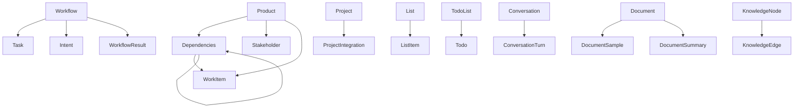

# Phase 3 Sub-step 5.4 Results: Navigation Template Design

**Created**: September 17, 2025
**Method**: Design navigation templates for Hub Navigation Format (Option C)
**Purpose**: Create navigation structures that support multiple access patterns

## Main Hub Navigation Template

```markdown
# Models Architecture

**Last Updated**: [Date]
**Source**: `services/domain/models.py`
**Total Models**: 38

## Navigation Hub

### 🗂️ By Technical Layer
Navigate by architectural concern and DDD purity level:

- **[Pure Domain Models](#pure-domain-models)** (8 models)
  Business concepts with no infrastructure dependencies

- **[Supporting Domain Models](#supporting-domain-models)** (7 models)
  Business concepts requiring data structures or complex state

- **[Integration & Transfer Models](#integration-transfer-models)** (15 models)
  External system contracts, DTOs, and data transfer objects

- **[Infrastructure Models](#infrastructure-models)** (8 models)
  System mechanisms, events, and technical concerns

### 🏷️ By Business Function
Navigate by business capability and domain area:

- **[#pm - Product Management](#pm-models)** (12 models)
  Products, features, stakeholders, work items, projects

- **[#workflow - Process Orchestration](#workflow-models)** (5 models)
  Workflows, tasks, intents, results, execution

- **[#knowledge - Information Management](#knowledge-models)** (9 models)
  Documents, summaries, knowledge graphs, analysis

- **[#spatial - Spatial Intelligence](#spatial-models)** (5 models)
  Spatial metaphor, events, objects, context, navigation

- **[#ai - AI Enhancement](#ai-models)** (3 models)
  Humanization, insights, confidence scoring

- **[#ethics - Safety & Boundaries](#ethics-models)** (2 models)
  Ethical decisions, boundary violations, safety

- **[#system - Infrastructure](#system-models)** (10 models)
  Events, lists, todos, conversations, system tracking

- **[#integration - External Systems](#integration-models)** (6 models)
  GitHub, Jira, external tool integrations

- **[#files - File Management](#files-models)** (4 models)
  Upload, validation, type detection, processing

### 🔤 Alphabetical Quick Lookup
[A](#a) [B](#b) [C](#c) [D](#d) [E](#e) [F](#f) [I](#i) [K](#k) [L](#l) [P](#p) [S](#s) [T](#t) [U](#u) [V](#v) [W](#w)

#### A
- [ActionHumanization](#actionhumanization) - AI text enhancement
- [AnalysisResult](#analysisresult) - Document analysis results

#### B
- [BoundaryViolation](#boundaryviolation) - Safety boundary events

#### C
- [ContentSample](#contentsample) - Content for analysis
- [Conversation](#conversation) - User-AI conversation
- [ConversationTurn](#conversationturn) - Single conversation exchange

[Continue for all letters...]

---
```

## Layer Section Template

```markdown
## Pure Domain Models

⚠️ **DDD Purity Warning**: Models in this section must have NO infrastructure dependencies, NO database concerns, and NO external system references. These represent pure business concepts and rules.

These models form the core business domain of Piper Morgan, representing fundamental product management concepts without any technical implementation details.

### Model Catalog

| Model | Purpose | Business Tags |
|-------|---------|--------------|
| **[Product](#product)** | A product being managed | #pm |
| **[Feature](#feature)** | A feature or capability | #pm |
| **[Stakeholder](#stakeholder)** | Someone with interest in the product | #pm |
| **[Intent](#intent)** | User intent parsed from natural language | #workflow #ai |
| **[Task](#task)** | Individual task within a workflow | #workflow |
| **[WorkflowResult](#workflowresult)** | Result of workflow execution | #workflow |
| **[Workflow](#workflow)** | A workflow definition and execution state | #workflow |
| **[EthicalDecision](#ethicaldecision)** | A recorded ethical decision with rationale | #ethics |
| **[BoundaryViolation](#boundaryviolation)** | A detected boundary violation event | #ethics #safety |

### Model Specifications

[Insert Template A/B/C for each model based on complexity]

---
```

## Business Function Section Template

```markdown
## Business Function Views

### #pm Models
**Product Management Domain** - Managing products, features, stakeholders, and work items

Models supporting product management capabilities:

| Model | Layer | Purpose | Key Relationships |
|-------|-------|---------|-------------------|
| [Product](#product) | Pure Domain | Core product entity | features, stakeholders, work_items |
| [Feature](#feature) | Pure Domain | Product capabilities | dependencies, work_items |
| [Stakeholder](#stakeholder) | Pure Domain | People with product interest | - |
| [WorkItem](#workitem) | Integration | External work tracking | product, feature |
| [Project](#project) | Integration | PM workspace | integrations |
| [ProjectIntegration](#projectintegration) | Integration | Tool configurations | project |
| [ProjectContext](#projectcontext) | Integration | Workflow context | - |

**Common Patterns**:
- Products contain Features in a hierarchical structure
- WorkItems link external systems to domain models
- Projects provide integration configuration context

**Service Integration**:
- [ProductService](../services/product_service.md) - Core product logic
- [WorkItemSyncService](../services/workitem_sync.md) - External synchronization

**Cross-References**:
- Architecture: [Product domain design](dependency-diagrams.md#product-domain)
- Database: [Product persistence](data-model.md#product-models)

---
```

## Supporting Navigation Templates

### Layer Summary Template
```markdown
### Layer Distribution

| Layer | Count | Primary Functions | DDD Purity |
|-------|-------|-------------------|------------|
| Pure Domain | 8 | Business rules and concepts | ⚠️ Highest - No infrastructure |
| Supporting Domain | 7 | Business with data needs | ⚠️ High - Minimal infrastructure |
| Integration & Transfer | 15 | External contracts | ⚠️ Medium - External dependencies |
| Infrastructure | 8 | System mechanisms | ⚠️ Low - Technical concerns |
```

### Business Tag Distribution Template
```markdown
### Business Function Coverage

| Tag | Model Count | Percentage | Primary Layer |
|-----|-------------|------------|---------------|
| #pm | 12 | 31.6% | Mixed (Pure + Integration) |
| #system | 10 | 26.3% | Infrastructure |
| #knowledge | 9 | 23.7% | Supporting + Integration |
| #workflow | 5 | 13.2% | Pure Domain |
| #spatial | 5 | 13.2% | Supporting Domain |
| #integration | 6 | 15.8% | Integration |
| #files | 4 | 10.5% | Integration |
| #ai | 3 | 7.9% | Mixed |
| #ethics | 2 | 5.3% | Pure Domain |

Note: Some models have multiple tags, percentages sum > 100%
```

### Model Relationship Map Template
```markdown
### Key Model Relationships


```

### Migration Guide Template
```markdown
## Migration from domain-models.md

This document replaces the outdated `domain-models.md` with current model documentation reflecting all 38 models in `services/domain/models.py`.

### What's Changed
- **Added**: 18 new models not previously documented
- **Updated**: All field definitions to match current implementation
- **Reorganized**: By technical layers instead of business domains
- **Enhanced**: Added business function tags for easier discovery

### Finding Models
- **Old location**: domain-models.md#[model-name]
- **New location**: models-architecture.md#[model-name]
- **Index updated**: domain-models-index.md now points here

### For Developers
1. Update imports to reference this document
2. Use layer warnings when adding new models
3. Maintain business tags when updating models
```

## Navigation Pattern Summary

### Primary Navigation Paths
1. **Technical (Architecture-focused)**:
   - Hub → Layer → Model Catalog → Specific Model
   - Use when: Implementing, reviewing architecture

2. **Functional (Business-focused)**:
   - Hub → Business Function → Model List → Specific Model
   - Use when: Understanding domain, finding related models

3. **Direct (Search-focused)**:
   - Hub → Alphabetical → Specific Model
   - Ctrl+F/Cmd+F → Model name
   - Use when: Know model name, quick lookup

### Navigation Elements That Work
Based on testing and existing patterns:
- ✅ Anchor links with auto-generated IDs
- ✅ Tables for quick scanning and comparison
- ✅ Letter index for alphabetical navigation
- ✅ Emoji icons for visual navigation aids
- ✅ Consistent heading hierarchy for structure

### Navigation Anti-patterns to Avoid
- ❌ Deeply nested sections (>3 levels)
- ❌ Circular navigation references
- ❌ External links without context
- ❌ Ambiguous anchor names
- ❌ Overly long section names

## Quality Verification

**All three access patterns supported**: ✅ Layer, function, alphabetical
**Navigation paths clear**: ✅ Each path has defined use case
**Consistent with existing patterns**: ✅ Based on domain-models-index.md
**User requirements met**: ✅ "layers first" with business tags
**Migration path provided**: ✅ Guide for updating references
**Ready for validation**: ✅ Navigation templates complete
