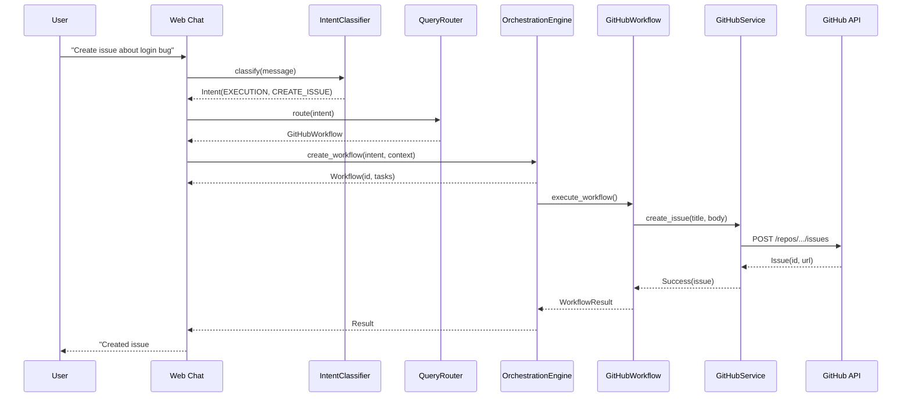
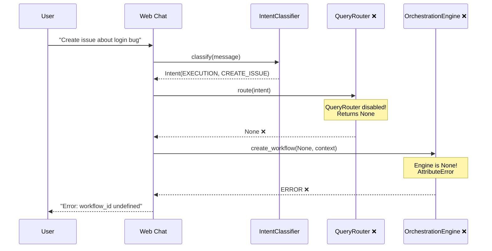

# GitHub Issue Creation: Sequence Diagram
**Purpose**: Document what SHOULD happen vs what ACTUALLY happens
**Date**: September 19, 2025

---

## Ideal Flow (What Should Happen)

---

## Current Reality (What Actually Happens - BROKEN)

---

## After REFACTOR-1 (Target State)

The goal is to restore the ideal flow with these specific fixes:

1. **Enable QueryRouter** (uncomment line 79 in engine.py)
2. **Initialize OrchestrationEngine** (in web/app.py startup)
3. **Wire LLM dependencies** (ensure llm_client available)
4. **Complete PM-034 integration** (A/B testing at 100%)

---

## Key Validation Points

When testing if the flow works:

1. ✅ Intent classification returns EXECUTION/CREATE_ISSUE
2. ✅ QueryRouter returns GitHubWorkflow (not None)
3. ✅ Engine creates workflow with ID and tasks
4. ✅ GitHub API call succeeds with 201 Created
5. ✅ User sees "Created issue #X" with clickable link

If ANY of these fail, the flow is broken.

---

## Performance Targets

From PM-034 specifications:
- Intent Classification: <200ms
- Query Routing: <50ms
- Workflow Creation: <100ms
- GitHub API: <1000ms
- **Total End-to-End: <1500ms**

Current Reality: ❌ Infinite (never completes)
After Refactor: ✅ <1500ms target
