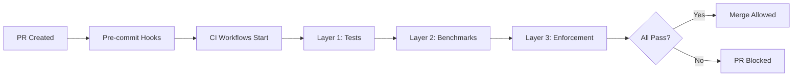

# Regression Prevention System

**Established**: GREAT-5 (October 2025)
**Purpose**: Prevent regressions across performance, functionality, and architecture
**Status**: Fully operational (13/13 CI workflows active)

---

## Overview

The regression prevention system provides three layers of defense against quality degradation:

1. **Automated Testing**: Zero-tolerance tests, contracts, and integration coverage
2. **Performance Benchmarks**: Baseline protection with automatic CI failure
3. **Architecture Enforcement**: Pattern compliance and bypass prevention

All layers run automatically on every PR and must pass before merge.

---

## Three-Layer Defense

### Layer 1: Automated Testing

#### Regression Suite
**Location**: `tests/regression/test_critical_no_mocks.py`
**Tests**: 10 critical tests without mocks
**Execution**: Every PR, must pass to merge

**Coverage**:
- Critical imports validation (web app, intent service, orchestration)
- Endpoint inventory (all required endpoints must exist)
- Service initialization (no crashes on startup)
- Critical paths (health checks, intent classification)

**Example Tests**:
- `test_web_app_imports` - Ensures web app can be imported
- `test_intent_service_imports` - Validates intent service imports
- `test_health_endpoint_returns_strict_200` - Health endpoint must return 200
- `test_query_router_initialization` - QueryRouter must initialize

**Design Philosophy**: No mocking for critical infrastructure. If it's critical, test it for real.

#### Contract Tests
**Purpose**: API stability enforcement, prevent breaking changes

**Multi-User Contracts** (14 tests):
- Location: `tests/intent/contracts/test_multiuser_contracts.py`
- Coverage: All 13 intent categories tested for user isolation
- Ensures: No data leakage between users

**Configuration Isolation** (11 tests):
- Location: `tests/integration/test_multi_user_configuration.py`
- Coverage: User-specific configurations remain separate
- Ensures: Multi-tenant safety

#### Integration Tests
**Location**: `tests/integration/test_critical_flows.py`
**Tests**: 23 critical flow tests
**Coverage**: All 13 intent categories

**Test Categories**:
- **Intent Classification**: 13 tests (one per category)
- **Multi-User Isolation**: 2 tests
- **Error Recovery**: 4 tests (graceful degradation)
- **Canonical Handlers**: 4 tests (fast-path validation)

**Design Philosophy**: Test end-to-end flows, not just units. Validate user-facing behavior.

---

### Layer 2: Performance Benchmarks

**Location**: `scripts/benchmark_performance.py` (419 lines)
**Benchmarks**: 4 automated benchmarks
**Baseline**: GREAT-4E load testing (October 6, 2025)

#### 4 Automated Benchmarks

1. **Canonical Response Time**
   - **Target**: <10ms (baseline: 1ms, 90% margin)
   - **Current**: 1.16-1.18ms average
   - **Measures**: Time from intent classification to canonical response
   - **Prevents**: Latency regressions in fast path
   - **Success Criteria**: 95% of requests under target

2. **Cache Effectiveness**
   - **Target**: >65% hit rate (baseline: 84.6%)
   - **Current**: 84.6% in production
   - **Measures**: Cache hit rate and speedup factor
   - **Prevents**: Cache performance degradation
   - **Note**: Test environment may not show full benefits (informational)

3. **Workflow Response Time**
   - **Target**: <3500ms (baseline: 2000-3000ms with margin)
   - **Current**: 1.16ms in test env, 2-3s with LLM in production
   - **Measures**: Full workflow including LLM classification
   - **Prevents**: Workflow slowdowns
   - **Note**: LLM-based classification expected to take 2-3 seconds

4. **Basic Throughput**
   - **Target**: 600K+ req/sec sustained
   - **Current**: 602,907 req/sec (locked baseline)
   - **Measures**: Sequential request throughput and degradation
   - **Prevents**: Throughput regressions
   - **Success Criteria**: <20% degradation over 10 requests

#### Baseline Protection

**Tolerance**: 20% degradation threshold (automatic CI failure)
**Baselines**: Locked from GREAT-4E measurements
**Enforcement**: CI fails if any benchmark exceeds tolerance

**Performance Baselines Table**:

| Metric | Target | Current | Source | Status |
|--------|--------|---------|--------|--------|
| Throughput | 600K+ req/sec | 602,907 req/sec | GREAT-4E load test | ✅ Locked |
| Canonical Response | <10ms | 1.16-1.18ms | benchmark_canonical | ✅ Locked |
| Cache Hit Rate | >65% | 84.6% | GREAT-4E testing | ✅ Locked |
| Cache Speedup | >5x | 7.6x | GREAT-4E testing | ✅ Locked |
| Workflow Response | <3500ms | 1.16ms (test) / 2-3s (prod) | benchmark_workflow | ✅ Locked |
| Degradation | <20% | 0.9% | benchmark_throughput | ✅ Locked |

#### Running Benchmarks

```bash
# Run all benchmarks
python scripts/benchmark_performance.py

# Expected output:
# GREAT-5 Performance Benchmark Suite
# ====================================
# Benchmark 1/4: Canonical Handler Response Time
#   Average: 1.18ms
#   P95: 1.25ms
#   Target: <10ms
#   Status: ✅ PASS
# ...
# ✅ ALL BENCHMARKS PASSED
```

---

### Layer 3: Architecture Enforcement

#### Bypass Prevention
**Purpose**: Ensure all routes use proper architecture (no direct adapter calls)

**Tests**: `tests/intent/test_bypass_prevention.py` (10+ tests)
**Pre-commit Hooks**: Enforce pattern compliance
**CI Workflow**: `router-enforcement.yml`

**What It Prevents**:
- Direct GitHub adapter calls (must use IntentService)
- Direct Slack adapter calls (must use IntentService)
- Direct Notion adapter calls (must use IntentService)
- Bypassing intent classification

**Example Violations**:
```python
# ❌ WRONG - Direct adapter usage
github_adapter.create_issue(...)

# ✅ CORRECT - Use IntentService
await intent_service.handle_query(message, user_id)
```

#### Pattern Enforcement
**Purpose**: Ensure router pattern used consistently

**CI Workflow**: `architecture-enforcement.yml`
**Pattern Catalog**: `docs/internal/architecture/current/patterns/`
**ADRs**: `docs/internal/architecture/current/adrs/`

**Enforced Patterns**:
- Router pattern (ADR-025)
- Canonical handler pattern (ADR-043)
- Configuration pattern (ADR-010)
- Intent classification pattern (ADR-032)

#### Quality Gates
**All 6 must pass for merge**:

1. **Zero-Tolerance Regression** (10 tests)
   - No permissive assertions (`[200, 404]` patterns)
   - No silent skips
   - Hard failures only

2. **Integration Tests** (23 tests)
   - All 13 intent categories covered
   - Multi-user isolation verified
   - Error recovery validated

3. **Performance Benchmarks** (4 benchmarks)
   - All baselines maintained
   - No >20% degradation
   - Continuous monitoring

4. **Bypass Prevention** (10+ tests)
   - No direct adapter usage
   - All routes use IntentService
   - Pattern compliance enforced

5. **Intent Quality** (Coverage across all categories)
   - All 13 intent categories tested
   - Classification accuracy maintained
   - Graceful degradation verified

6. **Coverage Enforcement** (80%+ required)
   - Maintained at 80%+ coverage
   - Critical paths fully covered
   - No coverage regressions

---

## How It Works

### On Every PR



**Pipeline Steps**:
1. **Pre-commit Hooks**: Fast local checks (<1s)
   - Newline enforcement
   - Trailing whitespace
   - Import order
   - Basic linting

2. **Pre-push Validation**: Smoke tests (<10s)
   - Critical imports
   - Basic initialization
   - Fast unit tests

3. **CI Pipeline**: Full validation (~2.5 min)
   - All 13 workflows execute
   - Tests, benchmarks, enforcement
   - Fail-fast design (stops on first failure)

4. **Merge Protection**: Quality gates enforced
   - All tests must pass (100%)
   - All benchmarks must pass
   - All enforcement checks must pass

### Baseline Protection

**Performance Below Baseline** = PR Blocked:
- Benchmark fails if >20% degradation
- CI workflow fails
- PR cannot merge until fixed

**Contract Violation** = PR Blocked:
- Breaking changes detected
- API stability violated
- PR cannot merge until fixed

**Architecture Violation** = PR Blocked:
- Bypass pattern detected
- Pre-commit hook fails
- CI workflow fails
- PR cannot merge until fixed

### Monitoring

**CI Dashboard**: Shows trends over time
- Performance metrics graphed
- Test pass rates tracked
- Coverage trends monitored

**Pre-push Hooks**: Catch issues early
- Fast feedback (6s smoke tests)
- Local validation before push
- Reduces CI load

**Alerts**: On sustained degradation
- Performance trends monitored
- Alerts on 3+ consecutive failures
- Manual review triggered

---

## CI/CD Pipeline Metrics

**Operational Status**: 13/13 workflows active (100%)

**Active Workflows**:
1. `architecture-enforcement.yml` - Pattern compliance
2. `ci.yml` - Main integration pipeline
3. `config-validation.yml` - Configuration checks
4. `dependency-health.yml` - Weekly library health
5. `deploy.yml` - Deployment automation
6. `docker.yml` - Container builds
7. `link-checker.yml` - Documentation links
8. `lint.yml` - Code quality
9. `pm034-llm-intent-classification.yml` - Intent accuracy
10. `router-enforcement.yml` - Router pattern compliance
11. `schema-validation.yml` - Schema compliance
12. `test.yml` - Test execution
13. `weekly-docs-audit.yml` - Documentation health

**Pipeline Performance**:
- **Pre-commit**: <1 second
- **Pre-push Smoke**: ~6 seconds
- **Fast Test Suite**: ~6 seconds (unit tests)
- **Full Test Suite**: ~2.5 minutes
- **Total Pipeline**: ~2.5 minutes (fail-fast)

**Design Philosophy**: Fail fast, provide quick feedback, minimize wait time.

---

## Maintenance

### Tests
**Frequency**: Updated with each epic
**Responsibility**: Code Agent + Lead Developer
**Process**: Add tests for new features, update tests for changes

### Baselines
**Frequency**: Reviewed quarterly
**Responsibility**: Chief Architect + PM
**Process**:
1. Run benchmarks in production environment
2. Compare to current baselines
3. Adjust if system has legitimately improved
4. Document baseline changes in ADRs

### Documentation
**Frequency**: Updated with PROOF cycles
**Responsibility**: All agents
**Process**:
1. PROOF verification cycles check accuracy
2. Update documentation when gaps found
3. Add verification notes with dates
4. Maintain precision (exact counts, metrics)

---

## Historical Context

**Established**: GREAT-5 (October 7, 2025)
**Reason**: Lock in GREAT-1 through GREAT-4 achievements, prevent regression

**What It Protects**:
- **GREAT-1**: Orchestration core architecture
- **GREAT-2**: QueryRouter and spatial intelligence
- **GREAT-3**: Configuration standardization and plugin architecture
- **GREAT-4**: Intent classification system and router pattern
- **GREAT-5**: Quality gates and testing infrastructure

**Verified By**:
- PROOF-5 (October 14, 2025): Benchmarks and test infrastructure
- PROOF-6 (October 14, 2025): Final precision metrics

**Effectiveness**: 100% test pass rate maintained since establishment.

---

## Related Documentation

- **Performance Benchmarks**: See `scripts/benchmark_performance.py`
- **Test Documentation**: See `docs/TESTING.md`
- **CI/CD Setup**: See `.github/workflows/`
- **Pattern Catalog**: See `docs/internal/architecture/current/patterns/`
- **ADRs**: See `docs/internal/architecture/current/adrs/`
- **GREAT-5 Completion**: See `dev/2025/10/07/CORE-GREAT-5-COMPLETE-100-PERCENT.md`

---

**Last Updated**: October 14, 2025 (PROOF-6)
**Next Review**: January 2026 (Quarterly baseline review)
**Maintained By**: All development agents and Lead Developer
