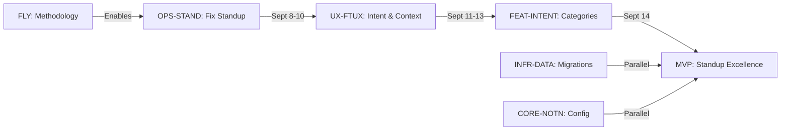

# Piper Morgan Multi-Track Roadmap v2.0
**Date**: September 7, 2025
**Philosophy**: Parallel tracks with clear MVP lines
**Current Sprint**: Fix standup, then expand intelligence
**New Taxonomy**: TRACK-EPIC: Story format

---

## Track Overview with MVP Gaps

```
Critical Path: OPS-STAND (now) → UX-FTUX (next week) → Production Ready
Parallel Support: FLY (methodology) + INFR (foundations) enable everything
```

---

## Track 1: Flywheel Methodology (FLY)

### Current Epics & Stories

**FLY-IMP: Process Improvements**
- ✅ Infrastructure verification system (complete today!)
- ✅ Three-tier verification pyramid (#146)
- ✅ Mandatory handoff protocol (#147)
- ✅ Configuration layer extraction (#148)
- ⬜ Performance benchmarking framework (#143)

**FLY-AUDIT: Documentation**
- ✅ Weekly audit 9/1 (#144)
- ⬜ Weekly audit 9/8 (tomorrow)
- ⬜ Resource maps for agents
- ⬜ Pattern catalog maintenance

### MVP Gap: None - methodology sufficient

### Next (Post-MVP)
- Automate methodology checks
- Multi-team scaling patterns

---

## Track 2: Operations (OPS)

### Current Epics & Stories

**OPS-STAND: Morning Standup** 🎯 **TOMORROW'S FOCUS**
- ⬜ Fix blank fields bug (#151) - HIGH PRIORITY
- ⬜ CLI investigation & repair (#149)
- ⬜ Human-readable metrics (#155)
- ⬜ MVP feature implementation (#119)

**OPS-KNOW: Knowledge Operations**
- ⬜ Connect knowledge graph to conversation (#99)

### MVP Gap: All 4 standup issues must work

### Next (Post-MVP)
- ⬜ OPS-FLOW: Workflow orchestration
- ⬜ OPS-ALERT: Smart notifications
- ⬜ OPS-REPORT: Status reporting

---

## Track 3: User Experience (UX)

### Current Epics & Stories

**UX-FTUX: First-Time User Experience** 🎯 **NEXT WEEK'S FOCUS**
- ⬜ Standup experience excellence epic (#95)
- ⬜ Quick context loading via PIPER.md (#97)
- ⬜ Document ingestion for context (#98)
- ⬜ Wizard implementation (#128)

**UX-GREET: Greeting Intelligence**
- ⬜ Calendar scanning on greeting (#102)

**UX-PIPER: Personality**
- ⬜ Response personality enhancement (#105)

**UX-DESIGN: Design System**
- ⬜ Establish design system (#154)

### MVP Gap: Must handle 5 canonical queries

### Next (Post-MVP)
- ⬜ UX-VOICE: Voice interface
- ⬜ UX-MOBILE: Mobile experience

---

## Track 4: Core Capabilities (CORE)

### Current Epics & Stories

**CORE-NOTN: Notion Integration**
- ⬜ Integration for knowledge management (#134)
- ⬜ Refactor hardcoded values (#136)
- ⬜ Audit codebase (#137)
- ⬜ Design configuration schema (#138)
- ⬜ Refactor commands (#140)
- ⬜ Testing and documentation (#141)
- ⬜ Fix enhanced validation (#142)

**CORE-INT: Integrations**
- ⬜ Learning integration (#107)
- ⬜ GitHub legacy deprecation (#109)

**CORE-KNOW: Knowledge Systems**
- ⬜ Knowledge graph connection (#99)

### MVP Gap: Notion config must work

### Next (Post-MVP)
- **CORE-OPT**: Workflow optimization (#63)
- **CORE-AUTO**: Autonomous workflows (#64)

---

## Track 5: Infrastructure (INFR)

### Current Epics & Stories

**INFR-DATA: Database & Data**
- ⬜ Migrate to AsyncSessionFactory (#113)
- ⬜ Remove legacy DatabasePool (#114)
- ⬜ Fix IntentEnricher anti-pattern (#115)
- ⬜ Fix asyncio Slack bug (#145)

**INFR-AGENT: Agent Coordination**
- ⬜ Multi-agent coordinator (#118)
- ⬜ Session continuity system (#152)
- ⬜ Code Agent permissions (#153)
- ⬜ Environment configurations (#156)

### MVP Gap: Database migrations blocking

### Next (Post-MVP)
- ⬜ INFR-SCALE: Auto-scaling
- ⬜ INFR-MONITOR: Observability

---

## Track 6: Features (FEAT)

### Current Epics & Stories

**FEAT-INTENT: Intent Recognition**
- ⬜ Add conversational intent categories (#96)

**FEAT-TIME: Temporal Intelligence**
- ⬜ Temporal context system (#101)
- ⬜ Time allocation analysis (#104)

**FEAT-PRIOR: Priority Systems**
- ⬜ Priority calculation engine (#103)

**FEAT-PROJ: Project Awareness**
- ⬜ Project portfolio awareness (#100)

**FEAT-STRAT: Strategic Intelligence**
- ⬜ Strategic recommendations (#106)

### MVP Gap: Intent categories critical

### Later (Vision Features)
- **FEAT-DOCS**: Document context (#56)
- **FEAT-MEET**: Meeting analysis (#57)
- **FEAT-DASH**: Analytics dashboard (#58)
- **FEAT-VISION**: Visual analysis (#65)
- **FEAT-PREDICT**: Predictive analytics (#66)
- **FEAT-GRAPH**: Knowledge graph UI (#87)

---

## Critical Path to MVP



---

## This Week's Priorities

### Monday Sept 8 (Tomorrow)
**Morning Block (9-11 AM)**
- [ ] OPS-STAND: Fix blank fields bug (#151)
- [ ] OPS-STAND: CLI investigation (#149)

**Afternoon**
- [ ] FLY-AUDIT: Weekly docs audit
- [ ] Set up UX-FTUX view for next sprint

### Tuesday-Wednesday Sept 9-10
- [ ] Complete OPS-STAND epic
- [ ] Begin UX-FTUX implementation
- [ ] INFR-DATA migrations if blocking

### Thursday-Friday Sept 11-12
- [ ] UX-FTUX: Core context systems
- [ ] FEAT-INTENT: Categories
- [ ] Integration testing

### Weekend Sept 13-14
- [ ] Polish and validate
- [ ] "Play Piper" comparison testing
- [ ] Prep for next sprint

---

## MVP Success Criteria

### Must Have (Sept 14)
- ✅ Morning standup works daily (OPS-STAND complete)
- ✅ Handles 5 canonical queries (UX-FTUX working)
- ✅ Intent recognition operational (FEAT-INTENT done)
- ✅ Database stable (INFR-DATA migrations complete)
- ✅ Methodology embedded (FLY improvements active)

### Nice to Have
- ⬜ Greeting intelligence (UX-GREET)
- ⬜ Time/priority systems (FEAT-TIME, FEAT-PRIOR)
- ⬜ Full Notion sync (CORE-NOTN complete)

### Defer to Post-MVP
- All vision features (FEAT-MEET, FEAT-DASH, etc.)
- Optimization and automation (CORE-OPT, CORE-AUTO)
- Advanced infrastructure (INFR-SCALE, INFR-MONITOR)

---

## Track Dependencies

```
FLY (Methodology) → enables all tracks via process excellence
OPS (Operations) → validates UX and reveals FEAT needs
UX (Experience) → drives FEAT and CORE requirements
CORE (Capabilities) → supports OPS and UX functionality
INFR (Infrastructure) → underlies everything, blocks when broken
FEAT (Features) → enhances UX and enables advanced OPS
```

---

## The MVP Lines (Per Track)

**FLY**: ✅ Already sufficient - methodology works
**OPS**: All 4 standup issues fixed and working daily
**UX**: FTUX handles canonical queries without errors
**CORE**: Notion configuration operational
**INFR**: Database migrations complete, agents coordinate
**FEAT**: Intent categories recognize conversation patterns

Beyond these lines = "Post-MVP enhancement"

---

## Gap Analysis Summary

### Critical Gaps (Blocking MVP)
1. OPS-STAND: All 4 issues must be fixed
2. UX-FTUX: Must handle canonical queries
3. FEAT-INTENT: Categories needed for conversation
4. INFR-DATA: Migrations may be blocking

### Non-Critical Gaps (Can defer)
- Most FEAT epics can wait
- CORE-OPT and CORE-AUTO are future
- Advanced UX features not required

### Well-Covered Areas
- FLY methodology (today's work!)
- Basic architecture exists
- Integration patterns established

---

## Next Actions

### Tonight
- [ ] Set up OPS-STAND project view
- [ ] Review backlog.md and completed.md
- [ ] Update CSV with new taxonomy
- [ ] Sleep well for tomorrow's sprint!

### Tomorrow Morning (9 AM)
1. Open OPS-STAND view
2. Start with #151 (blank fields)
3. Document in session log
4. Test standup after each fix

### Success Metric
By Friday Sept 13: Can you demo standup to someone and have them say "wow"?

---

*Roadmap Version: 2.0 - Post taxonomy implementation*
*Focus: Clear MVP with identified gaps*
*Methodology: Infrastructure verification before implementation*
