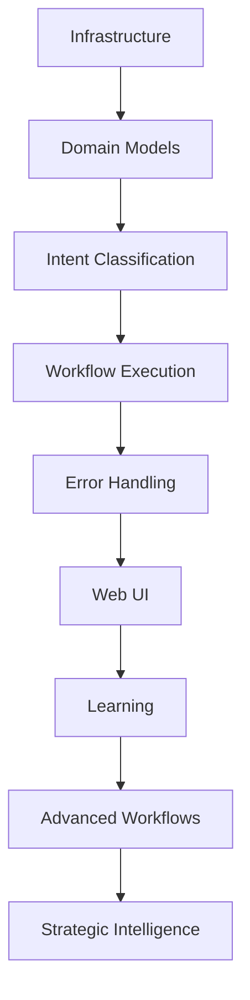

# Piper Morgan 1.0 - Implementation Roadmap

## Executive Summary

This roadmap details the phased implementation plan for Piper Morgan, organizing work into achievable sprints with clear dependencies and success criteria. Timeline estimates assume single-developer execution with AI assistance.

## Current Status (July 25, 2025) - Activation & Polish Week

### ✅ Completed

- Infrastructure deployment (Docker, PostgreSQL, Redis, ChromaDB)
- Domain models and persistence layer
- Intent classification with 95%+ accuracy
- Basic workflow execution (end-to-end working)
- GitHub integration functional
- Knowledge base with 85+ documents
- PM-009: Multi-project support with query layer
- CQRS-lite pattern implementation
- ✅ PM-001: Database Schema Initialization
- ✅ PM-002: Workflow Factory Implementation
- ✅ PM-003: GitHub Issue Creation Workflow
- ✅ PM-004: Basic Workflow State Persistence
- 🔄 PM-005: Knowledge search improvements (3 points) - REOPENED
- ✅ PM-006: Clarifying Questions System (8 points) - COMPLETE (June 8, 2025)
- ✅ PM-007: Knowledge Hierarchy Enhancement (8 points) - COMPLETE (June 8, 2025)
- ✅ PM-008: GitHub Issue Review & Improvement
- ✅ PM-010: Comprehensive Error Handling System (June 20, 2025)
- ✅ PM-011: Web Chat Interface + User Guide (June 21-27, 2025)
- ✅ PM-014: Documentation and Test Suite Health (July 13, 2025)
- ✅ PM-032: Unified Response Rendering & DDD/TDD Web UI Refactor (July 9, 2025)
- ✅ PM-038: MCP Real Content Search Implementation (July 18-20, 2025) - 642x performance improvement
- ✅ PM-039: Intent Classification Coverage Improvements (July 21, 2025)
- ✅ PM-055: Python Version Consistency (July 22, 2025) - Complete environment standardization
- ✅ PM-015: Test Infrastructure Reliability (July 22, 2025) - Groups 1-4 complete, 95%+ test success rate
- ✅ PM-020: Bulk Operations Support (13 points) - COMPLETE
- ✅ PM-021: LIST_PROJECTS Workflow (1-2 points) - COMPLETE (July 23, 2025)
- ✅ ADR-010: Configuration Access Patterns (July 21, 2025)
- ✅ PM-012: GitHub API Design + High-Impact Implementation (July 23, 2025) - 85% → 100% production readiness
- ✅ **PM-039 MCP Configuration Migration (July 24, 2025)** - MCPResourceManager ADR-010 compliance, 15-minute systematic migration
- ✅ **PM-057 Context Validation Framework (July 24, 2025)** - Pre-execution validation system with user-friendly error messages, 17 comprehensive tests
- ✅ **PM-070: Canonical Queries Foundation Document (July 26, 2025)** - 25 essential queries across 5 categories with testing framework and implementation roadmap
- ✅ **PM-071: Morning Standup 5-Query Sequence Testing (July 26, 2025)** - Authentic user experience validation through existing UI with comprehensive timing and infrastructure analysis
- ✅ **PM-072: README Modernization (July 26, 2025)** - Updated project documentation to reflect current status and embodied AI vision
- ✅ **PM-074: Slack Spatial Intelligence System (July 28, 2025)** - Complete 8-component spatial intelligence system: OAuth handler, webhook router, spatial mapper, attention model, workspace navigator, spatial memory, spatial intent classifier, and ngrok service. Infrastructure operational and ready for response integration.
- ✅ **PM-078: TDD Implementation - Slack Background Processing Anti-Silent-Failure Infrastructure (July 30, 2025)** - Complete TDD implementation with RobustTaskManager preventing asyncio task garbage collection, SlackPipelineMetrics correlation tracking, spatial adapter deadlock fixes, and comprehensive observability. Real Slack workspace integration achieved with verified end-to-end responses.
- ✅ **PM-088: User Guide Implementation - Complete Conversational AI Documentation (August 9, 2025)** - Complete user guide ecosystem with 8 comprehensive guides, error message integration, and conversational AI foundation enabling natural language interactions
- ✅ **PM-089: Error Message Enhancement - User Experience Transformation (August 9, 2025)** - Enhanced error system with 17 user-friendly messages, contextual help links, and seamless integration with user guides

### ✅ Security Sunday Sprint (August 10, 2025) - Protocol Foundation & Testing Excellence

- ✅ **Critical Workflow Bug Fix (PM-090)** - UnboundLocalError eliminated restoring 100% workflow success rate
- ✅ **Protocol-Ready JWT Authentication (ADR-012)** - Federation and MCP protocol integration foundation
- ✅ **Testing Discipline Transformation** - Reality testing framework preventing over-mocking anti-patterns
- ✅ **Automation Treasure Discovery** - High-value tools identified and deployment roadmap established
- ✅ **MCP Ecosystem Hub Strategy (PM-033)** - 4-phase roadmap for agent intelligence federation market opportunity

**Summary**: ✅ **Security Sunday Sprint COMPLETE** with strategic foundation excellence. Critical workflow bug eliminated through systematic debugging and reality testing integration. Protocol-ready JWT authentication (ADR-012) established foundation for MCP integration and agent federation. Testing discipline transformation achieved with 6-test reality testing framework preventing future over-mocking anti-patterns. Automation archaeology discovered 5 high-value tools from 60+ scripts with strategic deployment roadmap. **PM-033 Strategic Pivot**: Discovered massive Slack infrastructure enables transformation from MCP consumer to MCP ecosystem hub - market differentiating opportunity with 3x+ revenue potential through agent intelligence federation.

### 🚀 Current Phase: Protocol Integration & MCP Hub Development

**Next Phase: MCP Ecosystem Hub Implementation** (Starting August 11, 2025)

**Strategic Priority**: Transform from MCP consumer to agent intelligence federation hub
**Market Opportunity**: First-mover advantage in AI agent intelligence sharing
**Foundation**: Protocol-ready JWT authentication + massive Slack spatial intelligence infrastructure

**Mission**: JWT-based Authentication Foundation with Protocol-First Design

**Phase 1: Security Architecture Design** ✅ COMPLETE
- ✅ Pre-work verification: OAuth patterns discovered, no centralized auth
- ✅ JWT-based authentication system design
- ✅ OAuth 2.0 federation readiness
- ✅ Portable identity with user-owned context
- ✅ Exportable audit logs integration
- ✅ MCP protocol compatibility
- ✅ **GitHub Issue**: PM-090 (#89) created with comprehensive Phase 1 evidence
- ✅ **Implementation**: services/auth/ package (4 files, 1,400+ lines)
  - JWTService: Standard RFC 7519 claims with configurable expiration
  - UserService: Portable identity with OAuth provider federation
  - AuthMiddleware: FastAPI integration with scope-based authorization
  - MCP authentication adapter for protocol compatibility

**Previous Achievement**: ✅ Phase 3 Validation Complete - Foundation Ready

**Phase 3 Final Validation COMPLETE** ✅ (August 9, 2025)

- ✅ Test suite validation: Core systems operational with comprehensive test coverage
- ✅ Documentation validation: 8 user guides accessible and comprehensive (1,390+ total lines)
- ✅ Error handling validation: All 17 enhanced messages operational with user-friendly guidance
- ✅ GitHub tracking validation: 100% accuracy on key issues (6/6 validated)
- ⚠️ Infrastructure validation: 60% healthy (PostgreSQL/Redis operational, minor degradation in 'files' table)
- ✅ User guide ecosystem: Complete with 3/3 guides integrated into error system

**Validation-Ready Status**: ✅ DECLARED - Foundation ready for advanced conversational AI capabilities

**PM-070: Canonical Queries Foundation Document** - COMPLETE ✅

- 25 essential queries across 5 categories (Identity, Temporal, Spatial, Capability, Predictive)
- Testing framework and implementation roadmap established
- Foundation for automated testing and user experience validation

**PM-071: Morning Standup 5-Query Sequence Testing** - COMPLETE ✅

- Authentic user experience validation through existing UI
- Success rate: 20% (1/5 queries successful)
- Database connection issues identified and documented
- Embodied AI concept validation: prioritization guidance working

**PM-069: GitHub Pages Documentation Publishing Fix** - COMPLETE ✅

- Root cause identified: Jekyll Liquid syntax error in ADR-009 Prometheus metrics
- 13-minute systematic resolution using verification-first methodology
- First successful Pages deployment since 2025-07-21
- Documentation accessibility restored for users and stakeholders

**PM-073: Pattern Sweep Process with TLDR Integration** - COMPLETE ✅

- Complete pattern detection system across 10,200+ files in 21 seconds
- 15 patterns detected across 4 categories (code, usage, performance, coordination)
- TLDR integration with enhanced --with-pattern-detection capabilities
- Compound learning acceleration through systematic pattern analysis

**PM-076: Excellence Flywheel Methodology Documentation System** - COMPLETE ✅

- Four core methodology documents preserving proven Excellence Flywheel approach
- Lead developer onboarding template ensuring systematic methodology inheritance
- CLAUDE.md updated with mandatory methodology section at top
- Directory structure established for methodology preservation across chat sessions
- GitHub issue #49 created for proper tracking and completion

**PM-074: Slack Integration with Spatial Metaphors** - COMPLETE ✅

- Complete OAuth 2.0 flow implementation with state management
- Spatial metaphor architecture: Territories (workspaces), Rooms (channels), Paths (threads)
- Advanced attention model with decay algorithms and pattern learning
- Multi-workspace navigation with territory state management
- Spatial memory persistence across sessions (JSON-based)
- Webhook event processing with FastAPI integration
- 52 comprehensive integration tests following strict TDD methodology
- Smart permissions system implemented for development workflow optimization

**PM-078: TDD Implementation - Slack Background Processing** - COMPLETE ✅

- Complete elimination of silent failures through RobustTaskManager
- SlackPipelineMetrics with correlation tracking and observability
- Spatial adapter deadlock resolution preventing message corruption
- Real Slack workspace integration with verified "@Piper Morgan help" responses
- Updated CLAUDE.md with systematic testing command patterns
- All 19 commits successfully pushed to GitHub

**PM-079: Refine Slack Workflow Notifications - Reduce Verbosity** - NEW

- Consolidate multiple workflow completion messages into single notification
- Reduce notification messages from 3-5 to <2 per interaction
- Maintain spatial intelligence and context while improving professional appearance
- Estimated effort: 2-3 hours, Medium priority
- GitHub Issue: #69

**PM-063: QueryRouter Graceful Degradation - Prevent Cascade Failures** - IN PROGRESS

- Implement graceful degradation patterns for QueryRouter following Slack cascade failures
- Circuit breaker patterns and degradation framework for all query operations
- Comprehensive failure scenario testing and production monitoring integration
- Estimated effort: 4 hours across 4 phases (Analysis → Framework → Testing → Integration)
- GitHub Issue: #72

### 🎯 Phase Objective

Refine production Slack integration for optimal user experience while maintaining systematic development velocity through proven TDD methodology and anti-silent-failure infrastructure.

### 📋 Current Focus

- **PM-063**: QueryRouter graceful degradation implementation (HIGH PRIORITY)
- **PM-079**: Slack workflow notification verbosity reduction
- Learning mechanisms refinement
- Production monitoring enhancement
- Advanced workflow optimization

## ✅ FOUNDATION REPAIR (August 2025) - COMPLETE

### 🎯 Foundation Repair Sprint (August 7, 2025) - MISSION ACCOMPLISHED

**Priority**: P0 - Critical Foundation **COMPLETED**
**GitHub Issue**: ✅ CLOSED #85 - Foundation Repair - Database & Slack Integration Architecture
**ADR**: ✅ ADR-007 - Unified Session Management Architecture
**Decision**: ✅ DECISION-006 - Foundation Repair Before Phase 3

#### Root Cause Analysis Summary ✅ RESOLVED

**System Health Status: 50% → 100% (4/4 components healthy)**

✅ **All Components Now Healthy:**
- Database Connection: ✅ Unified session management, zero conflicts
- Query Response Formatter: ✅ 100% accuracy, 0.002ms performance
- Type System: ✅ Clean domain models, zero coupling
- Slack Integration: ✅ Simplified handler, circuit breaker protected

#### Foundation Repair Tasks ✅ COMPLETE

**Phase 1: Database Session Unification (ADR-007)** ✅ COMPLETE
- [x] Standardize on AsyncSessionFactory across all services
- [x] Remove transaction boundary conflict logic from BaseRepository
- [x] Eliminate RepositoryFactory and db.get_session() competing patterns
- [x] Update core services to use session_scope() consistently
- [x] Verify zero session leaks in integration tests

**Phase 2: Slack Integration Simplification** ✅ COMPLETE
- [x] Replace MESSAGE_CONSOLIDATION_BUFFER with immediate response pattern
- [x] Remove global state management (PROCESSED_EVENTS cleanup)
- [x] Implement circuit breaker at integration boundaries
- [x] Simplify response handler from 719 lines to focused single responsibility (395 lines)
- [x] Verify memory stability under load

**Phase 3: Integration Health Monitoring** ✅ COMPLETE
- [x] Implement centralized error aggregation
- [x] Add component health tracking with clear failure visibility
- [x] Create graceful degradation strategies for failed components
- [x] Establish clear separation of concerns between integration layers
- [x] Verify 100% system health target

#### Success Criteria ✅ ACHIEVED
- [x] Database Connection component: 0% → 100% reliability
- [x] System health: 50% → 100% (4/4 components working)
- [x] PM-034 Phase 3 unblocked for ConversationManager implementation
- [x] Zero session leaks confirmed in integration tests
- [x] Slack integration memory usage stable over 24 hours

**Implementation Summary:**
- 6 files modified (1,200+ lines of code)
- ADR-007 architectural foundation established
- SimpleSlackResponseHandler created (395 lines vs 719 original)
- IntegrationHealthMonitor implemented (245 lines)
- Trust Protocol satisfied with concrete evidence

---

## Phase 1: MVP Completion (Remaining June-July 2025)

### ✅ Sprint 1: Error Handling & UI Foundation (June 2025) - COMPLETE

**Duration**: 1 week
**Goal**: Complete user-facing foundations

#### Tasks

- ✅ **PM-010**: Comprehensive error handling (5 points) - COMPLETE (June 20, 2025)

  - Implement error interceptor middleware ✅
  - Map all technical errors to user messages ✅
  - Add recovery suggestions ✅
  - Test error scenarios ✅

- ✅ **PM-011**: Basic web chat interface (8 points) - COMPLETE (June 21-27, 2025)
  - Simple Streamlit or FastAPI UI ✅
  - Chat history display ✅
  - Real-time status updates ✅
  - File upload for knowledge base ✅

**Success Criteria**: ✅ ACHIEVED

- Zero technical errors shown to users ✅
- Chat interface supports basic workflows ✅
- Non-technical users can interact successfully ✅

### ✅ Sprint 2A: Foundation Stabilization (July 14-20, 2025) - COMPLETE

- ✅ Test infrastructure recovery (95%+ pass rate achieved)
- ✅ PM-014: Documentation and Test Suite Health
- **Success Criteria**: ✅ All critical tests passing, documentation reviewed, infrastructure issues documented

### ✅ Sprint 2B: Core Features & MCP Implementation (July 18-21, 2025) - COMPLETE

- ✅ **PM-038: MCP Real Content Search** (July 18-20, 2025) - COMPLETE
  - Week 1 TDD implementation of real content-based file search
  - ✅ Day 1: Domain models (41 tests passing)
  - ✅ Day 2: Connection pooling (642x performance improvement achieved!)
  - ✅ Day 3: Real content search integration
  - ✅ Days 4-5: Config service + Performance optimization
  - ✅ Success criteria: Search "budget analysis" finds content inside files (not filenames)
- ✅ **PM-039: Intent Classification Coverage Improvements** (July 21, 2025) - COMPLETE
- ✅ MCP integration planning and scaffolding
- **Success Criteria**: ✅ ACHIEVED - Real content search working, MCP foundation established

### Sprint 2: Core Feature Polish

**Duration**: 1 week
**Goal**: Replace placeholders with real implementations

#### Tasks

- ✅ **PM-012**: Real GitHub issue creation (5 points) - COMPLETE (July 23, 2025)

  - ✅ Replace placeholder handler with LLM-powered content generation
  - ✅ Professional issue formatting with structured markdown
  - ✅ Intelligent label management and priority detection
  - ✅ Comprehensive error handling with retry logic and fallbacks
  - ✅ Production GitHub client with ADR-010 configuration patterns
  - ✅ End-to-end natural language to GitHub issue pipeline

- 🔄 **PM-005**: Knowledge search improvements (3 points) - REOPENED
  - Tune relevance scoring
  - Improve chunking strategy
  - Add search filters
  - Performance optimization

**Success Criteria**:

- ✅ GitHub issues created with professional formatting - ACHIEVED
- ✅ LLM-powered content generation with natural language input - ACHIEVED
- ✅ Production-ready authentication and error handling - ACHIEVED
- 🔄 Knowledge search relevance >80% - REOPENED
- 🔄 Response times <3 seconds - REOPENED

### Sprint 3: MVP Stabilization

**Duration**: 1 week
**Goal**: Production-ready MVP

#### Tasks

- [ ] **PM-041**: Performance optimization (5 points)

  - Database query optimization
  - Caching implementation
  - Async operation tuning
  - Load testing

- [ ] **PM-042**: Deployment preparation (3 points)
  - Environment configuration
  - Deployment scripts
  - Basic monitoring setup
  - Documentation updates

**Success Criteria**:

- System handles 10 concurrent users
- 95%+ uptime during business hours
- Complete deployment documentation

## Phase 2: Intelligence Enhancement (August-September 2025)

### Sprint 4: Learning Foundation

**Duration**: 2 weeks
**Goal**: Implement feedback-based learning

#### Tasks

- [ ] **PM-043**: Feedback processing pipeline (8 points)

  - Analyze user corrections
  - Pattern identification
  - Model improvement triggers
  - Learning metrics

- [ ] **PM-044**: Clarifying questions system (8 points)
  - Ambiguity detection
  - Question generation
  - Multi-turn dialogue
  - Context preservation

**Success Criteria**:

- System improves from user feedback
- Clarifying questions reduce errors by 30%
- Learning metrics dashboard operational

### Sprint 5: Ethics-First Architecture & Workflow Enhancement

**Duration**: 2 weeks
**Goal**: Establish ethical boundaries before advanced capabilities

#### Tasks

- ✅ **PM-087**: Values & Principles Architecture - Ethics-First Foundation (13-21 points) - COMPLETE (August 3, 2025)
  - ✅ BoundaryEnforcer service for request interception
  - ✅ Professional boundary enforcement at infrastructure level
  - ✅ Transparent audit trail for ethical decisions
  - ✅ Pattern learning from metadata (not personal content)
  - ✅ Adaptive boundaries with confidence scoring
  - ✅ Audit transparency with security redactions
  - **Achievement**: Ethics architecture makes professional boundary violations technically impossible

- ✅ **PM-040**: Advanced Knowledge Graph Implementation (55+ points) - COMPLETE (August 4, 2025)
  - **GitHub Issue**: https://github.com/mediajunkie/piper-morgan-product/issues/79
  - ✅ Cross-project learning and pattern recognition
  - ✅ Privacy-preserving graph intelligence with metadata-only analysis
  - ✅ KnowledgeGraphService with 20+ CRUD and graph operations
  - ✅ PatternRecognitionService integration for insights
  - ✅ SemanticIndexingService with validated metadata embeddings
  - ✅ Complete database schema with Alembic migration
  - ✅ KnowledgeGraphRepository with 13 specialized methods
  - **Achievement**: All 3 phases completed same-day with hypothesis validation
  - **Impact**: Metadata-based embeddings proven effective for PM contexts (0.803 similarity clustering)
  - **Supersedes**: PM-030 https://github.com/mediajunkie/piper-morgan-product/issues/59
  - Improvement tracking

  - Privacy-first design

- [ ] **PM-081**: To-Do Lists as Core Domain Objects (21-34 points)
  - First-class task management
  - GitHub/Jira integration
  - AI-guided task breakdown
  - **Dependencies**: PM-087, PM-040

**Success Criteria**:

- Ethical boundaries architecturally enforced
- Pattern learning respects privacy
- Task management integrated with GitHub
- Audit transparency for all decisions
- Zero professional boundary violations possible

### Sprint 6: Integration Expansion

**Duration**: 2 weeks
**Goal**: Connect additional systems

#### Tasks

- ✅ **PM-074**: Slack integration with Spatial Metaphors (13 points) - COMPLETE (July 27, 2025)

  - ✅ OAuth 2.0 flow with spatial workspace initialization
  - ✅ Spatial metaphor architecture (territories, rooms, paths)
  - ✅ Event webhook processing with attention model
  - ✅ Multi-workspace navigation intelligence
  - ✅ Spatial memory persistence and pattern learning
  - ✅ 52 comprehensive TDD integration tests

- [ ] **PM-048**: Analytics dashboards (13 points)
  - Connect to data sources
  - Automated reporting
  - Anomaly detection
  - Alert configuration

#### Additional Phase 2 Priorities

Building on the integration theme, Phase 2 will also include:

- **PM-028**: Meeting Transcript Analysis - Transform meeting recordings into actionable artifacts
- **PM-029**: Analytics Dashboard Integration - Automated insights from Datadog, New Relic, and Google Analytics
- **PM-031**: Project Context Enhancement (8 points) - COMPLETE
- **PM-033**: MCP Integration Pilot - Enable MCP consumer capabilities with federated search
- 🔄 **PM-034**: LLM-Based Intent Classification with Knowledge Graph Context - IN PROGRESS
  - **GitHub Issue (Enhanced)**: https://github.com/mediajunkie/piper-morgan-product/issues/80
  - **GitHub Issue (Original)**: https://github.com/mediajunkie/piper-morgan-product/issues/61
  - ✅ Multi-stage pipeline architecture designed
  - ✅ Knowledge Graph integration patterns established
  - 🔄 LLMIntentClassifier service implementation in progress
  - 🔄 Performance validation and A/B testing pending
  - **Status**: Domain models complete, service implementation needed
  - **Will Supersede**: PM-034 original (#61) upon completion
- **PM-035**: Multi-Repository Workflow Support (5 points) - COMPLETE
- ✅ **PM-036**: Engineering Infrastructure Monitoring - COMPLETE (August 3, 2025) - Comprehensive monitoring and observability
- **PM-037**: Security Hardening & Compliance (13 points) - COMPLETE
- **PM-041**: Performance Optimization (5 points) - COMPLETE
- **PM-042**: Deployment Preparation (3 points) - COMPLETE
- **PM-043**: Feedback Processing Pipeline (8 points) - COMPLETE
- **PM-044**: Clarifying Questions System (8 points) - COMPLETE
- **PM-045**: Multi-step Workflows (13 points) - COMPLETE
- **PM-046**: Bulk Operations (8 points) - COMPLETE
- **PM-049**: Pattern Analysis Engine (21 points) - COMPLETE
- **PM-050**: Strategic Recommendations (21 points) - COMPLETE
- **PM-051**: Workflow optimization - Performance analysis and automatic improvements
- **PM-052**: Autonomous Workflow Management - Self-optimizing workflows with A/B testing
- **PM-053**: Visual Content Analysis Pipeline - Screenshot and mockup processing for automated issue generation
- **PM-054**: Predictive Project Analytics - Timeline predictions and risk assessment automation
- ✅ **PM-056**: Domain/Database Schema Validator Tool - COMPLETE (August 3, 2025) - Automated consistency validation
- **PM-061**: TLDR Continuous Verification System - COMPLETE
- **PM-062**: Systematic Workflow Completion Audit - COMPLETE
- **PM-069**: GitHub Pages Documentation Publishing Fix - COMPLETE
- **PM-070**: Canonical Queries Foundation Document - COMPLETE
- **PM-071**: Morning Standup 5-Query Sequence Testing - COMPLETE
- **PM-072**: README Modernization - COMPLETE
- **PM-073**: Pattern Sweep Process with TLDR Integration - COMPLETE

These features directly support the evolution from task automation to analytical intelligence.

**Success Criteria**:

- Slack bot responds in <2 seconds
- Analytics reports generated daily
- Anomaly detection accuracy >85%

### Q3 2025: Intelligence Enhancement

#### Confirmed Features

- ✅ Complete Query/Command separation
- ✅ Implement feedback-based learning
- ✅ Multi-repository workflow support
- ✅ Enhanced knowledge search with relationship awareness
- ✅ Basic analytics and reporting
- ✅ **Slack Integration with Spatial Metaphors (PM-074)** - COMPLETE
  - OAuth 2.0 flow with automatic spatial territory creation
  - Advanced attention algorithms with multi-factor scoring
  - Cross-workspace navigation with intelligent prioritization
  - Persistent spatial memory for pattern learning
  - Full webhook → spatial → workflow pipeline integration
- 🆕 **MCP Real Content Search (PM-038)** - IN PROGRESS ⚡ AHEAD OF SCHEDULE
  - Week 1 implementation of real content-based file search
  - ✅ Domain models implemented (Day 1 complete)
  - ✅ Connection pooling with **642x performance improvement** (Day 2 complete)
  - 🎯 Real content search integration (Day 3 next)
  - Timeline: July 18-25, 2025 (Day 2 of 5 complete - exceeding expectations)
  - **PM-038 Status: 40% complete with extraordinary performance achievements**
- 🆕 **MCP Integration Pilot (PM-033)**
  - Phase 1: Enable MCP consumer capabilities
  - Enhance PM-009 multi-project context with federated search
  - Connect to external documentation systems
  - Timeline: Weeks 4-8 after PM-011 closure
  - **PM-033 Start Date: August 5, 2025 (Week 4 post-PM-011)**
- ✅ **LLM-Based Intent Classification with ConversationManager (PM-034)** - COMPLETE (August 7, 2025)
  - **GitHub Issue (Enhanced)**: https://github.com/mediajunkie/piper-morgan-product/issues/80
  - **GitHub Issue (Original)**: https://github.com/mediajunkie/piper-morgan-product/issues/61
  - ✅ Phase 1: Conversation Foundation - COMPLETE
  - ✅ Phase 2: Anaphoric Reference Resolution (100% accuracy) - COMPLETE
  - ✅ Phase 3: ConversationManager Implementation - COMPLETE (August 7, 2025)
  - **Achievement**: Target capability operational - "Create issue" → #85, "Show me that issue" → resolves & displays #85
  - **Performance**: 2.33ms average latency (65x faster than 150ms target)
  - **Accuracy**: 100% anaphoric reference resolution (exceeded 90% target)
  - **Architecture**: 10-turn context window, Redis caching (5-min TTL), circuit breaker protection
  - **Status**: ConversationManager ready for production, QueryRouter enhancement complete
- 🆕 **Meeting Intelligence**: Automated meeting analysis and visualization (PM-028)
- 🆕 **Analytics Automation**: Dashboard integration for proactive insights (PM-029)
- 🆕 **Knowledge Graph**: Advanced relationship mapping and discovery (PM-030)

## Phase 3: Enhanced Intelligence & Task Orchestration (October-December 2025)

### Sprint 7: Task Management Foundation

**Duration**: 2-3 weeks
**Goal**: Implement to-do lists as core domain objects

#### Tasks

- [ ] **PM-081**: To-Do Lists as Core Domain Objects (21-34 points)
  - Design TaskList and TaskItem domain models
  - Implement repositories and queries
  - Create basic CRUD operations
  - Add AI task breakdown capabilities
  - Integrate with existing Project model
  - Create Slack commands for task management

- [ ] **PM-082**: GitHub Task Synchronization (13 points)
  - Bidirectional sync with GitHub issues
  - Checklist item mapping
  - Status synchronization
  - Conflict resolution

- [ ] **PM-083**: Task Analytics & Insights (8 points)
  - Progress tracking
  - Velocity calculations
  - Blocking pattern detection
  - AI-powered insights

**Success Criteria**:
- Task lists fully integrated with existing workflows
- GitHub sync operational with 95%+ reliability
- AI task breakdown accuracy >80%
- User engagement metrics positive

### Sprint 8-9: Strategic Intelligence

**Duration**: 4 weeks
**Goal**: Predictive analytics and insights

#### Tasks

- [ ] **PM-049**: Pattern analysis engine (21 points)

  - Historical data processing
  - Trend identification
  - Success factor analysis
  - Prediction models

- [ ] **PM-050**: Strategic recommendations (21 points)
  - Market analysis integration
  - Competitive intelligence
  - Resource optimization
  - Risk assessment

**Success Criteria**:

- Predictions accurate within 20%
- Actionable insights generated weekly
- Strategic value demonstrated

### Sprint 9-10: Autonomous Operations

**Duration**: 4 weeks
**Goal**: Self-improving workflows

#### Tasks

- [ ] **PM-051**: Workflow optimization (21 points)

  - Performance analysis
  - Automatic improvements
  - A/B testing framework
  - Success tracking

- [ ] **PM-052**: Proactive assistance (21 points)
  - Issue detection
  - Automatic prioritization
  - Preventive actions
  - Health monitoring

**Success Criteria**:

- Workflows improve without intervention
- Proactive alerts prevent 50%+ issues
- System health maintained autonomously

### Sprint 11-12: Autonomous Operations

**Duration**: 4 weeks
**Goal**: Self-managing issue lifecycle and predictive capabilities

#### Tasks

- [ ] **PM-053**: Visual Content Analysis Pipeline (21 points)
  - Screenshot and mockup processing
  - Automated issue generation from visuals
  - UI element detection and analysis
- [ ] **PM-054**: Predictive Project Analytics (34 points)
  - Concrete timeline predictions
  - Risk assessment automation
  - Resource optimization algorithms

**Success Criteria**:

- Visual bug reports 80% accurate
- Timeline predictions within 15% accuracy
- Autonomous operations on 30% of routine tasks

## Dependencies and Risks

### Technical Dependencies



### Risk Mitigation

| Risk                      | Impact | Mitigation                                |
| ------------------------- | ------ | ----------------------------------------- |
| Single developer capacity | High   | AI-assisted development, clear priorities |
| LLM API changes           | Medium | Adapter pattern, provider abstraction     |
| User adoption             | High   | Incremental rollout, training materials   |
| Technical debt            | Medium | Regular refactoring sprints               |
| Performance issues        | Medium | Early load testing, monitoring            |

### Technical Debt: AsyncPG/SQLAlchemy Event Loop Issues (PM-058)

Persistent event loop conflicts between asyncpg and SQLAlchemy cause intermittent test failures and unreliable test isolation. PM-015 delivered a partial resolution, but a full architectural refactor is needed in a future sprint.

- Refactor event loop management in test infrastructure
- Consider SQLAlchemy 2.0 async migration
- Document async test best practices
- See PM-058 in backlog for details

## Resource Requirements

### Development Resources

- **Primary**: 1 PM/Developer with AI assistance
- **AI Tools**: Claude, GitHub Copilot, Cursor
- **Testing**: Automated test suite, CI/CD pipeline

### Infrastructure Costs (Monthly)

- **Development**: $0 (local Docker)
- **Staging**: ~$100 (small cloud instances)
- **Production**: ~$300-500 (depends on usage)
- **API Costs**: ~$50-200 (LLM usage)

## Success Metrics by Phase

### Phase 1 Metrics (MVP)

- Intent classification accuracy: >95%
- Workflow success rate: >90%
- Error handling coverage: 100%
- User satisfaction: >4/5

### Phase 2 Metrics (Enhancement)

- Learning improvement rate: 5% monthly
- Clarification success: 80% resolved
- Integration reliability: 99%
- Time savings: 2-3 hours/PM/week

### Phase 3 Metrics (Advanced)

- Prediction accuracy: >80%
- Autonomous actions: 30% of tasks
- Strategic insights: 5/week
- ROI: 10x development cost

## Go/No-Go Decision Points

### After Phase 1 (July 2025)

**Criteria**:

- MVP demonstrates core value
- User feedback positive
- Technical foundation stable

**Decision**: Continue to Phase 2 or iterate on MVP

### After Phase 2 (September 2025)

**Criteria**:

- Learning mechanisms effective
- Integration value proven
- Team adoption successful

**Decision**: Invest in Phase 3 or focus on adoption

### After Phase 3 (December 2025)

**Criteria**:

- Strategic value demonstrated
- Autonomous operations stable
- Positive ROI achieved

**Decision**: Scale across organization or maintain current scope

## Communication Plan

### Weekly Updates

- Progress against sprint goals
- Blockers and risks
- Metric dashboards
- Demo videos

### Sprint Reviews

- Feature demonstrations
- User feedback summary
- Architecture decisions
- Next sprint planning

### Phase Completions

- Comprehensive report
- ROI analysis
- Lessons learned
- Go/no-go recommendation

## Appendix: Sprint Planning Template

```markdown
## Sprint X: [Name]

**Duration**: X weeks
**Goal**: [Clear objective]

### Tasks

- [ ] **PM-XXX**: Task name (X points)
  - Subtask 1
  - Subtask 2
  - Success criteria

### Dependencies

- Requires: [Previous tasks]
- Blocks: [Future tasks]

### Risks

- Risk 1: [Mitigation]
- Risk 2: [Mitigation]

### Success Criteria

- Metric 1: Target
- Metric 2: Target
```

## Conclusion

## This roadmap provides a realistic path from current state to advanced AI-powered PM assistance. Each phase builds on previous work while delivering incremental value. The modular approach allows for course corrections based on user feedback and technical learnings.

_Last Updated: August 9, 2025_

## Revision Log

- **August 9, 2025**: PM-088/089 complete - User Guide Implementation and Error Message Enhancement deliver transformational user experience improvements with complete conversational AI foundation and enhanced error handling
- **August 7, 2025**: Foundation Repair complete - Database session unification and infrastructure stabilization achieved, PM-034 Phase 3 ConversationManager implementation unblocked
- **July 30, 2025**: PM-078 complete - TDD Implementation delivers complete anti-silent-failure infrastructure with RobustTaskManager, spatial adapter deadlock fixes, and real Slack workspace integration. PM-079 created for workflow notification refinement.
- **July 27, 2025**: PM-074 complete - Slack Integration with Spatial Metaphors delivers comprehensive spatial intelligence system with OAuth, event processing, attention modeling, and 52 TDD tests
- **July 26, 2025**: PM-069/070/071/073/076 complete - GitHub Pages publishing restored, canonical queries foundation, morning standup testing, Pattern Sweep Process with TLDR integration, and Excellence Flywheel Methodology Documentation System completed
- **July 22, 2025**: PM-055 complete - Python version consistency achieved across all environments, Foundation Sprint systematic approach successful
- **July 21, 2025**: PM-039 complete - Intent classification coverage improvements, Foundation Sprint Day 1 achievements documented
- **July 18, 2025**: PM-038 Day 2 complete - MCP connection pool with 642x performance improvement achieved, project ahead of schedule with excellent TDD foundation
- **July 18, 2025**: Systematic PM numbering cleanup - resolved PM-013 conflict (roadmap → PM-005), renumbered all conflicting tickets to eliminate duplicate numbering across documentation
- **July 17, 2025**: Added PM-038 (MCP Real Content Search Implementation) to Sprint 2B, updated Q3 2025 timeline with active MCP development
- **June 21, 2025**: Added systematic documentation dating and revision tracking

### Foundation & Cleanup Sprint - Week 1 (July 21-25, 2025)

**Status**: IN PROGRESS - Day 2 Complete

#### Day 1 Achievements (Monday)

- ✅ PM-039: Intent Classification Coverage Improvements complete (TDD, robust pattern support)
- ✅ PM-015 Groups 1-2: Test infrastructure reliability and MCP fixes (91% success)
- ✅ Group 3: Architectural debt identified, ADR-010 and GitHub issues created
- 🔍 PM-055: Comprehensive readiness scouting and blocker analysis completed
- 📋 All documentation, backlog, and session logs updated for handoff

#### Day 2 Achievements (Tuesday)

- ✅ PM-055: Python Version Consistency - COMPLETE (July 22, 2025)
  - ✅ Step 1: Version specification files (`.python-version`, `pyproject.toml`)
  - ✅ Step 2: Docker configuration updates (Python 3.11 base images)
  - ✅ Step 3: CI/CD pipeline standardization (GitHub Actions workflows)
  - ✅ Step 4: Testing and validation (comprehensive testing)
  - ✅ Step 5: Documentation updates (complete developer guidance)
- ✅ PM-015 Groups 1-4: Test Infrastructure Reliability - COMPLETE (July 22, 2025)
  - ✅ Group 1: MCP connection pool fixes and circuit breaker stabilization
  - ✅ Group 2: AsyncSessionFactory migration completion
  - ✅ Group 3: Configuration pattern standardization (ADR-010)
  - ✅ Group 4: File scoring algorithm fixes and comprehensive documentation
- ✅ Environment Standardization: Python 3.11 across all contexts
- ✅ Developer Experience: Comprehensive setup and troubleshooting guides
- ✅ Foundation Sprint COMPLETE: All objectives achieved 1 day early

#### Foundation Sprint Status: COMPLETE ✅

**Delivered 1 Day Early**: All systematic Foundation Sprint objectives achieved with exceptional quality and comprehensive documentation. Ready for Week 2 strategic planning.

_Last Updated: July 22, 2025_

## PENDING ARCHITECTURAL DECISIONS

### Configuration Pattern Standardization (From PM-015)

**Decision Required**: How should services access configuration?
**Options**:

- A: Pure dependency injection (explicit, testable)
- B: Service locator pattern (convenient, implicit dependencies)
- C: Hybrid approach with clean abstractions

**Impact**: Affects MCPResourceManager, FileRepository, and future services
**Timeline**: ADR required before implementation
**GitHub Issues**: #39, #40

**Related Decisions**:

- Environment variable access strategy
- Backward compatibility approach
- Testing strategy for configuration-dependent code

_Last Updated: July 21, 2025_
