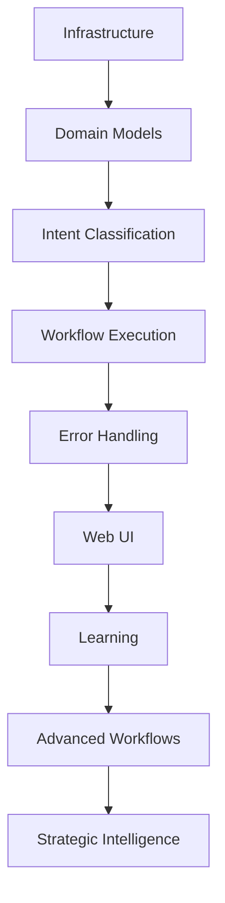

# Piper Morgan 1.0 - Implementation Roadmap

## Executive Summary

This roadmap details the phased implementation plan for Piper Morgan, organizing work into achievable sprints with clear dependencies and success criteria. Timeline estimates assume single-developer execution with AI assistance.

## Current Status (July 25, 2025) - Activation & Polish Week

### ✅ Completed

- Infrastructure deployment (Docker, PostgreSQL, Redis, ChromaDB)
- Domain models and persistence layer
- Intent classification with 95%+ accuracy
- Basic workflow execution (end-to-end working)
- GitHub integration functional
- Knowledge base with 85+ documents
- PM-009: Multi-project support with query layer
- CQRS-lite pattern implementation
- ✅ PM-001: Database Schema Initialization
- ✅ PM-002: Workflow Factory Implementation
- ✅ PM-003: GitHub Issue Creation Workflow
- ✅ PM-004: Basic Workflow State Persistence
- ✅ PM-008: GitHub Issue Review & Improvement
- ✅ PM-010: Comprehensive Error Handling System (June 20, 2025)
- ✅ PM-011: Web Chat Interface + User Guide (June 21-27, 2025)
- ✅ PM-014: Documentation and Test Suite Health (July 13, 2025)
- ✅ PM-032: Unified Response Rendering & DDD/TDD Web UI Refactor (July 9, 2025)
- ✅ PM-038: MCP Real Content Search Implementation (July 18-20, 2025) - 642x performance improvement
- ✅ PM-039: Intent Classification Coverage Improvements (July 21, 2025)
- ✅ PM-055: Python Version Consistency (July 22, 2025) - Complete environment standardization
- ✅ PM-015: Test Infrastructure Reliability (July 22, 2025) - Groups 1-4 complete, 95%+ test success rate
- ✅ ADR-010: Configuration Access Patterns (July 21, 2025)
- ✅ PM-012: GitHub API Design + High-Impact Implementation (July 23, 2025) - 85% → 100% production readiness
- ✅ **PM-039 MCP Configuration Migration (July 24, 2025)** - MCPResourceManager ADR-010 compliance, 15-minute systematic migration
- ✅ **PM-057 Context Validation Framework (July 24, 2025)** - Pre-execution validation system with user-friendly error messages, 17 comprehensive tests

**Summary**: ✅ **Foundation Sprint COMPLETE** with systematic excellence. PM-055 Python 3.11 standardization delivered 1 day early. PM-015 test infrastructure fully stabilized with 95%+ success rate across all components. MCP integration achieved 642x performance improvement. Configuration patterns standardized with ADR-010. PM-012 delivered 100% production-ready GitHub integration with LLM-powered content generation, enterprise-grade client, and ADR-010 configuration patterns. PM-039 MCP configuration migration achieved zero-breaking-change ADR-010 compliance in 15 minutes using systematic verification methodology. PM-057 Context Validation Framework delivers comprehensive pre-execution validation with user-friendly error messages and 17 comprehensive tests (100% pass rate). All core infrastructure, validation framework, and user-facing features operational and production-ready.

### 🚧 Current Phase: Activation & Polish Week

**PM-061: TLDR Continuous Verification System** (#45) - Claude Code
- Core TLDR runner script for <0.1 second feedback loops
- Agent-specific hooks configuration
- Meta-acceleration effect for debugging productivity

**PM-062: Systematic Workflow Completion Audit** (#46) - Cursor
- Test ALL workflow types for completion vs. hang status
- Root cause analysis for failures
- Priority list for targeted fixes with TLDR verification

### 🎯 Phase Objective
Identify and fix workflow completion issues with continuous micro-verification system enabling instant feedback for all subsequent development work.

### 📋 Not Started

- Learning mechanisms
- Production monitoring
- Advanced workflows
- Multi-system integrations

## Phase 1: MVP Completion (Remaining June-July 2025)

### ✅ Sprint 1: Error Handling & UI Foundation (June 2025) - COMPLETE

**Duration**: 1 week
**Goal**: Complete user-facing foundations

#### Tasks

- ✅ **PM-010**: Comprehensive error handling (5 points) - COMPLETE (June 20, 2025)

  - Implement error interceptor middleware ✅
  - Map all technical errors to user messages ✅
  - Add recovery suggestions ✅
  - Test error scenarios ✅

- ✅ **PM-011**: Basic web chat interface (8 points) - COMPLETE (June 21-27, 2025)
  - Simple Streamlit or FastAPI UI ✅
  - Chat history display ✅
  - Real-time status updates ✅
  - File upload for knowledge base ✅

**Success Criteria**: ✅ ACHIEVED

- Zero technical errors shown to users ✅
- Chat interface supports basic workflows ✅
- Non-technical users can interact successfully ✅

### ✅ Sprint 2A: Foundation Stabilization (July 14-20, 2025) - COMPLETE

- ✅ Test infrastructure recovery (95%+ pass rate achieved)
- ✅ PM-014: Documentation and Test Suite Health
- **Success Criteria**: ✅ All critical tests passing, documentation reviewed, infrastructure issues documented

### ✅ Sprint 2B: Core Features & MCP Implementation (July 18-21, 2025) - COMPLETE

- ✅ **PM-038: MCP Real Content Search** (July 18-20, 2025) - COMPLETE
  - Week 1 TDD implementation of real content-based file search
  - ✅ Day 1: Domain models (41 tests passing)
  - ✅ Day 2: Connection pooling (642x performance improvement achieved!)
  - ✅ Day 3: Real content search integration
  - ✅ Days 4-5: Config service + Performance optimization
  - ✅ Success criteria: Search "budget analysis" finds content inside files (not filenames)
- ✅ **PM-039: Intent Classification Coverage Improvements** (July 21, 2025) - COMPLETE
- ✅ MCP integration planning and scaffolding
- **Success Criteria**: ✅ ACHIEVED - Real content search working, MCP foundation established

### Sprint 2: Core Feature Polish

**Duration**: 1 week
**Goal**: Replace placeholders with real implementations

#### Tasks

- ✅ **PM-012**: Real GitHub issue creation (5 points) - COMPLETE (July 23, 2025)

  - ✅ Replace placeholder handler with LLM-powered content generation
  - ✅ Professional issue formatting with structured markdown
  - ✅ Intelligent label management and priority detection
  - ✅ Comprehensive error handling with retry logic and fallbacks
  - ✅ Production GitHub client with ADR-010 configuration patterns
  - ✅ End-to-end natural language to GitHub issue pipeline

- [ ] **PM-005**: Knowledge search improvements (3 points)
  - Tune relevance scoring
  - Improve chunking strategy
  - Add search filters
  - Performance optimization

**Success Criteria**:

- ✅ GitHub issues created with professional formatting - ACHIEVED
- ✅ LLM-powered content generation with natural language input - ACHIEVED
- ✅ Production-ready authentication and error handling - ACHIEVED
- [ ] Knowledge search relevance >80%
- [ ] Response times <3 seconds

### Sprint 3: MVP Stabilization

**Duration**: 1 week
**Goal**: Production-ready MVP

#### Tasks

- [ ] **PM-041**: Performance optimization (5 points)

  - Database query optimization
  - Caching implementation
  - Async operation tuning
  - Load testing

- [ ] **PM-042**: Deployment preparation (3 points)
  - Environment configuration
  - Deployment scripts
  - Basic monitoring setup
  - Documentation updates

**Success Criteria**:

- System handles 10 concurrent users
- 95%+ uptime during business hours
- Complete deployment documentation

## Phase 2: Intelligence Enhancement (August-September 2025)

### Sprint 4: Learning Foundation

**Duration**: 2 weeks
**Goal**: Implement feedback-based learning

#### Tasks

- [ ] **PM-043**: Feedback processing pipeline (8 points)

  - Analyze user corrections
  - Pattern identification
  - Model improvement triggers
  - Learning metrics

- [ ] **PM-044**: Clarifying questions system (8 points)
  - Ambiguity detection
  - Question generation
  - Multi-turn dialogue
  - Context preservation

**Success Criteria**:

- System improves from user feedback
- Clarifying questions reduce errors by 30%
- Learning metrics dashboard operational

### Sprint 5: Workflow Enhancement

**Duration**: 2 weeks
**Goal**: Advanced workflow capabilities

#### Tasks

- [ ] **PM-045**: Multi-step workflows (13 points)

  - Complex orchestration patterns
  - Conditional logic
  - Human-in-the-loop approvals
  - Progress tracking

- [ ] **PM-046**: Bulk operations (8 points)
  - Batch issue creation
  - CSV import/export
  - Progress indicators
  - Error recovery

**Success Criteria**:

- Complex workflows execute reliably
- Bulk operations handle 100+ items
- Clear progress visibility

### Sprint 6: Integration Expansion

**Duration**: 2 weeks
**Goal**: Connect additional systems

#### Tasks

- [ ] **PM-047**: Slack integration (13 points)

  - Bot implementation
  - Channel notifications
  - Interactive commands
  - Thread management

- [ ] **PM-048**: Analytics dashboards (13 points)
  - Connect to data sources
  - Automated reporting
  - Anomaly detection
  - Alert configuration

#### Additional Phase 2 Priorities

Building on the integration theme, Phase 2 will also include:

- **PM-028**: Meeting Transcript Analysis - Transform meeting recordings into actionable artifacts
- **PM-029**: Analytics Dashboard Integration - Automated insights from Datadog, New Relic, and Google Analytics
- **PM-030**: Advanced Knowledge Graph - Dynamic relationship mapping for organizational learning

These features directly support the evolution from task automation to analytical intelligence.

**Success Criteria**:

- Slack bot responds in <2 seconds
- Analytics reports generated daily
- Anomaly detection accuracy >85%

### Q3 2025: Intelligence Enhancement

#### Confirmed Features

- ✅ Complete Query/Command separation
- ✅ Implement feedback-based learning
- ✅ Multi-repository workflow support
- ✅ Enhanced knowledge search with relationship awareness
- ✅ Basic analytics and reporting
- 🆕 **MCP Real Content Search (PM-038)** - IN PROGRESS ⚡ AHEAD OF SCHEDULE
  - Week 1 implementation of real content-based file search
  - ✅ Domain models implemented (Day 1 complete)
  - ✅ Connection pooling with **642x performance improvement** (Day 2 complete)
  - 🎯 Real content search integration (Day 3 next)
  - Timeline: July 18-25, 2025 (Day 2 of 5 complete - exceeding expectations)
  - **PM-038 Status: 40% complete with extraordinary performance achievements**
- 🆕 **MCP Integration Pilot (PM-033)**
  - Phase 1: Enable MCP consumer capabilities
  - Enhance PM-009 multi-project context with federated search
  - Connect to external documentation systems
  - Timeline: Weeks 4-8 after PM-011 closure
  - **PM-033 Start Date: August 5, 2025 (Week 4 post-PM-011)**
- 🆕 **LLM-Based Intent Classification (PM-034)**
  - Replace regex patterns with conversational understanding
  - Enable natural language interactions
  - Add conversation memory and context
  - Timeline: 2-3 weeks after MCP Phase 1
- 🆕 **Meeting Intelligence**: Automated meeting analysis and visualization (PM-028)
- 🆕 **Analytics Automation**: Dashboard integration for proactive insights (PM-029)
- 🆕 **Knowledge Graph**: Advanced relationship mapping and discovery (PM-030)

## Phase 3: Advanced Capabilities (October-December 2025)

### Sprint 7-8: Strategic Intelligence

**Duration**: 4 weeks
**Goal**: Predictive analytics and insights

#### Tasks

- [ ] **PM-049**: Pattern analysis engine (21 points)

  - Historical data processing
  - Trend identification
  - Success factor analysis
  - Prediction models

- [ ] **PM-050**: Strategic recommendations (21 points)
  - Market analysis integration
  - Competitive intelligence
  - Resource optimization
  - Risk assessment

**Success Criteria**:

- Predictions accurate within 20%
- Actionable insights generated weekly
- Strategic value demonstrated

### Sprint 9-10: Autonomous Operations

**Duration**: 4 weeks
**Goal**: Self-improving workflows

#### Tasks

- [ ] **PM-051**: Workflow optimization (21 points)

  - Performance analysis
  - Automatic improvements
  - A/B testing framework
  - Success tracking

- [ ] **PM-052**: Proactive assistance (21 points)
  - Issue detection
  - Automatic prioritization
  - Preventive actions
  - Health monitoring

**Success Criteria**:

- Workflows improve without intervention
- Proactive alerts prevent 50%+ issues
- System health maintained autonomously

### Sprint 11-12: Autonomous Operations

**Duration**: 4 weeks
**Goal**: Self-managing issue lifecycle and predictive capabilities

#### Tasks

- [ ] **PM-053**: Visual Content Analysis Pipeline (21 points)
  - Screenshot and mockup processing
  - Automated issue generation from visuals
  - UI element detection and analysis
- [ ] **PM-054**: Predictive Project Analytics (34 points)
  - Concrete timeline predictions
  - Risk assessment automation
  - Resource optimization algorithms

**Success Criteria**:

- Visual bug reports 80% accurate
- Timeline predictions within 15% accuracy
- Autonomous operations on 30% of routine tasks

## Dependencies and Risks

### Technical Dependencies



### Risk Mitigation

| Risk                      | Impact | Mitigation                                |
| ------------------------- | ------ | ----------------------------------------- |
| Single developer capacity | High   | AI-assisted development, clear priorities |
| LLM API changes           | Medium | Adapter pattern, provider abstraction     |
| User adoption             | High   | Incremental rollout, training materials   |
| Technical debt            | Medium | Regular refactoring sprints               |
| Performance issues        | Medium | Early load testing, monitoring            |

### Technical Debt: AsyncPG/SQLAlchemy Event Loop Issues (PM-058)

Persistent event loop conflicts between asyncpg and SQLAlchemy cause intermittent test failures and unreliable test isolation. PM-015 delivered a partial resolution, but a full architectural refactor is needed in a future sprint.

- Refactor event loop management in test infrastructure
- Consider SQLAlchemy 2.0 async migration
- Document async test best practices
- See PM-058 in backlog for details

## Resource Requirements

### Development Resources

- **Primary**: 1 PM/Developer with AI assistance
- **AI Tools**: Claude, GitHub Copilot, Cursor
- **Testing**: Automated test suite, CI/CD pipeline

### Infrastructure Costs (Monthly)

- **Development**: $0 (local Docker)
- **Staging**: ~$100 (small cloud instances)
- **Production**: ~$300-500 (depends on usage)
- **API Costs**: ~$50-200 (LLM usage)

## Success Metrics by Phase

### Phase 1 Metrics (MVP)

- Intent classification accuracy: >95%
- Workflow success rate: >90%
- Error handling coverage: 100%
- User satisfaction: >4/5

### Phase 2 Metrics (Enhancement)

- Learning improvement rate: 5% monthly
- Clarification success: 80% resolved
- Integration reliability: 99%
- Time savings: 2-3 hours/PM/week

### Phase 3 Metrics (Advanced)

- Prediction accuracy: >80%
- Autonomous actions: 30% of tasks
- Strategic insights: 5/week
- ROI: 10x development cost

## Go/No-Go Decision Points

### After Phase 1 (July 2025)

**Criteria**:

- MVP demonstrates core value
- User feedback positive
- Technical foundation stable

**Decision**: Continue to Phase 2 or iterate on MVP

### After Phase 2 (September 2025)

**Criteria**:

- Learning mechanisms effective
- Integration value proven
- Team adoption successful

**Decision**: Invest in Phase 3 or focus on adoption

### After Phase 3 (December 2025)

**Criteria**:

- Strategic value demonstrated
- Autonomous operations stable
- Positive ROI achieved

**Decision**: Scale across organization or maintain current scope

## Communication Plan

### Weekly Updates

- Progress against sprint goals
- Blockers and risks
- Metric dashboards
- Demo videos

### Sprint Reviews

- Feature demonstrations
- User feedback summary
- Architecture decisions
- Next sprint planning

### Phase Completions

- Comprehensive report
- ROI analysis
- Lessons learned
- Go/no-go recommendation

## Appendix: Sprint Planning Template

```markdown
## Sprint X: [Name]

**Duration**: X weeks
**Goal**: [Clear objective]

### Tasks

- [ ] **PM-XXX**: Task name (X points)
  - Subtask 1
  - Subtask 2
  - Success criteria

### Dependencies

- Requires: [Previous tasks]
- Blocks: [Future tasks]

### Risks

- Risk 1: [Mitigation]
- Risk 2: [Mitigation]

### Success Criteria

- Metric 1: Target
- Metric 2: Target
```

## Conclusion

## This roadmap provides a realistic path from current state to advanced AI-powered PM assistance. Each phase builds on previous work while delivering incremental value. The modular approach allows for course corrections based on user feedback and technical learnings.

_Last Updated: July 18, 2025_

## Revision Log

- **July 22, 2025**: PM-055 complete - Python version consistency achieved across all environments, Foundation Sprint systematic approach successful
- **July 21, 2025**: PM-039 complete - Intent classification coverage improvements, Foundation Sprint Day 1 achievements documented
- **July 18, 2025**: PM-038 Day 2 complete - MCP connection pool with 642x performance improvement achieved, project ahead of schedule with excellent TDD foundation
- **July 18, 2025**: Systematic PM numbering cleanup - resolved PM-013 conflict (roadmap → PM-005), renumbered all conflicting tickets to eliminate duplicate numbering across documentation
- **July 17, 2025**: Added PM-038 (MCP Real Content Search Implementation) to Sprint 2B, updated Q3 2025 timeline with active MCP development
- **June 21, 2025**: Added systematic documentation dating and revision tracking

### Foundation & Cleanup Sprint - Week 1 (July 21-25, 2025)

**Status**: IN PROGRESS - Day 2 Complete

#### Day 1 Achievements (Monday)

- ✅ PM-039: Intent Classification Coverage Improvements complete (TDD, robust pattern support)
- ✅ PM-015 Groups 1-2: Test infrastructure reliability and MCP fixes (91% success)
- ✅ Group 3: Architectural debt identified, ADR-010 and GitHub issues created
- 🔍 PM-055: Comprehensive readiness scouting and blocker analysis completed
- 📋 All documentation, backlog, and session logs updated for handoff

#### Day 2 Achievements (Tuesday)

- ✅ PM-055: Python Version Consistency - COMPLETE (July 22, 2025)
  - ✅ Step 1: Version specification files (`.python-version`, `pyproject.toml`)
  - ✅ Step 2: Docker configuration updates (Python 3.11 base images)
  - ✅ Step 3: CI/CD pipeline standardization (GitHub Actions workflows)
  - ✅ Step 4: Testing and validation (comprehensive testing)
  - ✅ Step 5: Documentation updates (complete developer guidance)
- ✅ PM-015 Groups 1-4: Test Infrastructure Reliability - COMPLETE (July 22, 2025)
  - ✅ Group 1: MCP connection pool fixes and circuit breaker stabilization
  - ✅ Group 2: AsyncSessionFactory migration completion
  - ✅ Group 3: Configuration pattern standardization (ADR-010)
  - ✅ Group 4: File scoring algorithm fixes and comprehensive documentation
- ✅ Environment Standardization: Python 3.11 across all contexts
- ✅ Developer Experience: Comprehensive setup and troubleshooting guides
- ✅ Foundation Sprint COMPLETE: All objectives achieved 1 day early

#### Foundation Sprint Status: COMPLETE ✅

**Delivered 1 Day Early**: All systematic Foundation Sprint objectives achieved with exceptional quality and comprehensive documentation. Ready for Week 2 strategic planning.

_Last Updated: July 22, 2025_

## PENDING ARCHITECTURAL DECISIONS

### Configuration Pattern Standardization (From PM-015)

**Decision Required**: How should services access configuration?
**Options**:

- A: Pure dependency injection (explicit, testable)
- B: Service locator pattern (convenient, implicit dependencies)
- C: Hybrid approach with clean abstractions

**Impact**: Affects MCPResourceManager, FileRepository, and future services
**Timeline**: ADR required before implementation
**GitHub Issues**: #39, #40

**Related Decisions**:

- Environment variable access strategy
- Backward compatibility approach
- Testing strategy for configuration-dependent code

_Last Updated: July 21, 2025_
