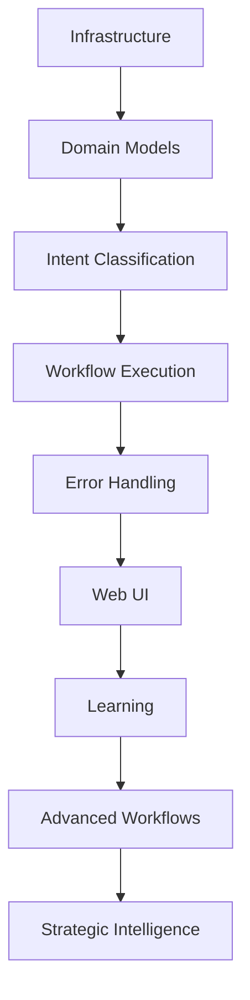

# Piper Morgan 1.0 - Implementation Roadmap

## Executive Summary

This roadmap details the phased implementation plan for Piper Morgan, organizing work into achievable sprints with clear dependencies and success criteria. Timeline estimates assume single-developer execution with AI assistance.

## Current Status (June 19, 2025)

### ✅ Completed

- Infrastructure deployment (Docker, PostgreSQL, Redis, ChromaDB)
- Domain models and persistence layer
- Intent classification with 95%+ accuracy
- Basic workflow execution (end-to-end working)
- GitHub integration functional
- Knowledge base with 85+ documents
- PM-009: Multi-project support with query layer
- CQRS-lite pattern implementation
- ✅ PM-032: Unified Response Rendering & DDD/TDD Web UI Refactor

**Summary**: All bot message rendering and response handling is now unified in a DDD-compliant, test-driven domain module (`bot-message-renderer.js`). The web UI provides real-time feedback, actionable error messages, and consistent user experience. All logic is fully covered by automated tests.

### 🚧 In Progress

- Test infrastructure recovery (87% → 95%+ target)
- PM-014: Documentation and Test Suite Health
- PM-012: Real GitHub issue creation (starting July 21)

### 📋 Not Started

- Learning mechanisms
- Production monitoring
- Advanced workflows
- Multi-system integrations

## Phase 1: MVP Completion (Remaining June-July 2025)

### Sprint 1: Error Handling & UI Foundation (Current)

**Duration**: 1 week
**Goal**: Complete user-facing foundations

#### Tasks

- [ ] **PM-010**: Comprehensive error handling (5 points)

  - Implement error interceptor middleware
  - Map all technical errors to user messages
  - Add recovery suggestions
  - Test error scenarios

- [ ] **PM-011**: Basic web chat interface (8 points)
  - Simple Streamlit or FastAPI UI
  - Chat history display
  - Real-time status updates
  - File upload for knowledge base

**Success Criteria**:

- Zero technical errors shown to users
- Chat interface supports basic workflows
- Non-technical users can interact successfully

### Sprint 2A: Foundation Stabilization (July 14-20, 2025)

- [ ] Test infrastructure recovery (target: 95%+ pass rate)
- [ ] PM-014: Documentation and Test Suite Health
- **Success Criteria**: All critical tests passing, documentation reviewed, no session leaks, testability issues documented

### Sprint 2B: Core Features & MCP Prep (July 21 - Aug 3, 2025)

- [ ] PM-012: Real GitHub issue creation (start July 21)
- [ ] MCP integration planning and scaffolding
- **Success Criteria**: GitHub issues created in real repos, MCP pilot plan ready, dependencies mapped

### Sprint 2: Core Feature Polish

**Duration**: 1 week
**Goal**: Replace placeholders with real implementations

#### Tasks

- [ ] **PM-012**: Real GitHub issue creation (5 points)

  - Replace placeholder handler
  - Professional issue formatting
  - Label management
  - Error handling for API failures

- [ ] **PM-013**: Knowledge search improvements (3 points)
  - Tune relevance scoring
  - Improve chunking strategy
  - Add search filters
  - Performance optimization

**Success Criteria**:

- GitHub issues created with professional formatting
- Knowledge search relevance >80%
- Response times <3 seconds

### Sprint 3: MVP Stabilization

**Duration**: 1 week
**Goal**: Production-ready MVP

#### Tasks

- [ ] **PM-014**: Performance optimization (5 points)

  - Database query optimization
  - Caching implementation
  - Async operation tuning
  - Load testing

- [ ] **PM-015**: Deployment preparation (3 points)
  - Environment configuration
  - Deployment scripts
  - Basic monitoring setup
  - Documentation updates

**Success Criteria**:

- System handles 10 concurrent users
- 95%+ uptime during business hours
- Complete deployment documentation

## Phase 2: Intelligence Enhancement (August-September 2025)

### Sprint 4: Learning Foundation

**Duration**: 2 weeks
**Goal**: Implement feedback-based learning

#### Tasks

- [ ] **PM-016**: Feedback processing pipeline (8 points)

  - Analyze user corrections
  - Pattern identification
  - Model improvement triggers
  - Learning metrics

- [ ] **PM-017**: Clarifying questions system (8 points)
  - Ambiguity detection
  - Question generation
  - Multi-turn dialogue
  - Context preservation

**Success Criteria**:

- System improves from user feedback
- Clarifying questions reduce errors by 30%
- Learning metrics dashboard operational

### Sprint 5: Workflow Enhancement

**Duration**: 2 weeks
**Goal**: Advanced workflow capabilities

#### Tasks

- [ ] **PM-018**: Multi-step workflows (13 points)

  - Complex orchestration patterns
  - Conditional logic
  - Human-in-the-loop approvals
  - Progress tracking

- [ ] **PM-019**: Bulk operations (8 points)
  - Batch issue creation
  - CSV import/export
  - Progress indicators
  - Error recovery

**Success Criteria**:

- Complex workflows execute reliably
- Bulk operations handle 100+ items
- Clear progress visibility

### Sprint 6: Integration Expansion

**Duration**: 2 weeks
**Goal**: Connect additional systems

#### Tasks

- [ ] **PM-020**: Slack integration (13 points)

  - Bot implementation
  - Channel notifications
  - Interactive commands
  - Thread management

- [ ] **PM-021**: Analytics dashboards (13 points)
  - Connect to data sources
  - Automated reporting
  - Anomaly detection
  - Alert configuration

#### Additional Phase 2 Priorities

Building on the integration theme, Phase 2 will also include:

- **PM-028**: Meeting Transcript Analysis - Transform meeting recordings into actionable artifacts
- **PM-029**: Analytics Dashboard Integration - Automated insights from Datadog, New Relic, and Google Analytics
- **PM-030**: Advanced Knowledge Graph - Dynamic relationship mapping for organizational learning

These features directly support the evolution from task automation to analytical intelligence.

**Success Criteria**:

- Slack bot responds in <2 seconds
- Analytics reports generated daily
- Anomaly detection accuracy >85%

### Q3 2025: Intelligence Enhancement

#### Confirmed Features

- ✅ Complete Query/Command separation
- ✅ Implement feedback-based learning
- ✅ Multi-repository workflow support
- ✅ Enhanced knowledge search with relationship awareness
- ✅ Basic analytics and reporting
- 🆕 **MCP Integration Pilot (PM-033)**
  - Phase 1: Enable MCP consumer capabilities
  - Enhance PM-009 multi-project context with federated search
  - Connect to external documentation systems
  - Timeline: Weeks 4-8 after PM-011 closure
  - **PM-033 Start Date: August 5, 2025 (Week 4 post-PM-011)**
- 🆕 **LLM-Based Intent Classification (PM-034)**
  - Replace regex patterns with conversational understanding
  - Enable natural language interactions
  - Add conversation memory and context
  - Timeline: 2-3 weeks after MCP Phase 1
- 🆕 **Meeting Intelligence**: Automated meeting analysis and visualization (PM-028)
- 🆕 **Analytics Automation**: Dashboard integration for proactive insights (PM-029)
- 🆕 **Knowledge Graph**: Advanced relationship mapping and discovery (PM-030)

## Phase 3: Advanced Capabilities (October-December 2025)

### Sprint 7-8: Strategic Intelligence

**Duration**: 4 weeks
**Goal**: Predictive analytics and insights

#### Tasks

- [ ] **PM-022**: Pattern analysis engine (21 points)

  - Historical data processing
  - Trend identification
  - Success factor analysis
  - Prediction models

- [ ] **PM-023**: Strategic recommendations (21 points)
  - Market analysis integration
  - Competitive intelligence
  - Resource optimization
  - Risk assessment

**Success Criteria**:

- Predictions accurate within 20%
- Actionable insights generated weekly
- Strategic value demonstrated

### Sprint 9-10: Autonomous Operations

**Duration**: 4 weeks
**Goal**: Self-improving workflows

#### Tasks

- [ ] **PM-024**: Workflow optimization (21 points)

  - Performance analysis
  - Automatic improvements
  - A/B testing framework
  - Success tracking

- [ ] **PM-025**: Proactive assistance (21 points)
  - Issue detection
  - Automatic prioritization
  - Preventive actions
  - Health monitoring

**Success Criteria**:

- Workflows improve without intervention
- Proactive alerts prevent 50%+ issues
- System health maintained autonomously

### Sprint 11-12: Autonomous Operations

**Duration**: 4 weeks
**Goal**: Self-managing issue lifecycle and predictive capabilities

#### Tasks

- [ ] **PM-031**: Visual Content Analysis Pipeline (21 points)
  - Screenshot and mockup processing
  - Automated issue generation from visuals
  - UI element detection and analysis
- [ ] **PM-032**: Predictive Project Analytics (34 points)
  - Concrete timeline predictions
  - Risk assessment automation
  - Resource optimization algorithms

**Success Criteria**:

- Visual bug reports 80% accurate
- Timeline predictions within 15% accuracy
- Autonomous operations on 30% of routine tasks

## Dependencies and Risks

### Technical Dependencies



### Risk Mitigation

| Risk                      | Impact | Mitigation                                |
| ------------------------- | ------ | ----------------------------------------- |
| Single developer capacity | High   | AI-assisted development, clear priorities |
| LLM API changes           | Medium | Adapter pattern, provider abstraction     |
| User adoption             | High   | Incremental rollout, training materials   |
| Technical debt            | Medium | Regular refactoring sprints               |
| Performance issues        | Medium | Early load testing, monitoring            |

## Resource Requirements

### Development Resources

- **Primary**: 1 PM/Developer with AI assistance
- **AI Tools**: Claude, GitHub Copilot, Cursor
- **Testing**: Automated test suite, CI/CD pipeline

### Infrastructure Costs (Monthly)

- **Development**: $0 (local Docker)
- **Staging**: ~$100 (small cloud instances)
- **Production**: ~$300-500 (depends on usage)
- **API Costs**: ~$50-200 (LLM usage)

## Success Metrics by Phase

### Phase 1 Metrics (MVP)

- Intent classification accuracy: >95%
- Workflow success rate: >90%
- Error handling coverage: 100%
- User satisfaction: >4/5

### Phase 2 Metrics (Enhancement)

- Learning improvement rate: 5% monthly
- Clarification success: 80% resolved
- Integration reliability: 99%
- Time savings: 2-3 hours/PM/week

### Phase 3 Metrics (Advanced)

- Prediction accuracy: >80%
- Autonomous actions: 30% of tasks
- Strategic insights: 5/week
- ROI: 10x development cost

## Go/No-Go Decision Points

### After Phase 1 (July 2025)

**Criteria**:

- MVP demonstrates core value
- User feedback positive
- Technical foundation stable

**Decision**: Continue to Phase 2 or iterate on MVP

### After Phase 2 (September 2025)

**Criteria**:

- Learning mechanisms effective
- Integration value proven
- Team adoption successful

**Decision**: Invest in Phase 3 or focus on adoption

### After Phase 3 (December 2025)

**Criteria**:

- Strategic value demonstrated
- Autonomous operations stable
- Positive ROI achieved

**Decision**: Scale across organization or maintain current scope

## Communication Plan

### Weekly Updates

- Progress against sprint goals
- Blockers and risks
- Metric dashboards
- Demo videos

### Sprint Reviews

- Feature demonstrations
- User feedback summary
- Architecture decisions
- Next sprint planning

### Phase Completions

- Comprehensive report
- ROI analysis
- Lessons learned
- Go/no-go recommendation

## Appendix: Sprint Planning Template

```markdown
## Sprint X: [Name]

**Duration**: X weeks
**Goal**: [Clear objective]

### Tasks

- [ ] **PM-XXX**: Task name (X points)
  - Subtask 1
  - Subtask 2
  - Success criteria

### Dependencies

- Requires: [Previous tasks]
- Blocks: [Future tasks]

### Risks

- Risk 1: [Mitigation]
- Risk 2: [Mitigation]

### Success Criteria

- Metric 1: Target
- Metric 2: Target
```

## Conclusion

## This roadmap provides a realistic path from current state to advanced AI-powered PM assistance. Each phase builds on previous work while delivering incremental value. The modular approach allows for course corrections based on user feedback and technical learnings.

_Last Updated: June 21, 2025_

## Revision Log

- **June 21, 2025**: Added systematic documentation dating and revision tracking
