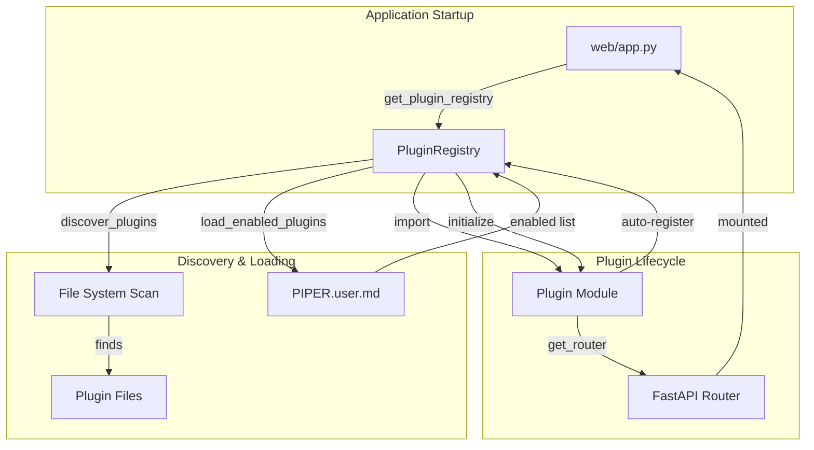
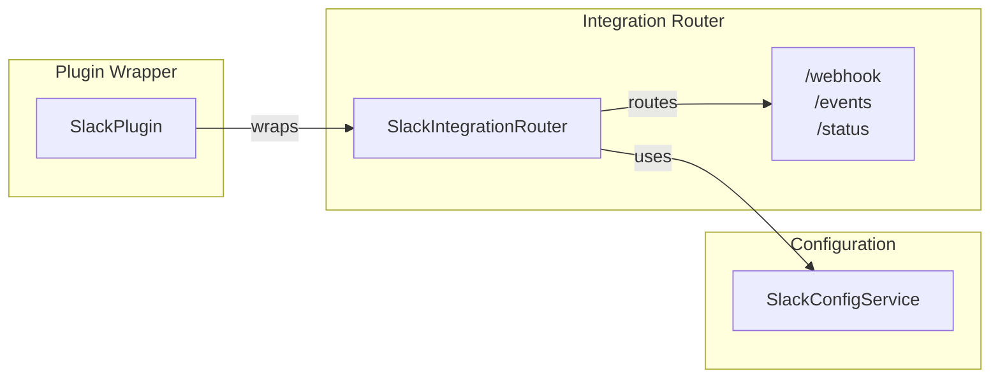
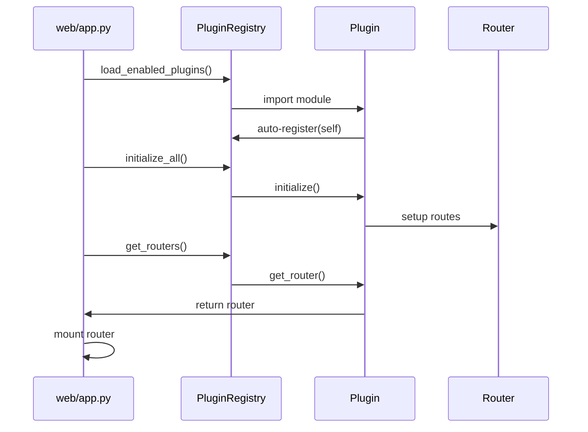

# Piper Plugin System

## Overview

The Piper plugin system enables integration plugins (Slack, Notion, GitHub, Calendar) to self-register as modular components with standardized interfaces.

**Built**: October 2, 2025 (GREAT-3A Phase 3)
**Enhanced**: October 3, 2025 (GREAT-3B)
**Documented**: October 4, 2025 (GREAT-3C)

For architectural details, see [Pattern-031: Plugin Wrapper](../../docs/internal/architecture/current/patterns/pattern-031-plugin-wrapper.md).

## GREAT-3B Enhancements

As of October 2025 (GREAT-3B), the plugin system includes:

- **Dynamic Discovery**: Automatic plugin detection from `services/integrations/*/`
- **Config Control**: Enable/disable plugins via `config/PIPER.user.md`
- **Backwards Compatible**: All plugins enabled by default
- **Enhanced Logging**: Detailed startup status per plugin
- **Graceful Degradation**: Plugin failures don't crash startup

### Migration from GREAT-3A

GREAT-3A introduced the plugin interface and registry. GREAT-3B adds:

- Removed static imports from `web/app.py`
- Added discovery and dynamic loading
- Added configuration system
- No breaking changes - existing code continues to work

## Architecture

### Plugin System Overview



### Wrapper Pattern



### Data Flow



## Why the Wrapper Pattern?

Piper Morgan uses a **two-file structure** for integrations:

1. **Router File**: Contains business logic (300-500 lines)
2. **Plugin File**: Thin wrapper implementing interface (100 lines)

**Benefits**:

- Clear separation between business logic and plugin protocol
- Easy to test independently
- Supports gradual migration if needed
- Minimal coupling between layers

See [Pattern-031: Plugin Wrapper](../../docs/internal/architecture/current/patterns/pattern-031-plugin-wrapper.md) for detailed explanation.

### Components

- **PiperPlugin Interface** (`plugin_interface.py`): Abstract base class all plugins implement
- **PluginRegistry** (`plugin_registry.py`): Singleton registry managing plugin lifecycle
- **Auto-Registration**: Plugins register on module import
- **FastAPI Integration**: Plugin routers auto-mount at startup

### How It Works

1. **Plugin Definition**: Implement `PiperPlugin` interface
2. **Auto-Registration**: Plugin registers on import
3. **Startup**: Registry initializes all plugins
4. **Router Mounting**: Plugin routes auto-mount to FastAPI
5. **Lifecycle**: Registry manages init/shutdown

## Current Plugins

| Plugin       | Capabilities              | Status    |
| ------------ | ------------------------- | --------- |
| **Slack**    | routes, webhooks, spatial | ✅ Active |
| **GitHub**   | routes, spatial           | ✅ Active |
| **Notion**   | routes, mcp               | ✅ Active |
| **Calendar** | routes, spatial           | ✅ Active |

## Adding New Plugins

See `PLUGIN_GUIDE.md` for complete development guide.

### Quick Start

```python
from services.plugins import PiperPlugin, PluginMetadata
from fastapi import APIRouter

class MyPlugin(PiperPlugin):
    def get_metadata(self):
        return PluginMetadata(
            name="my_plugin",
            version="1.0.0",
            description="My integration",
            author="Developer Name",
            capabilities=["routes"],
            dependencies=[]
        )

    def get_router(self):
        router = APIRouter(prefix="/api/v1/my-plugin")
        # Add routes...
        return router

    def is_configured(self):
        return True  # Check actual config

    async def initialize(self):
        # Startup logic
        pass

    async def shutdown(self):
        # Cleanup logic
        pass

    def get_status(self):
        return {"status": "active"}

# Auto-register
from services.plugins import get_plugin_registry
_plugin = MyPlugin()
get_plugin_registry().register(_plugin)
```

### Integration Steps

1. Create plugin class in `services/integrations/my_integration/my_plugin.py`
2. Implement all `PiperPlugin` methods
3. Add auto-registration at module bottom
4. Import plugin in `web/app.py` lifespan
5. Plugin auto-loads at startup

## Plugin Discovery

The plugin system can automatically discover available plugins by scanning the integrations directory:

```python
from services.plugins import get_plugin_registry

registry = get_plugin_registry()

# Discover what's available
available = registry.discover_plugins()
print(f"Found {len(available)} plugins: {list(available.keys())}")
# Output: Found 4 plugins: ['slack', 'github', 'notion', 'calendar']

# See module paths
for name, module_path in available.items():
    print(f"  {name}: {module_path}")
# Output:
#   slack: services.integrations.slack.slack_plugin
#   github: services.integrations.github.github_plugin
#   notion: services.integrations.notion.notion_plugin
#   calendar: services.integrations.calendar.calendar_plugin
```

**How Discovery Works**:

- Scans `services/integrations/*/` for `*_plugin.py` files
- Returns mapping of plugin name to module path
- Does NOT load or register plugins (only identifies what's available)
- Useful for dynamic loading and configuration-based plugin management

**Discovery vs Registration**:

- `discover_plugins()` - Finds available plugins (no imports)
- `register()` - Adds plugin instance to registry (requires import)
- Use discovery to decide which plugins to load dynamically

## Dynamic Plugin Loading

Plugins can be loaded dynamically without static imports:

```python
from services.plugins import get_plugin_registry

registry = get_plugin_registry()

# Discover available plugins
available = registry.discover_plugins()

# Load specific plugin
success = registry.load_plugin("slack", available["slack"])
if success:
    print("Slack plugin loaded!")

# Load all discovered plugins
for name, module_path in available.items():
    registry.load_plugin(name, module_path)
```

**Loading Process**:

1. Plugin module is imported using `importlib`
2. Import triggers auto-registration (plugin's `_plugin` instance registers itself)
3. Plugin is immediately available via `get_plugin(name)`

**Error Handling**:

- Import errors are caught and logged
- Failed loads return `False`
- Existing plugins are not affected by failed loads
- Safe to attempt loading invalid plugins

**Re-registration Handling**:

- If plugin already loaded, returns `True` immediately
- Handles case where module imported but registry was reset
- Automatically re-registers existing plugin instances

## Plugin Configuration

Configure which plugins are enabled in `config/PIPER.user.md`:

````markdown
## 🔌 Plugin Configuration

Configure which integration plugins are enabled and their settings.

```yaml
plugins:
  enabled:
    - github
    - slack
    # - notion  # Disabled
    # - calendar  # Disabled

  settings:
    github:
      timeout: 30
```
````

**Loading Enabled Plugins**:

```python
from services.plugins import get_plugin_registry

registry = get_plugin_registry()

# Load only enabled plugins from config
results = registry.load_enabled_plugins()

print(f"Loaded {len(results)} plugins")
for name, success in results.items():
    status = "✅" if success else "❌"
    print(f"{status} {name}")
```

**Default Behavior**:

- If no config section exists: all discovered plugins are loaded (backwards compatible)
- If config exists with empty enabled list: no plugins are loaded
- Maintains backwards compatibility (everything enabled by default)

**Config Reading Methods**:

- `get_enabled_plugins()` - Returns list of enabled plugin names from config
- `load_enabled_plugins()` - Discovers and loads only enabled plugins
- `_read_plugin_config()` - Internal method to parse config file

## Example Plugin

A complete example plugin is available at `services/integrations/demo/`:

```bash
# View the demo plugin code
ls -la services/integrations/demo/

# Run demo plugin tests
PYTHONPATH=. pytest services/integrations/demo/tests/ -v

# Try the demo endpoints
python3 main.py
curl http://localhost:8001/api/integrations/demo/health
```

The demo plugin demonstrates:

- Standard file structure
- Config service pattern
- Router with multiple endpoints
- Plugin wrapper implementation
- Complete test coverage

See the [Plugin Development Guide](../../docs/guides/plugin-development-guide.md) for how to create your own integration based on this example.

## Versioning

All plugins use [Semantic Versioning](https://semver.org/). See [Plugin Versioning Policy](../../docs/guides/plugin-versioning-policy.md) for details.

## Testing Plugins

### Interface Validation

```python
from my_plugin import _plugin
from tests.plugins.test_plugin_interface import validate_plugin_interface

validate_plugin_interface(_plugin)  # Raises if invalid
```

### Full Test Suite

```bash
# Run all plugin tests
pytest tests/plugins/ -v

# Run specific test
pytest tests/plugins/test_plugin_interface.py::TestPiperPluginInterface -v
```

## Monitoring

### Plugin Status

```python
from services.plugins import get_plugin_registry

registry = get_plugin_registry()

# List all plugins
plugins = registry.list_plugins()

# Get plugin status
status = registry.get_status_all()

# Get specific plugin
slack_plugin = registry.get_plugin("slack")
```

### Health Checks

Each plugin provides status via `get_status()`:

```python
plugin = registry.get_plugin("slack")
status = plugin.get_status()
# Returns: {"configured": bool, "router": str, ...}
```

## Plugin Capabilities

Plugins declare capabilities in metadata:

- **routes**: Provides HTTP endpoints
- **webhooks**: Handles webhook callbacks
- **spatial**: Uses spatial intelligence (MCP-based)
- **mcp**: Uses Model Context Protocol
- **background**: Runs background tasks

## Architecture Decisions

See ADRs for design rationale:

- ADR-010: Configuration Access Patterns
- ADR-038: Spatial Intelligence Patterns

## Files

```
services/plugins/
├── __init__.py              # Package exports
├── plugin_interface.py      # PiperPlugin ABC + PluginMetadata
├── plugin_registry.py       # PluginRegistry singleton
├── PLUGIN_GUIDE.md          # Development guide
└── README.md               # This file

tests/plugins/
├── test_plugin_interface.py # Interface compliance tests
├── test_plugin_registry.py  # Registry tests
└── conftest.py              # Test fixtures
```

## Future Enhancements

Potential improvements:

- Dynamic plugin loading from config
- Plugin marketplace
- Plugin dependencies resolution
- Hot-reload support
- Plugin sandboxing
- Version management
